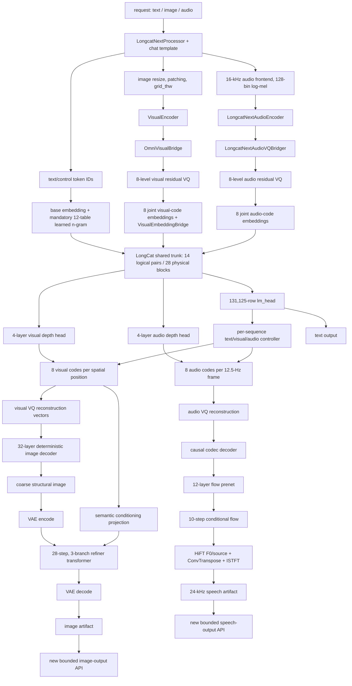
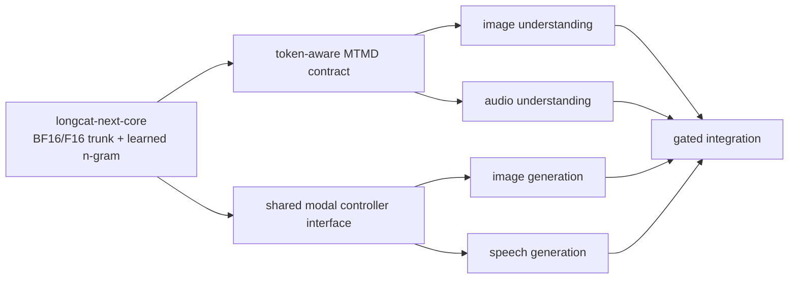

# Reconciled technical feasibility report: full LongCat-Next support in llama.cpp

**Audit date:** 2026-07-25  
**Nature of work:** architecture, checkpoint, source-code, and engineering-feasibility analysis only  
**Implementation status:** no code implemented, no patch generated, no repository modified, and no pull request created  
**Analyses reconciled:** the original Work audit and the six independent Codex verification documents at commit [`d2ed975bc296bd0eeb295edb80e672f61661b3df`][verification-commit]

This report uses three evidence labels:

- **Verified fact** means the conclusion follows directly from a pinned official source file, configuration field, checkpoint index/header, or mechanically reproduced arithmetic.
- **Engineering inference** means a proposed llama.cpp design, feasibility judgment, memory envelope, or sequencing recommendation derived from those facts.
- **Still unverified** means the result requires conversion, numerical parity, backend execution, quality testing, or measurement that neither audit performed.

## 1. Reconciled executive decision

**Reconciled decision: proceed, but as five separately gated engineering workstreams.** A correct LongCat-Next text core, mandatory learned n-gram embedding, image understanding, visual-code generation, deterministic image decoding, audio understanding, audio-code generation, codec/flow decoding, and HiFT speech synthesis are technically credible. They are not equally difficult and should not be presented as one ordinary model port.

The decisive conclusions are:

1. **GGUF conversion/loading and text inference are GO.** The main checkpoint inventory, three vocabulary extents, text/trunk tensor names, configuration, and LongCat-Flash-Lite reuse surface are sufficiently established to justify a narrow BF16/F16 correctness spike.
2. **The learned n-gram embedding is mandatory model computation.** It is neither trained MTP nor weight-free prompt n-gram speculation. Correct sequence-local history is part of the core acceptance gate.
3. **Trained LongCat-Next MTP is NO-GO for the released checkpoint.** The published Next index contains zero `model.mtp.*` tensors, while Flash-Lite contains 17. The Lite weights are checkpoint-specific and cannot be transplanted into Next.
4. **Image and audio understanding are CONDITIONAL GO.** Their weights and official graphs exist, and GGML can express correctness fallbacks, but token-aware media embedding injection, preprocessing parity, residual-VQ parity, and bounded workspace remain unimplemented and unmeasured.
5. **Visual/audio code generation is CONDITIONAL GO.** The official eight-level depth heads and state machine are source-verified, but llama.cpp has no equivalent sequence-local controller.
6. **Deterministic coarse image decoding is CONDITIONAL GO and materially easier than full image output.** Its 558-tensor, 433,743,858-parameter sidecar family is now exactly inventoried.
7. **Full image refinement/VAE and codec/flow/HiFT speech are research-grade workstreams.** Their weights and topology are available, but iterative schedulers, RNG parity, force-upcast behavior, weight-normalization folding, resource peaks, and latency make them substantially more than ordinary transformer ports.
8. **Existing llama-server media-input plumbing is reusable.** Native image and speech output require new runtime products, APIs, bounded artifact handling, capability reporting, cancellation, and scheduling.
9. **The 96 GiB VRAM / 256 GiB RAM plan is not a verified deployment.** Fixed checkpoint, n-gram, tensor-count, and KV-cache arithmetic is verified. Quantized size, runtime workspace, CUDA allocation/fragmentation, phase overlap, CPU-offload performance, and latency remain estimates until measured locally.

### Plain answers

| Question | Answer |
|---|---|
| Is full LongCat-Next support technically credible? | **Not literally all requested capabilities from the released files:** trained Next MTP is impossible without weights. **All published non-MTP multimodal functionality is technically credible as a staged program.** “Full” image refinement and waveform synthesis remain research projects. |
| What is realistically achievable on a 96 GiB VRAM / 256 GiB RAM workstation? | A quantized text core, learned n-gram inference, one-slot 8k/32k text service, image/audio understanding, raw visual/audio code generation, and probably deterministic coarse image and speech prototypes. Full-refiner image output is capacity-plausible only with phase eviction/offload and must be measured. Full 131k context plus large output stacks and concurrency should not be assumed. |
| Which parts are research projects? | Full image refiner/VAE parity and performance; codec/flow/HiFT speech parity and latency; modal batching/cancellation; production multi-file graph loading; and optimized residual-VQ/ConvTranspose1d paths. |
| What is the smallest justified coding task? | First freeze a read-only tensor-classification harness and official Python fixtures, then implement only the BF16/F16 `longcat-next-core` correctness spike described in section 11. |
| Should the project proceed? | **Yes**, through the first core gate. Do not commit to production modality output or a 96 GiB fit until their independent stop/go measurements pass. |

## 2. Corrections to the original Work audit

The following table maps every entry in `CLAIM_MATRIX.md` back to the original report. The final-classification vocabulary is exactly the one requested.

### 2.1 Checkpoint, vocabulary, and n-gram claims

| ID | Original Work statement and Codex treatment | Final classification | Reconciled result and decisive evidence |
|---|---|---|---|
| C01 | Next has zero `model.mtp.*`; Lite has 17. Codex confirmed. | **Original Work claim confirmed** | Direct prefix counts in the two official `model.safetensors.index.json` files are 0 and 17. The Next repository has no published MTP sibling. Reproduction is below. [Next index][hf-index], [Lite index][hf-lite-index] |
| C02 | Native Next MTP is unavailable. Codex confirmed. | **Original Work claim confirmed** | A trained auxiliary model cannot be reconstructed from absent weights. This proves absence in the published revision, not that Meituan never trained an unpublished model. `LongcatNextModel` and `LongcatNextForCausalLM` also ignore unexpected `model.mtp.*`. [`modeling_longcat_next.py`, classes at lines 90 and 275][hf-next-model] |
| C03 | Three extents are 131072/131125/282624. Codex confirmed. | **Original Work claim confirmed** | Exact fields are `text_vocab_size`, `text_vocab_plus_multimodal_special_token_size`, and `vocab_size`. `NmmFlashForCausalLM.load_weights()` slices the core embedding/head to 131125, while `LongcatOOverEmbContext.__init__()` slices modal rows from the full table. [Config][hf-config-json], [optimized core loader][lcni-nmm-flash], [modal slices][lcni-context] |
| C04 | Twelve learned n-gram tables. Codex confirmed. | **Original Work claim confirmed** | `NgramEmbedding._init_ngram_embeddings()` creates `(emb_neighbor_num-1)*emb_split_num = 3*4 = 12` embedders and projections; the index has matching 12+12 names. [N-gram source][hf-ngram] |
| C05 | IDs 131072 through 131124 are ignored. Codex confirmed. | **Original Work claim confirmed** | `LongcatNextConfig.__init__()` derives the half-open ignored interval and `NgramCache.update_ngram_context()` maps it to zero. [Configuration class][hf-config-py], [n-gram source][hf-ngram] |
| C06 | Zero and EOS delimit history. Codex confirmed. | **Original Work claim confirmed** | `NgramEmbedding._shift_right_ignore_eos()` prevents shifted context from crossing literal-zero and EOS boundaries. [N-gram source][hf-ngram] |
| C07 | Table `i` has `78*131072+2*i+1` rows. Codex confirmed. | **Original Work claim confirmed** | `m = ngram_vocab_size_ratio * text_vocab_size`; `_init_ngram_embeddings()` allocates `m + 2*i + 1`. Width is `3072/12 = 256`. [N-gram source][hf-ngram] |
| C08 | Hash zero contributes a zero vector. Codex confirmed. | **Original Work claim confirmed** | `EmbeddingWithMask.forward()` masks the lookup result. Correctness does not depend on stored row zero being learned as zero. [N-gram source][hf-ngram] |
| C09 | Ordinary positions divide by 13; ignored positions do not. Codex confirmed. | **Original Work claim confirmed** | `NgramEmbedding.forward()` combines the base and 12 projections, divides ordinary positions by 13, and restores unscaled replacement embeddings at ignored positions. [N-gram source][hf-ngram] |
| C10 | Main index has 13,450 names. Codex confirmed. | **Original Work claim confirmed** | `len(weight_map) == 13450`. [Next index][hf-index] |
| C11 | Families are 11143/425/71/1740/71. Codex confirmed. | **Original Work claim confirmed** | A mutually exclusive prefix classifier over all index keys gives those exact counts and sums to 13,450. |
| C12 | Main tensor payload is 150,825,367,872 bytes. Codex confirmed. | **Original Work claim confirmed** | This is `metadata.total_size` in the official index. It is tensor payload, not the sum of safetensors file framing. [Next index][hf-index] |
| C13 | Main parameter count is 74,257,230,752. Codex confirmed. | **Original Work claim confirmed** | Official model metadata reports 73,101,777,568 BF16 and 1,155,453,184 F32 parameters. `2*BF16 + 4*F32` exactly equals the index payload. [Official model metadata][hf-model-api] |
| C14 | All 11,143 Next text names occur in Lite. Codex confirmed. | **Original Work claim confirmed** | Set subtraction after removing the four Next modal prefixes returns zero. This proves **name coverage only**. Compatible trunk topology and shapes are separate findings established by the pinned configuration, source classes, and checkpoint-header comparisons; none of those findings proves binary GGUF or weight compatibility. |

### 2.2 Reuse, runtime, server, and fixed-memory claims

| ID | Original Work statement and Codex treatment | Final classification | Reconciled result and decisive evidence |
|---|---|---|---|
| C15 | Flash conversion/graph is reusable; Codex qualified it as source reuse. | **Original Work claim confirmed** | Work sections 8.1-8.3 already limited unchanged reuse to algorithms and separately listed extent, RoPE, tokenizer, n-gram, lifecycle, and MTMD adaptation. It never claimed drop-in reuse. [Fork converter][fork-converter], [fork main graph][fork-model-main] |
| C16 | CUDA duplicate-ID fixes are reusable. Codex called this plausible. | **Still unverified** | The fork contains duplicate-ID changes and `test_mul_mat_id_duplicate_ids`, but neither audit ran a CUDA/backend matrix. Applicability after rebase is an empirical gate. |
| C17 | Existing n-gram tests are reusable; Codex said new cases are required. | **Original Work claim confirmed** | Work already retained them as Flash regression tests and required Next-specific ignored-ID, boundary, `/13`, embedding-batch, and lifecycle cases. [Fork tests][fork-tests] |
| C18 | MTMD embedding batches lose token identity. Codex confirmed. | **Original Work claim confirmed** | Upstream `decode_embd_batch()` sets `tokens=nullptr`, while fork `llm_graph_input_ngram::set_input()` returns immediately on `!ubatch->token`. Official Next computes n-gram state from `input_ids` before replacing embeddings. [MTMD batch][upstream-mtmd-batch], [fork n-gram input][fork-ngram-input], [Next forward][hf-next-forward] |
| C19 | Existing GGML operations suffice for prototypes; Codex qualified backend/performance. | **Original Work claim confirmed** | The original explicitly meant mathematical expressibility, not backend coverage, parity, peak-memory, or performance proof. [GGML operations][ggml-core-ops] |
| C20 | Residual-VQ fusion is a performance gap; Codex warned workspace may be a product blocker. | **Original Work claim confirmed** | The squared-distance fallback is correct. Maximum-grid workspace remains unmeasured and can become a capacity blocker, but that does not make a fused kernel an initial mathematical prerequisite. [`VQEmbedding.compute_distances`][hf-visual-vq], [`EuclideanCodebook.forward`][hf-audio-vq] |
| C21 | Mixed-precision CUDA ConvTranspose1d is a performance gap. Codex confirmed. | **Original Work claim confirmed** | Pinned CUDA dispatch is F32/F32. Casting or matmul plus `ggml_col2im_1d` is a correctness fallback. [CUDA implementation][cuda-convtranspose1d] |
| C22 | Chat Completions supports typed image/audio input. Codex confirmed. | **Original Work claim confirmed** | `server-common.cpp` handles `image_url` and `input_audio` content parts and turns them into MTMD media markers. [Server media parser][upstream-server-media] |
| C23 | Responses supports image, not audio input. Codex confirmed. | **Original Work claim confirmed** | The pinned conversion path accepts `input_text`, `input_image`, and `input_file`; it lacks `input_audio`. [Responses conversion][upstream-responses-input] |
| C24 | Server output is text-only. Codex confirmed. | **Original Work claim confirmed** | `server-models.cpp` fixes `output_modalities` to `["text"]`, and the route table contains no image-generation or speech endpoint. [Model capabilities][upstream-server-models], [routes][upstream-server-routes] |
| C25 | `/v1/audio/transcriptions` is reusable; Codex qualified dispatch/encoder. | **Original Work claim confirmed** | The original already said the transport/response contract is reusable **once the LongCat encoder exists**. LongCat dispatch and inference are new. |
| C26 | N-gram tables occupy 58.500 GiB BF16. Codex confirmed. | **Original Work claim confirmed** | Exact count is 31,406,985,216 parameters and 62,813,970,432 bytes = 58.5000686646 GiB. “58.500 GiB” is the correctly rounded presentation. |
| C27 | Full 131k F16 KV is 7.4375 GiB per sequence. Codex confirmed. | **Original Work claim confirmed** | Fork layout stores 576 K plus 512 V elements for each of 28 blocks: `28*(576+512)*2 = 60,928` bytes/token; at 131,072 tokens this is exactly 7.4375 GiB. Recheck if the port changes layout or cache dtype. [Fork main graph][fork-model-main] |

### 2.3 External-checkpoint and feasibility corrections

| ID | Original Work statement and Codex treatment | Final classification | Reconciled result and decisive evidence |
|---|---|---|---|
| C28 | Image sidecar inventory was unavailable. Codex recovered it. | **Original Work claim corrected** | A revision-pinned range request recovered the full 226,408-byte safetensors header. The metadata P0 gate is closed. The authoritative Git-LFS OID is known, but local verification of a downloaded full payload against that OID—and all numerical goldens—remains open. [Official image sidecar][hf-output-lfs] |
| C29 | Sidecar listed only decoder/refiner families. Codex found `visual_model.*`. | **Original Work claim corrected** | Exact inventory is 558 `image_decoder.*`, 828 `image_refiner.*`, and 385 `visual_model.*`; the omitted family has 631,975,680 parameters. |
| C30 | Image sidecar file size is 10,248,311,818 bytes. Codex confirmed. | **Original Work claim confirmed** | The original total size was correct. The corrected internal arithmetic is 10,248,085,402 tensor bytes + 226,408 header bytes + 8-byte length word. |
| C31 | HiFT exact inventory was unavailable. Codex recovered it. | **Original Work claim corrected** | `cosy24k_vocoder/hift.pt` is a root-level 328-tensor F32 state dictionary. The 83,364,158-byte file-size claim remains correct. [Official HiFT checkpoint][hf-vocoder-lfs] |
| C32 | HiFT requires weight-normalization handling. Codex confirmed explicit pairs. | **Original Work claim confirmed** | The original already required folding. Metadata now proves explicit `.weight_g`/`.weight_v` pairs. Instantiate the official `HiFTGenerator`, strict-load the root state, fold each registered module using its configured dimension, and compare outputs. `HiFTGenerator.remove_weight_norm()` covers its main generator stacks but does not traverse `f0_predictor.condnet`; those weight-normalized convolutions must also be folded explicitly. Preserve `Snake.alpha`. [HiFT classes and loader][hf-vocoder] |
| C33 | Codex says Work claimed a nested `generator` key. | **Codex claim corrected** | The original audit contains no such claim. The final underlying fact is nevertheless verified: `Cosy24kVocoder.from_pretrained()` passes `torch.load(model_path)` directly to `hifigan_generator.load_state_dict()`, so the loaded root object is the state dict. [HiFT root loader][hf-vocoder-load] |
| C34 | Visual input is a feasible prototype. Codex calls it plausible. | **Still unverified** | The architecture is expressible and supports CONDITIONAL GO, but no official processor/window/RVQ/embedding/logit fixture or maximum-grid allocation test has run. |
| C35 | Deterministic image decoder is feasible. Codex calls it plausible. | **Still unverified** | Exact weights/topology now remove the metadata blocker. No GGML graph, pixel-feature parity, or peak measurement exists. |
| C36 | Refiner is latency rather than correctness blocked. Codex calls it plausible. | **Still unverified** | The operations are expressible, but three-axis RoPE, scheduler/RNG, force-upcast VAE, latent parity, peak memory, and roughly 84 guided transformer evaluations are untested. It remains a conditional research project. |
| C37 | Audio understanding is feasible. Codex calls it plausible. | **Still unverified** | Official topology maps to existing operations, but exact centered-STFT/mel/chunking, RVQ, bridge, and logits parity are unexecuted. |
| C38 | Speech generation is feasible. Codex calls it plausible. | **Still unverified** | HiFT metadata closes one evidence gap. Codec, flow, folded-vocoder, segmentation, waveform parity, and latency remain future gates. |
| C39 | Arbitrary music/SFX should not be promised. Codex confirmed. | **Original Work claim confirmed** | Official claims and examples establish speech conversation and voice cloning, not a general-purpose music/SFX quality contract. |
| C40 | 96 GiB VRAM is viable. Codex downgraded it. | **Original Work claim corrected** | The original disclosed estimates but concluded “viable” too strongly. The correct conclusion is **plausible capacity envelope, unverified fit**. Quantized bytes, graph workspaces, CUDA allocator overhead, fragmentation, coexistence, concurrency, and latency are unmeasured. |
| C41 | 256 GiB RAM is viable. Codex downgraded it. | **Original Work claim corrected** | Streaming/mmap arithmetic is credible, but conversion high-water mark, page-cache pressure, CPU-offload residency, and latency are unmeasured. It is a capacity hypothesis, not a verified deployment. |
| C42 | Four modality capabilities should be separate branches. Codex confirmed. | **Both reports incomplete** | The original stage plan separated image input, audio input, image output, and audio output; Codex made those four post-core git boundaries explicit. Neither made the shared core a durable fifth workstream or specified a gated integration branch. The final structure does both; see section 10. |

### 2.4 Material reconciliation points outside the 42-row matrix

| Point | Final classification | Reconciled result |
|---|---|---|
| Codex calls external `visual_model.*` “duplicated.” | **Codex claim corrected** | The 385-name count matches the main `model.visual_tokenizer.visual_model.*` count and strongly suggests duplication, but a header/name match does not prove tensor equality. Final wording is **additional/apparently duplicated family; identity unverified**. |
| Where the 385 external tensors belong. | **Both reports incomplete** | Work omitted them; Codex inventoried them but did not resolve ownership. Canonical HF output loaders filter only `image_decoder.*` and `image_refiner.*`, while the optimized repository can load `model.visual_tokenizer.visual_model.*` from its image-model path and passes that encoder to image decoding. Every tensor must be accounted for; retain a quarantine component until payload comparison establishes aliasing or distinct use. [Coarse loader][hf-visual-decoder], [refiner loader][hf-refiner-load], [optimized load][lcni-image-model-load], [optimized postprocessor][lcni-postprocessor] |
| First-spike literal file list. | **Both reports incomplete** | `FIRST_SPIKE.md` correctly defines behavior and gates but does not enumerate files. Section 11 selects a prospective implementation design and exact expected file set, with an explicit scope-review rule for discovery-driven changes, without implementing it. |
| First spike as a quantized text/server release. | **Original Work claim corrected** | The original closing language could be read as “ship a quantized text core.” The reconciled spike is an internal BF16/F16 correctness gate only: no product release, quantization tuning, server work, MTMD, modal heads, or sidecars. |
| Original eight-file GGUF split is final. | **Both reports incomplete** | Phase separation remains sound, but deterministic image decoding and refiner/VAE should be separate, `visual_model.*` must be quarantined or proven duplicate, and HiFT should begin as an F32 reference package. Multi-file graph ABI/lazy loading remains experimental. |

### 2.5 Mechanical reproduction commands and expected results

All URLs below pin HF revision `0cf0631862402ff36366e513e4023d22e7e5c84c`, rather than mutable `main`.

```bash
# Main family counts, MTP counts, and text-name reuse
python3 - <<'PY'
import collections, json
n = json.load(open("sources/hf-LongCat-Next/model.safetensors.index.json"))
l = json.load(open("sources/hf-LongCat-Flash-Lite/model.safetensors.index.json"))
w = n["weight_map"]
c = collections.Counter()
for k in w:
    if k.startswith("model.visual_tokenizer."): c["visual_tokenizer"] += 1
    elif k.startswith("visual_head."): c["visual_head"] += 1
    elif k.startswith("model.audio_tokenizer."): c["audio_tokenizer"] += 1
    elif k.startswith("audio_head."): c["audio_head"] += 1
    else: c["text_trunk"] += 1
modal = ("model.visual_tokenizer.", "visual_head.",
         "model.audio_tokenizer.", "audio_head.")
text = {k for k in w if not k.startswith(modal)}
subfamilies = (
    "model.visual_tokenizer.visual_model.",
    "model.visual_tokenizer.visual_bridge_model.bridge.",
    "model.visual_tokenizer.visual_bridge_model.quantizer.",
    "model.visual_tokenizer.visual_embedding_layer.",
    "visual_head.",
    "model.audio_tokenizer.audio_model.",
    "model.audio_tokenizer.audio_bridge_model.",
    "model.audio_tokenizer.audio_decoder.",
    "model.audio_tokenizer.audio_flow_matching_decoder.prenet.",
    "model.audio_tokenizer.audio_flow_matching_decoder.conditional_decoder.",
    "audio_head.",
)
print(len(w), n["metadata"]["total_size"], c)
for p in subfamilies:
    print(p, sum(k.startswith(p) for k in w))
print(sum(k.startswith("model.mtp.") for k in w))
print(sum(k.startswith("model.mtp.") for k in l["weight_map"]))
print(len(text), len(text - set(l["weight_map"])))
PY
```

Expected:

```text
13450 150825367872
text_trunk=11143 visual_tokenizer=425 visual_head=71 audio_tokenizer=1740 audio_head=71
model.visual_tokenizer.visual_model.=385
model.visual_tokenizer.visual_bridge_model.bridge.=5
model.visual_tokenizer.visual_bridge_model.quantizer.=30
model.visual_tokenizer.visual_embedding_layer.=5
visual_head.=71
model.audio_tokenizer.audio_model.=487
model.audio_tokenizer.audio_bridge_model.=31
model.audio_tokenizer.audio_decoder.=149
model.audio_tokenizer.audio_flow_matching_decoder.prenet.=163
model.audio_tokenizer.audio_flow_matching_decoder.conditional_decoder.=910
audio_head.=71
Next MTP=0
Lite MTP=17
Next text names=11143 missing in Lite=0
```

```bash
# Sum the 15 revision-pinned Git-LFS shard file sizes from local pointer files
python3 - <<'PY'
from pathlib import Path
total = 0
for p in Path("sources/hf-LongCat-Next").glob("model-*.safetensors"):
    fields = dict(line.split(" ", 1) for line in p.read_text().splitlines()
                  if " " in line)
    total += int(fields["size"])
print(total)
PY
```

Expected: 150,827,115,056 bytes including safetensors framing/header overhead.

```bash
# Complete image-sidecar header without downloading the payload
curl -fL --range 0-1048575 \
  'https://huggingface.co/meituan-longcat/LongCat-Next/resolve/0cf0631862402ff36366e513e4023d22e7e5c84c/image_decoder/image_decoder.safetensors' \
  -o /tmp/longcat-next-image-header.bin

python3 - <<'PY'
import collections, json, math, struct
with open("/tmp/longcat-next-image-header.bin", "rb") as f:
    n = struct.unpack("<Q", f.read(8))[0]
    h = json.loads(f.read(n))
h.pop("__metadata__", None)
out = collections.defaultdict(lambda: [0, 0, 0, set()])
for name, item in h.items():
    p = name.split(".", 1)[0]
    lo, hi = item["data_offsets"]
    out[p][0] += 1
    out[p][1] += math.prod(item["shape"])
    out[p][2] += hi - lo
    out[p][3].add(item["dtype"])
print(n, len(h))
for p, row in sorted(out.items()):
    print(p, row)
PY
```

Expected: header length 226,408; 1,771 entries; all BF16; exact three-family counts and byte totals in section 3.

```bash
# HiFT root/state metadata
curl -fL \
  'https://huggingface.co/meituan-longcat/LongCat-Next/resolve/0cf0631862402ff36366e513e4023d22e7e5c84c/cosy24k_vocoder/hift.pt' \
  -o /tmp/longcat-next-hift.pt

python3 - <<'PY'
import collections, torch
sd = torch.load("/tmp/longcat-next-hift.pt",
                map_location="cpu", weights_only=True)
print(type(sd), len(sd))
print(collections.Counter(str(v.dtype) for v in sd.values()))
print([k for k in sd if k.endswith(".weight_g")][:10])
print([k for k in sd if k.endswith(".weight_v")][:10])
PY
```

Expected: the root object is a mapping with 328 tensors, all `torch.float32`, including paired `.weight_g` and `.weight_v` names.

```bash
# Fixed arithmetic
python3 - <<'PY'
rows = [78*131072 + 2*i + 1 for i in range(12)]
p = sum(r*256 for r in rows)
bpt = 28*(576+512)*2
print(p, p*2, p*2/2**30)
print(bpt, bpt*8192/2**30, bpt*32768/2**30,
      bpt*131072/2**30)
print(2*73101777568 + 4*1155453184)
PY
```

Expected: 31,406,985,216 n-gram parameters; 62,813,970,432 bytes; 58.5000686646 GiB; 60,928 bytes/token; 0.46484375/1.859375/7.4375 GiB KV; 150,825,367,872 main payload bytes.

## 3. Confirmed architecture and checkpoint facts

### 3.1 Source lock

| Source | Pinned revision | Role |
|---|---|---|
| `meituan-longcat/LongCat-Next` | `49dc718151f9943a9dca2c1169541934bb85d83e` | Official training/SFT repository and MoE behavior |
| `meituan-longcat/LongCat-Next-inference` | `70ab100beecaaa77c1f45c0cf9ec89a4faf20fd8` | Official optimized state machine, loader, processor, and decoder integration |
| HF `meituan-longcat/LongCat-Next` | `0cf0631862402ff36366e513e4023d22e7e5c84c` | Official config, processor/model classes, checkpoint indexes/files |
| HF `meituan-longcat/LongCat-Flash-Lite` | `b62b68827ead0b7fef3ba98b57f18484acaaec06` | Official reuse/MTP comparison |
| `ggml-org/llama.cpp` | `555881ebc8b0fc0402b30e09258a32a7bfd13c52` | Pinned upstream GGML, MTMD, and server baseline |
| supplied fork | `ee1435a505ae6a4dda09abfd3e795c8760ba9eb5` | Existing LongCat-Flash-Lite/MTP reuse baseline |
| Codex verification | `d2ed975bc296bd0eeb295edb80e672f61661b3df` | Independent verification documents being reconciled |

### 3.2 Complete component and dependency graph



**Verified fact:** the shared autoregressive trunk emits text/control logits or conditions an eight-level modality head. It does not directly emit pixels or waveform samples. Generated modal codes are both fed back as the next autoregressive modality embedding and consumed by separate detokenizer/decoder products. [`LongcatNextModel.forward` and `LongcatNextForCausalLM.forward`][hf-next-forward], [`CasualDepthTransformerHead`][hf-depth-head]

### 3.3 Every model component, purpose, tensor family, and prototype operation

#### Shared core and controller

| Component | Official source anchor | Purpose / checkpoint family | Existing GGML implementation basis |
|---|---|---|---|
| Processor and chat template | `LongcatNextProcessor.__call__`; `tokenizer_config.json` | Render roles/tools and replace media with control/pad spans | Host tokenizer/Jinja/marker handling |
| Joint embedding | `LongcatNextModel.embed_tokens` | `model.embed_tokens.weight [282624,3072]`; source for text, audio, and visual rows | `ggml_get_rows` |
| `NgramCache` | `NgramCache.update_ngram_context` | Prior three hashable IDs per sequence; ignores `[131072,131125)` | Host sequence state; no tensor op needed |
| `EmbeddingWithMask` | `EmbeddingWithMask.forward` | Make hash ID zero contribute exactly zero | `ggml_get_rows`, mask, `ggml_mul` |
| Learned `NgramEmbedding` | `_shift_right_ignore_eos`, `_get_ngram_ids`, `forward` | 12 learned table lookups and 12 projections added to base embedding | Host hashes, `ggml_get_rows`, `ggml_mul_mat`, `ggml_add`, `ggml_scale` |
| MLA attention | inherited `LongcatFlashDecoderLayer` path | Q-LoRA 1536, KV-LoRA 512, 128 no-RoPE + 64 RoPE QK, value 128 | Existing fork graph: matmul, reshape/permute, `ggml_rope_ext`, `ggml_flash_attn_ext` |
| Paired 28-block trunk | `LongcatFlashNgramModel`; fork `graph::graph` | 14 logical layers, two attention/MLP sub-blocks each | Reuse fork graph |
| Dense branches | `mlps.0` and `mlps.1` | Two 3072->6144->3072 SwiGLU branches per logical layer | `ggml_mul_mat`, `ggml_silu`, `ggml_mul` |
| Routed and identity experts | official SFT [`_deterministic_moe`][lc-sft-moe]; fork route helper | Top-12 of 256 learned + 128 identity experts; correction bias selects, unbiased probabilities weight | `ggml_argsort_top_k`, `ggml_soft_max`, `ggml_get_rows`, `ggml_mul_mat_id`, reductions |
| Final norm and text head | `LongcatNextForCausalLM.__init__` | `model.norm.weight`; `lm_head.weight [131125,3072]` | `ggml_rms_norm`, `ggml_mul_mat` |
| Visual/audio depth heads | `CasualDepthTransformerHead.forward` | Four causal inner layers, eight sequential codebook outputs | Existing attention/norm/matmul ops; new host controller |
| Generation controller | `LongcatNextForCausalLMGenerationStatus`, `prepare_inputs_for_generation`, `_sample`; optimized `StateMachine` | Select text/visual/audio heads, force controls, maintain CFG/guidance/code state | Entirely new sequence-local runtime logic, not a missing scalar op |

#### Image input and output

| Component | Official source anchor | Purpose / checkpoint family | Existing GGML implementation basis |
|---|---|---|---|
| Image preprocessing | `LongcatNextProcessor`; optimized `OmniImageProcessor` | Bicubic dynamic-resolution patch sequence and `grid_thw` | Host image decode/resize; existing MTMD mechanics, LongCat-specific policy |
| `VisualEncoder` | [`modular_longcat_next_visual.py::VisualEncoder`][hf-visual-input] | 32-layer Qwen2.5-VL-derived encoder; main `model.visual_tokenizer.visual_model.*` | `ggml_im2col_3d`, matmul, LayerNorm, 2-D RoPE composition, attention |
| `OmniVisualBridge` | same file | Merge 2x2 groups, normalize, project 5120->5120->3584, reverse window order | reshape/permute, norm, `ggml_mul_mat`, GELU |
| `RQBottleneck` / `VisualQuantizer` | `RQBottleneck.quantize`, `VQEmbedding.compute_distances` | Eight residual nearest-code searches; valid rows 0..16383 | squared-distance identity using `ggml_sqr`, reductions, `ggml_mul_mat`, `ggml_argmax`; tiled/fused kernel optional |
| `VisualEmbeddingBridge` | same file | Sum eight 3072-wide joint rows, then LayerNorm/SwiGLU residual | row lookup, add, norm, matmul, SiLU |
| Visual depth head | `visual_head` | Eight 16385-logit levels; optimized path masks extra class; image CFG | Existing transformer ops; new eight-level sampler and CFG pairing |
| `VisionTransformerDecoder` | `VisionTransformerDecoder.forward` | Sum VQ vectors, restore patches, 32 layers, RGB patch features; sidecar `image_decoder.*` | row lookup, attention, 2-D RoPE, linear/conv lowering |
| `ImageRefinerContainer` | `from_pretrained` | Load `image_refiner.cond_proj`, transformer/refiner stacks, VAE | Existing ops; new graph family and lifecycle |
| `Transformer2DModel` | `refiner_modules.py` | 32 joint blocks plus 2 noise, 2 reference-image, 2 context refiner blocks | matmul, attention, norms, 3-axis RoPE composition |
| Flow scheduler | [`FlowMatchEulerDiscreteScheduler`, `RefinerPipeline._denoise_once`][hf-image-refiner] | 28 Euler steps with unconditional/reference/text branches | Host scheduler/RNG; no new scalar op |
| VAE | `image_refiner.vae` config and runtime | Encode coarse image to 16-channel latent, force-upcast path, decode final image | Conv2d/im2col, GroupNorm, SiLU, resampling; F32-sensitive runtime |

#### Audio input and output

| Component | Official source anchor | Purpose / checkpoint family | Existing GGML implementation basis |
|---|---|---|---|
| `LongcatNextAudioProcessor` | [`processing_longcat_next.py::extract_fbank_features`][hf-audio-processor] | 16-kHz decode/resample; centered Hann STFT 400/hop 160; 128-bin Slaney log-mel | Reuse MTMD decode/resample/FFT/mel building blocks with LongCat-specific parity |
| `LongcatNextAudioEncoder` | `forward` | Two Conv1d stages + 32 non-causal 1280-wide Whisper-style layers | Conv1d/im2col, GELU, attention, LayerNorm |
| `LongcatNextAudioVQBridger` | `forward`, `rvq_op` | Pool four encoder frames, gated bridge, eight residual VQ searches | pooling, SwiGLU, squared-distance fallback |
| Audio LLM embedding | `LongcatNextModel.get_audio_embeddings` | Sum eight offset joint-embedding rows | row lookup and add |
| Audio depth head | `audio_head` | Eight code levels per 12.5-Hz frame; level-0 extra class terminates | Existing transformer ops; new guidance/code controller |
| Codec reconstruction/decoder | `LongcatNextAudioVQBridger.decode`, `LongcatNextAudioDecoder.forward` | Sum 5120-wide codec vectors, project to 1280, transposed convolution, eight causal layers | row lookup, matmul, ConvTranspose1d fallback, causal attention |
| `FlowmatchingPrenet` | `forward` | 12 causal layers producing 80-bin mel condition | matmul, attention, masks |
| `ConditionalCFM` / `ConditionalDecoder` | [`modular_longcat_next_audio.py::solve_euler`, `forward`][hf-audio-flow] | Ten cosine/Euler steps with conditioned/zero-conditioned estimates | Conv1d, attention, SiLU/GELU; Mish composition; host loop |
| `HiFTGenerator` | `HiFTGenerator.forward/inference` | F0/source generation, weight-normalized Conv1d/ConvTranspose1d, Snake, ISTFT | conv/transposed-conv fallback, sine/tanh, explicit Snake, FFT/ISTFT |
| Segment combiner | `decode_save_concat2` | Terminal-delimited decode and published transition blend/concatenation | Host waveform processing |

### 3.4 Confirmed configuration inventory

#### Shared core

| Configuration field | Exact value | Runtime consequence |
|---|---:|---|
| `architectures[0]` / `model_type` | `LongcatNextForCausalLM` / `longcat_next` | New converter/model registration |
| `vocab_size` | 282624 | Serialized joint embedding extent |
| `text_vocab_size` | 131072 | BPE/hash polynomial base |
| `text_vocab_plus_multimodal_special_token_size` | 131125 | Text/control embedding exposure and LM-head rows |
| `hidden_size` | 3072 | Shared residual width |
| `num_layers` | 14 logical / 28 physical | Paired-layer mapping |
| `num_attention_heads` | 32 | MLA query/value heads |
| `q_lora_rank` / `kv_lora_rank` | 1536 / 512 | MLA ranks |
| `qk_nope_head_dim` / `qk_rope_head_dim` | 128 / 64 | MLA QK split |
| `v_head_dim` | 128 | Value width |
| `ffn_hidden_size` / `expert_ffn_hidden_size` | 6144 / 1024 | Dense/expert widths |
| `n_routed_experts` / `zero_expert_num` | 256 / 128 | Learned/identity router classes |
| `moe_topk` / `routed_scaling_factor` | 12 / 6.0 | Routing |
| `rms_norm_eps` | `1e-5` | RMSNorm |
| `max_position_embeddings` | 131072 | Published context |
| `rope_theta` / `rope_scaling` | 10000000 / absent | Plain 10M RoPE, not Lite YaRN |
| `ngram_vocab_size_ratio` | 78 | Table-row base |
| `emb_neighbor_num` / `emb_split_num` | 4 / 4 | Orders 2-4 and four hashes/order |
| `audio_offset` / `visual_offset` | 131125 / 150581 | Global modal spans |

#### Vision

| Group | Exact fields |
|---|---|
| Input encoder | hidden 1280; 32 blocks; 16 heads; FFN 3420; full attention at 7/15/23/31; window 112; spatial merge 2 |
| Visual VQ | depth 8; eight codebooks of 16384 valid codes; dimension 3584; `shared_codebook=true`; quant projection enabled |
| LLM bridge | hidden 3072; intermediate 8192; SiLU |
| Visual depth head | dimension 2048; 4 layers; FFN scale 16; 16 heads |
| Control IDs | image start/end/pad/newline = 131106/131107/131108/131109 |
| Coarse decoder | hidden 1024; FFN 2730; 32 layers; 16 heads; patch 14; merge 2; distillation taps 3/7/15/23 |
| Refiner transformer | patch 2; latent channels 16; hidden 2520; 32 base + 2/2/2 refiner blocks; 21 Q heads, 7 KV heads; axes dimensions `[40,40,40]`; text feature 2048 |
| VAE | channels `[128,256,512,512]`; latent 16; groups 32; scale 0.3611; shift 0.1159; `force_upcast=true` |
| Scheduler/default generation | 1000 training steps; dynamic shift; 28 inference steps; default 37x37 grid; CFG 3; temperature .5; top-p .75; top-k 1024 |

#### Audio

| Group | Exact fields |
|---|---|
| Frontend | 16 kHz; FFT 400; hop 160; 128 mel bins; 30-second chunks; centered Hann; Slaney mel |
| Encoder | `d_model=1280`; 32 layers; 20 heads; FFN 5120; Conv1d kernel 3/stride 2 |
| Bridge/VQ | pool 4; codebook sizes `[8192,4096,2048,1024,1024,1024,1024,1024]` |
| Audio depth head | dimension 3072; 4 layers; FFN scale 16; 24 heads |
| Decoder | 8 causal layers; 20 heads; FFN 5120; transposed-conv kernel 3; first stride 4, second stride 2 |
| Flow prenet | 1280->2048->512 then 512->80; 12 layers; 8 heads; FFN 2048 |
| Conditional flow | 80 noise + 80 condition channels; width 256; 1 down + 12 mid + 1 up groups; 4 transformer blocks/group; 10 Euler steps; CFG .7 |
| HiFT | 80 mel bins; 24 kHz; upsample `[8,5,3]`; ISTFT FFT 16/hop 4 |
| Generation control IDs | audio start/end/pad/delim 131103/131104/131105/131116; audiotext start/end/pad 131120/131121/131122; audiogen start/end 131123/131124 |

### 3.5 Complete checkpoint and tensor inventory

#### Main checkpoint

| Family | Tensor names | Verified notes |
|---|---:|---|
| Text/trunk, including full joint embedding and LM head | 11,143 | Every name occurs in Flash-Lite |
| `model.visual_tokenizer.*` | 425 | Includes exactly 385 `model.visual_tokenizer.visual_model.*`, plus bridge/embedding families |
| `visual_head.*` | 71 | Four-layer, eight-level visual head |
| `model.audio_tokenizer.*` | 1,740 | Encoder, bridge/VQ, codec decoder, flow |
| `audio_head.*` | 71 | Four-layer, eight-level audio head |
| **Total** | **13,450** | `model.mtp.* = 0` |

| Dtype | Parameters | Tensor payload bytes |
|---|---:|---:|
| BF16 | 73,101,777,568 | 146,203,555,136 |
| F32 | 1,155,453,184 | 4,621,812,736 |
| **Total** | **74,257,230,752** | **150,825,367,872** |

The 15 main safetensors shard files total 150,827,115,056 bytes. The 1,747,184-byte difference from tensor payload is safetensors framing/header overhead.

Key text/trunk families:

| Official family | Count | PyTorch shape |
|---|---:|---|
| `model.embed_tokens.weight` | 1 | `[282624,3072]` |
| `lm_head.weight` | 1 | `[131125,3072]` |
| `model.norm.weight` | 1 | `[3072]` |
| `model.ngram_embeddings.embedders.i.weight` | 12 | `[10223616+2*i+1,256]` |
| `model.ngram_embeddings.post_projs.i.weight` | 12 | `[3072,256]` |
| attention input/post norms | 56 | `[3072]` |
| Q-A / Q-A norm / Q-B | 28 each | `[1536,3072]`, `[1536]`, `[6144,1536]` |
| KV-A / KV-A norm / KV-B | 28 each | `[576,3072]`, `[512]`, `[8192,512]` |
| attention output | 28 | `[3072,4096]` |
| dense `mlps.{0,1}.{gate,up,down}` | 84 | gate/up `[6144,3072]`; down `[3072,6144]` |
| router classifier/correction | 14 each | `[384,3072]`, `[384]` |
| learned expert gate/up/down | 10,752 | gate/up `[1024,3072]`; down `[3072,1024]` |

Main modality subfamilies, mechanically classified from the same index:

| Official family | Tensor names | Purpose |
|---|---:|---|
| `model.visual_tokenizer.visual_model.*` | 385 | Visual patch/transformer encoder |
| `model.visual_tokenizer.visual_bridge_model.bridge.*` | 5 | Merge/projection bridge |
| `model.visual_tokenizer.visual_bridge_model.quantizer.*` | 30 | Quant projection, codebooks, and stored VQ state |
| `model.visual_tokenizer.visual_embedding_layer.*` | 5 | 3072-wide LLM embedding bridge |
| `visual_head.*` | 71 | Four-layer/eight-output visual depth head |
| `model.audio_tokenizer.audio_model.*` | 487 | Conv frontend plus 32-layer audio encoder |
| `model.audio_tokenizer.audio_bridge_model.*` | 31 | Pooling/projection bridge and eight VQ levels |
| `model.audio_tokenizer.audio_decoder.*` | 149 | Codec reconstruction and causal decoder |
| `model.audio_tokenizer.audio_flow_matching_decoder.prenet.*` | 163 | 12-layer mel-condition prenet |
| `model.audio_tokenizer.audio_flow_matching_decoder.conditional_decoder.*` | 910 | Conditional flow estimator |
| `audio_head.*` | 71 | Four-layer/eight-output audio depth head |

#### External image sidecar

| Prefix | Tensors | Parameters | Payload bytes | GiB |
|---|---:|---:|---:|---:|
| `image_decoder.*` | 558 | 433,743,858 | 867,487,716 | 0.807911 |
| `image_refiner.*` | 828 | 4,058,323,163 | 8,116,646,326 | 7.559216 |
| `visual_model.*` | 385 | 631,975,680 | 1,263,951,360 | 1.177146 |
| **Total** | **1,771** | **5,124,042,701** | **10,248,085,402** | **9.544273 payload** |

All 1,771 entries are BF16. Including header framing, the file is 10,248,311,818 bytes = 9.544484 GiB. Representative header names include:

```text
image_decoder.decoder_head.0.bias
image_decoder.decoder_head.0.weight
image_decoder.decoder_head.2.bias
image_decoder.decoder_head.2.weight
image_refiner.base_transformer.transformer_blocks.0.attn.to_q.weight
image_refiner.cond_proj.weight
image_refiner.vae.encoder.conv_in.weight
visual_model.blocks.0.attn.qkv.weight
```

The official Git-LFS pointer declares the expected object SHA-256
`b90cd3d7eab6fdd9ad03db391b0e097e11980cd7893ec1e50891adb009e91d40`.
The verification retrieved and parsed only the header, not the full 10.25-GB
payload, so a local full-payload hash comparison against that OID remains open.

**Still unverified:** tensor-by-tensor identity of external `visual_model.*` versus main `model.visual_tokenizer.visual_model.*`; identity of eight physically named visual shared-codebook payloads; numerical decoder fixtures.

#### External HiFT checkpoint

`cosy24k_vocoder/hift.pt` is exactly 83,364,158 bytes = 0.077639 GiB. Its root is an ordered state dictionary with **328 F32 tensors**. Representative exact names/shapes include:

```text
m_source.l_linear.weight                         [1,9]
m_source.l_linear.bias                           [1]
conv_pre.bias                                    [512]
conv_pre.weight_g                                [512,1,1]
conv_pre.weight_v                                [512,80,7]
ups.0.bias                                       [256]
ups.0.weight_g                                   [512,1,1]
ups.0.weight_v                                   [512,256,16]
ups.1.weight_v                                   [256,128,11]
ups.2.weight_v                                   [128,64,7]
source_downs.0.weight                            [256,18,30]
source_resblocks.0.convs1.0.weight_g             [256,1,1]
source_resblocks.0.convs1.0.weight_v             [256,256,7]
source_resblocks.0.activations1.0.alpha           [256,1]
```

The official Git-LFS pointer declares the expected object SHA-256
`1d4af0d661a416c69544eec83ff9c070dc80c37ee53ef44af3a37d910c95bc21`.
Codex downloaded and structurally parsed the HiFT payload, but its documents do
not record a local SHA-256 comparison against that OID; that check remains open.

The source state must be accounted for as 328 inputs even though folding a `weight_g`/`weight_v` pair produces one effective convolution weight. The reference converter must strict-load the official class and fold per registered module, not infer one normalization axis from filenames. The official `HiFTGenerator.remove_weight_norm()` covers `ups`, generator/source residual blocks, `conv_pre`, `conv_post`, `m_source`, and `source_downs`; the converter must separately fold the weight-normalized `f0_predictor.condnet` convolutions.

### 3.6 LongCat-Next generation state machine

The canonical semantic reference is `LongcatNextForCausalLMGenerationStatus`, `prepare_inputs_for_generation()`, `get_multimodal_logits_and_ids()`, `inner_sample()`, and `_sample()` in the official HF revision. The optimized repository’s `StateMachine` and output processor provide an operational second reference. [HF generation loop][hf-next-generate], [optimized state machine][lcni-state], [optimized output processor][lcni-output]

```mermaid
stateDiagram-v2
    [*] --> Text
    Text --> VisualSetup: image_start
    VisualSetup --> VisualCodes: any-resolution prefix + optional CFG pair
    VisualCodes --> VisualCodes: 8 codes then image_pad
    VisualCodes --> VisualCodes: host-forced image_newline
    VisualCodes --> Done: image_end then canonical forced EOS

    Text --> AudioGuide: audiogen_start
    AudioGuide --> AudioGuide: serial guidance token / outer audiotext_pad
    AudioGuide --> AudioParallel: parallel=true or optimized delay reached / force audiotext_start
    AudioGuide --> AudioCodes: serial first audiotext_pad / force audiotext_start
    AudioParallel --> AudioParallel: LM guidance + 8 codes / outer audio_pad
    AudioParallel --> AudioCodes: LM emits audiotext_pad; audio continues
    AudioParallel --> AudioNext: level-0 terminal / audiogen_end
    AudioCodes --> AudioCodes: 8 codes / outer audio_pad
    AudioCodes --> AudioNext: level-0 terminal then audiogen_end
    AudioNext --> AudioGuide: optimized another audiogen_start
    AudioNext --> Done: EOS

    Text --> Done: EOS / stop
```



Common outer-step contract:

1. The trunk consumes the token/embedding chosen at the previous outer step.
2. The current mode sends the final trunk hidden state to `lm_head`,
   `visual_head`, `audio_head`, or, in parallel-audio mode, both `lm_head` and
   `audio_head` from the same trunk pass.
3. A modality head performs eight **inner** autoregressive levels. Level `l` sees the trunk hidden state plus cumulative embeddings of levels `<l`, then emits `C_l+1` logits.
4. The eight local IDs are offset into joint-vocabulary code ranges and appended to a separate code matrix. The outer token stream receives a placeholder/control ID.
5. On the next outer step, eight code embeddings are summed and replace or augment the placeholder embedding.
6. Learned n-gram history sees the original outer/control IDs after official zeroing/substitution rules; it never hashes the raw modal code IDs.

Transition details:

| State | Head and action | Exit/forced token |
|---|---|---|
| Text | 131,125 text/control logits; generic prompt n-gram speculation may operate only here | EOS/stop; `image_start`; `audiogen_start` |
| Visual setup | Reset image count; insert `<longcat_img_token_size>{h} {w}</...>`; duplicate conditional/unconditional rows when CFG != 1 | Enter code grid |
| Visual code position | Run levels 0..7; apply CFG; sample same codes for paired rows; append eight global IDs | Outer `image_pad` |
| Visual row/end | Host counter forces newline every `w+1`th outer position; end after `h` rows | `image_newline`, then `image_end`, canonical HF EOS |
| Audio serial guidance | LM head emits transcript/guidance; outer stream uses `audiotext_pad` while real IDs are stored separately; the audio head is inactive | First sampled `audiotext_pad` marks guidance end; controller emits `audiotext_start` |
| Audio parallel start | HF `audio_parallel_decoding=true` forces `audiotext_start` after the first audio-mode guidance sample; optimized `output_processor.py` can force it when `gen_step == delay` | Set `is_audio_start`/`audio_start`; preserve the already sampled guidance ID |
| Audio parallel guidance + codes | One trunk hidden state feeds both LM and eight-level audio heads; transcript IDs go to `audio_text_ids`, code rows go to `audio_ids`, and the outer stream carries `audio_pad` | LM `audiotext_pad` ends only guidance; level-0 terminal can end audio |
| Audio code-only | Run levels 0..7 after serial guidance, or continue after parallel guidance ends; append one code row per 12.5-Hz frame | `audio_pad`; local level-0 8192 forces `audiogen_end` |
| Audio next | HF path returns to text; optimized path can begin another audio segment | new `audiogen_start` or EOS |

For the default 37x37 visual grid, the controller produces 1,369 code positions, 36 newline controls, and one end control: 1,406 outer positions after image start and 10,952 depth-head level evaluations. With CFG, the trunk carries paired conditional/unconditional rows.

The serial and parallel audio paths are distinct parity surfaces. The pinned HF
default is serial (`generation_config.json::audio_parallel_decoding=false`).
When enabled, `LongcatNextForCausalLM.forward()` computes text logits and—after
`is_audio_start`—audio codes from the same hidden state, while `_sample()` stores
the sampled transcript separately and forces outer controls. The optimized
runtime generalizes the start point with request `delay`; `delay=0` starts audio
early and `delay=inf` defers it until guidance ends. A llama.cpp controller must
match both official transition traces before claiming parallel speech
generation. [HF generation loop][hf-next-generate], [optimized output
processor][lcni-output]

**Engineering inference:** llama.cpp must bind the following to each sequence and to copy/remove/keep/shift/reset/speculative rollback:

- learned three-token n-gram history;
- mode/last mode and pending outer control token;
- visual grid counters and CFG pairing;
- visual/audio eight-code matrices and per-level repetition history;
- audio guidance-end/start/parallel-delay/segment state;
- RNG streams and cancellation state.

A token-only KV rollback is insufficient.

### 3.7 Exact n-gram/MTP/speculation distinction

| Mechanism | Weights | Required for ordinary forward | Scope |
|---|---|---|---|
| Learned `NgramEmbedding` | 12 huge embedding tables + 12 projections in the Next checkpoint | **Yes** | Every text/control forward, under the official ignore/boundary rules |
| Generic llama.cpp n-gram speculation | None; target-verified draft heuristic | No | Optional optimization in pure text mode only; must snapshot/rollback LongCat state |
| Trained MTP | Separate learned auxiliary graph; 17 tensors in Lite, zero in Next | No published Next implementation possible | Hard NO-GO without revision-matched weights |

The mandatory learned mechanism:

1. retains three prior IDs per sequence;
2. maps IDs `[131072,131125)` to zero;
3. treats literal zero and EOS 2 as segment boundaries;
4. computes four polynomial hashes for each order 2, 3, and 4 using base 131072;
5. masks hash zero to a zero vector;
6. projects and adds all 12 learned vectors;
7. divides ordinary text positions by 13;
8. retains the unscaled replacement embedding at ignored/control positions.

### 3.8 Operator coverage and missing kernels

**Engineering inference:** every published component can be expressed as a
correctness prototype by composing operations already present in the pinned
GGML tree plus host-side control/state. This is supported by the operator
inventory below; it is **not** proof of backend coverage, numerical parity,
workspace fit, or usable performance.

| Component | Existing operations sufficient for correctness | Missing/new work |
|---|---|---|
| Embeddings/n-gram | `ggml_get_rows`, add/mul/scale, matmul | Host hash/history and three-extent invariants |
| MLA/MoE | matmul, reshape/permute, `ggml_rope_ext`, `ggml_flash_attn_ext`, top-k, softmax, `ggml_mul_mat_id` | Reuse/adapt fork; backend duplicate-ID validation |
| Depth heads | norms, attention, causal masks, SwiGLU, output projections | Eight-level sampler/controller |
| Vision encoder | `ggml_im2col_3d`, matmul, LayerNorm, attention, RoPE composition | Exact patch/window ordering and preprocessing |
| Residual VQ | `ggml_sqr`, row reductions, matmul, add, negative `ggml_argmax` | Optional fused/tiled nearest-code kernel |
| Coarse image decoder | row lookup, attention, 2-D RoPE, matmul/conv lowering | New graph and spatial restoration |
| Refiner/VAE | Conv2d/im2col, norms, attention, add/mul, resampling | 3-axis reset-frequency RoPE helper optional; scheduler/RNG and force-upcast graph required |
| Audio frontend/encoder | existing FFT/IFFT, resampling, mel helpers, Conv1d, attention | Exact centered/drop-last/Slaney/chunk behavior |
| Codec/flow | Conv1d, matmul, attention, masks, activations, `ggml_col2im_1d` | New iterative graph/controller |
| HiFT | Conv1d/ConvTranspose fallback, sine/tanh, FFT/ISTFT | Weight-norm fold, Snake, source/noise RNG, synthesis graph |

Performance gaps:

| Gap | Correctness fallback | Why it may become a product blocker |
|---|---|---|
| Fused/tiled residual-VQ search | `||x||^2 + ||e||^2 - 2x·e`, tiled by graph or host | Unfused distance matrices can exceed maximum-grid workspace/bandwidth budgets |
| BF16/F16 CUDA ConvTranspose1d | Cast to F32, or matmul + `ggml_col2im_1d` | Copies and F32 work can dominate codec/HiFT latency |
| Three-axis refiner RoPE helper | Split head ranges and compose existing RoPE operations | More graph nodes, backend overhead, and parity complexity |
| Fused Mish | `x*tanh(log(1+exp(x)))` composition | Repeated flow-block latency |

These are not initial correctness blockers. They become stop conditions only if measured fallback resource use violates a stage’s budget.

## 4. Final capability matrix

Decisions here answer whether engineering should proceed from the pinned released artifacts. “GO” is not a claim that code already exists; “CONDITIONAL GO” means a credible implementation path exists but a named parity/resource gate must pass.

| Capability | Decision | Confidence | Verified prerequisites | Unverified prerequisites | Principal risks | Earliest implementation stage | Stop condition |
|---|---|---:|---|---|---|---|---|
| GGUF conversion and loading | **GO** | High | Exact 13,450-name inventory; exact core/modal families; three extents; reusable remap/stack mechanics; streamed GGUF infrastructure | A produced core GGUF, loader shape tests, real converter high-water mark | A global `n_vocab` assumption conflates extents; incomplete source accounting; unsafe conversion memory | Stage 1 core spike | Any source name is unclassified; 131072/131125/282624 cannot coexist without violating loader invariants |
| Text inference | **GO** | High | All 11,143 text names exist in Lite; MLA/MoE topology matches; fork graph exists; Next RoPE/context are exact | BF16/F16 hidden/logit/continuation parity on target hardware | Reuse divergence, router/backend duplicate IDs, tokenizer/control-token error | Stage 1 core spike | Persistent pre-trunk, selected-layer, final-logit, or greedy-continuation divergence |
| Mandatory learned n-gram embeddings | **GO** | High | Exact official algorithm; 12+12 tensors; table dimensions; ignored interval; boundary and `/13` semantics | Sequence lifecycle implementation and official numerical fixtures | State loss on copy/remove/shift/rollback; embedding-only batch; wrong masked-zero semantics | Stage 1 core spike | Any hash/embedding divergence after zero, EOS, an ignored ID, sequence operation, or speculative rejection |
| Generic text-mode n-gram speculation | **CONDITIONAL GO** | Medium-high | Existing weight-free target-verification infrastructure | Atomic snapshot/rollback of LongCat history and modal state; acceptance tests | KV/state disagreement; draft crossing a modal control; batching corruption | Stage 2, after core correctness | Any rejected draft leaves n-gram/controller state different from a fresh target-only decode |
| Trained MTP | **NO-GO** | Very high | Next MTP count 0; Lite count 17; no published Next sidecar | A future official revision-matched MTP checkpoint or separately trained/validated weights | Unsupported cross-checkpoint transplant falsely appears shape-compatible | No stage for current checkpoint | No matching weights. The project must not copy Lite MTP or advertise native Next MTP |
| Image understanding | **CONDITIONAL GO** | Medium-high | 425 main visual tensors; exact config and source topology; processor/MTMD ingestion precedents; GGML expressibility | Token-aware embedding override; resize/window/RVQ/bridge/logit fixtures; max-grid memory | Bicubic/order mismatch; unfused RVQ workspace; media token-history loss | Stage 4 image-understanding workstream | Processor/RVQ/logit parity fails, or the declared maximum grid cannot fit a bounded profile |
| Visual-code generation | **CONDITIONAL GO** | Medium | 71 visual-head tensors; eight-level source loop; exact codebook/control IDs; official CFG/grid controller | Sequence-local controller, paired CFG batching, sentinel mask, raw-code goldens | Wrong forced-token schedule; paired rows diverge; rollback/cancel corruption | Stage 6 image-generation workstream | Fixed-seed raw code grid or state-transition trace does not match the optimized official reference |
| Deterministic image decoding | **CONDITIONAL GO** | Medium-high | Exact 558-tensor/433,743,858-parameter inventory; official 32-layer class/config | GGML graph; payload hash; pixel-feature/structural-image fixtures; measured peak | Patch restoration, 2-D RoPE, bias/layout error | Stage 7 coarse-image substage | A fixed official code grid does not reproduce decoder intermediates and structural image within tolerance |
| Full image refinement and VAE output | **CONDITIONAL GO** | Medium-low | Exact 828-tensor/4,058,323,163-parameter inventory; transformer/VAE/scheduler source | 3-axis RoPE, seeded scheduler/RNG, VAE force-upcast parity, 28-step peak/latency | Roughly 84 guided transformer evaluations; CUDA fragmentation; latent drift; unacceptable latency | Stage 8 research substage | Fixed-seed latent checkpoints diverge, or measured peak/latency exceeds the workstation/product budget |
| Audio understanding | **CONDITIONAL GO** | Medium-high | Main audio inventory; official frontend, 32-layer encoder, bridge and VQ source; GGML/MTMD building blocks | Exact mel/chunk/length/RVQ/embedding/logit fixtures; token-aware override | Centered padding/drop-last mismatch; chunk boundaries; VQ workspace | Stage 5 audio-understanding workstream | Mel, RVQ IDs, bridge embeddings, or text logits fail parity across the required corpus |
| Audio-code generation | **CONDITIONAL GO** | Medium | 71 audio-head tensors; exact codebook sizes/offsets; official guidance/code state machine | Eight-level controller, terminal handling, serial/parallel traces, raw-code goldens | Guidance/code stream desynchronization; sentinel boundary bug; sequence corruption | Stage 6 speech-generation workstream | Fixed-seed codes or guidance/terminal transitions diverge |
| Codec and flow decoding | **CONDITIONAL GO** | Medium-low | Codec/flow tensors are in the 1,740 main audio family; official causal decoder, prenet, flow classes; existing ops | Exact ConvTranspose padding, 100-frame chunk mask, ten-step/two-branch flow parity and latency | F32 fallback overhead; flow scheduler/mask drift; long-segment memory | Stage 9 speech decoder substage | Fixed-code hidden/mel intermediates fail parity, or measured latency/memory violates bounds |
| HiFT speech synthesis | **CONDITIONAL GO** | Medium | Root-level 328-tensor F32 state; explicit weight-normalized pairs; official `HiFTGenerator`, Snake, F0, ISTFT code | Per-module fold proof; F0/spectrum/phase/waveform fixtures; RNG parity; F32-to-F16 quality if attempted | Wrong weight-norm dimension; source-noise nondeterminism; ISTFT mismatch | Stage 9 HiFT substage | Strict load/fold comparison or fixed-seed waveform intermediates fail |
| Image-output server APIs | **CONDITIONAL GO** | Medium | Existing request/media/server task infrastructure; image artifact formats can be host-encoded | New response schema/route, artifact lifecycle, limits, cancellation, capability discovery, client tests | Unbounded compute/bytes, leaked artifacts, token SSE mixed with binary output | Stage 10 output-product workstream | No bounded cancellable schema can be made truthful and client-compatible |
| Speech-output server APIs | **CONDITIONAL GO** | Medium | Existing transcription transport, WAV helpers, server scheduler/task patterns | New speech route/stream object, back-pressure, cancellation through flow/HiFT, waveform runtime | Unbounded generation, long-lived buffers, partial-stream semantics, cross-request state | Stage 10 output-product workstream | Resource bounds, cancellation, cleanup, or client compatibility fails |

### 4.1 Image input and understanding

**Verified path:** `LongcatNextProcessor` -> `VisualEncoder` -> `OmniVisualBridge` -> `VisualQuantizer`/`RQBottleneck` -> `VisualEmbeddingBridge` -> shared trunk. The input path needs only main-checkpoint visual tensors, the correct joint-embedding rows, and the shared core; it does not require the external image decoder/refiner file.

**Engineering assessment:** this is an encoder/projector port with one unusual but expressible component: eight-stage residual nearest-code search. The hardest correctness interfaces are bicubic resize/dynamic grid formation, patch/window ordering, reverse permutation, sentinel exclusion, F32 distance search, and simultaneous preservation of placeholder token identity. Existing Qwen/MTMD code is a structural precedent, not a drop-in processor.

**Deployment assessment:** likely feasible within 96 GiB beside a selective-quantized core at one slot and 32k context. Maximum 4,096-merged-token inputs must be bounded until workspace telemetry proves the unfused path.

### 4.2 Image output

Image output is three independently gated capabilities:

1. **Visual-code generation:** shared trunk plus the 71-tensor depth head, CFG pair, eight inner levels, and host-forced grid controls.
2. **Deterministic coarse decoding:** 558 external tensors (0.808 GiB payload) plus reconstruction VQ vectors.
3. **Refined image output:** 828 external tensors (7.559 GiB payload), 28 scheduler steps, three guidance branches, 3-axis RoPE, and a force-upcast VAE.

The first two are credible targeted ports. The third is a research project whose limiting risks are numerical scheduler parity, graph/workspace size, CUDA fragmentation, and latency rather than a missing scalar operation. The 385 external `visual_model.*` tensors are not evidence that the output decoder can omit its main VQ reconstruction dependency.

### 4.3 Audio input and understanding

**Verified path:** waveform decode/resample -> centered 400-point STFT/hop 160 -> 128-bin Slaney log-mel -> two Conv1d stages -> 32-layer audio encoder -> pool-four bridge -> eight residual VQ levels -> sum joint audio-code embeddings -> shared trunk/text head.

**Engineering assessment:** existing MTMD/Whisper audio utilities cover decoding, resampling, FFT, mel construction, and transformer precedents. Exact LongCat padding, drop-last, normalization, validity masking, non-overlapping 30-second chunks, pooling lengths, and VQ must be independently implemented and compared. No output decoder is needed for ASR, translation, or audio question answering.

### 4.4 Audio output and speech

Audio output separates into:

1. eight-level audio-code generation with guidance text and a level-0 terminal;
2. codec reconstruction and eight-layer causal decoder;
3. 12-layer prenet and ten-step conditioned/zero-conditioned flow;
4. HiFT F0/source, weight-normalized convolution stack, Snake activations, and 24-kHz ISTFT;
5. segment transition/concatenation and server waveform delivery.

Exact HiFT metadata removes the former inventory blocker. It does not prove fold, flow, RNG, waveform, or latency parity. Speech/conversation/voice-cloning support is credible; a general music/SFX product claim is not supported by the pinned official evidence.

### Server-input conclusion

At upstream revision `555881eb...`, Chat Completions image/audio input and Responses image input are reusable infrastructure. Responses audio input needs a schema conversion addition. `/v1/audio/transcriptions` provides reusable transport and response semantics, not a LongCat encoder implementation. Text/image/audio **input** integration is therefore ordinary server adaptation after the model/MTMD gates. Image and speech **output** remain new products.

| Server surface | Reuse/new work | Decision |
|---|---|---|
| `/v1/chat/completions` text output from text/image/audio input | Reuse typed media parsing, markers, task/token SSE; add LongCat core/projectors | GO after model gates |
| `/v1/responses` text output from text/image/audio input | Reuse image path; add `input_audio` conversion and LongCat model path | GO after model gates |
| `/v1/audio/transcriptions` | Reuse route, upload/response contract; add LongCat audio projector/trunk dispatch | GO after audio-understanding gate |
| Image generation | New `/v1/images/generations`-style or explicitly experimental route, bounded artifact, revised prompt/seed metadata | CONDITIONAL GO |
| Speech generation | New `/v1/audio/speech`-style route or documented bounded stream, back-pressure and cancellation | CONDITIONAL GO |
| Model capability metadata | Advertise image/audio input and image/audio output only when exact required components are loaded and validated; truthfulness is a mandatory gate | GO |

## 5. Final reuse map

### 5.0 LongCat-Flash-Lite versus LongCat-Next

| Property | Flash-Lite baseline | LongCat-Next | Reuse effect |
|---|---:|---:|---|
| hidden width | 3072 | 3072 | unchanged |
| logical / physical blocks | 14 / 28 | 14 / 28 | unchanged |
| attention heads | 32 | 32 | unchanged |
| Q / KV LoRA ranks | 1536 / 512 | 1536 / 512 | unchanged |
| QK no-RoPE / RoPE dims | 128 / 64 | 128 / 64 | unchanged |
| value head dim | 128 | 128 | unchanged |
| dense / expert FFN | 6144 / 1024 | 6144 / 1024 | unchanged |
| learned / identity experts | 256 / 128 | 256 / 128 | unchanged |
| top-k / route scale | 12 / 6.0 | 12 / 6.0 | unchanged |
| n-gram neighbor/split/ratio | 4 / 4 / 78 | 4 / 4 / 78 | topology unchanged; semantics adapted |
| context | 327680 | 131072 | metadata/runtime change |
| RoPE | base 5M with YaRN x10 | plain base 10M | graph parameters change |
| vocabulary extent | 131072 | 131072 / 131125 / 282624 | converter/loader redesign |
| ignored n-gram IDs | none | `[131072,131125)` | history/embedding change |
| `model.mtp.*` | 17 | 0 | disable MTP for Next |
| vision/audio | absent | present | new graphs/controllers/products |

### 5.1 Code reusable unchanged

“Unchanged” has two meanings that must not be conflated. Generic subsystems can
remain source-unchanged. The Flash-Lite trunk/converter algorithms can remain
**behaviorally** unchanged, but the selected design factors them into shared
helpers, so their source organization changes. Neither meaning implies that a
Lite GGUF can be loaded as Next.

| Code | Reuse decision | Expected source treatment |
|---|---|---|
| Generic GGUF split writing, mmap, quantization, backend scheduler, tensor offload, samplers, and standard KV cache | Reuse unchanged | No LongCat-specific edit |
| `src/llama-graph.cpp::llm_graph_build_longcat_moe_route` | Reuse selection/weighting/identity aggregation unchanged | Call unchanged |
| Upstream MTMD media byte ingestion, image/audio decoding, marker parsing, FFT/IFFT, mel-filter construction, resampling, and WAV helpers | Reuse low-level building blocks unchanged where their local contracts match | Call unchanged; LongCat policy is layered above |
| `conversion/longcat_flash_ngram.py::LongcatFlashNgramModel._remap_double_block` | Reuse the 14-logical to 28-physical mapping behavior unchanged | Move or call through a shared helper |
| Expert collection/streaming stack in `modify_tensors()` | Reuse source traversal and 256-expert stacking behavior unchanged | Factor or parameterize for Next |
| MLA `kv_b_proj` K/V split and output layouts | Reuse behavior unchanged; validate shapes | Factor or call through a shared helper |
| `src/models/longcat-flash-ngram.cpp::graph::graph` MLA/MoE trunk math | Reuse absorbed MLA, compressed KV, rank scaling, paired residual schedule, and delayed MoE shortcut unchanged | Behavior-preserving refactor into a shared parameterized trunk |
| `tests/test-longcat-router.cpp`, `tests/test-longcat-ngram.cpp`, and backend duplicate-ID tests | Keep unchanged as existing regression baselines | No dedicated Flash-Lite MTP test exists; add an opt-in smoke regression before refactoring its graph |

The fork’s CUDA duplicate-expert-ID changes are a **reuse candidate**, not a confirmed portable fact. Carry them only after rebasing against the target upstream and running the available backend tests.

### 5.2 Code reusable with adaptation

| Area | Mandatory LongCat-Next adaptation |
|---|---|
| Architecture/schema | Add distinct `longcat-next`; no MTP key or auxiliary graph |
| Embeddings/output | Convert `embed_tokens[:131125]` for the core, keep `lm_head` at 131125, record source extent 282624, and extract modal spans separately |
| N-gram | Hash base 131072; ignore `[131072,131125)`; zero/EOS boundaries; masked hash zero; conditional division by 13 |
| RoPE/context | Plain base 10,000,000 and context 131072; do not inherit Lite base-5M YaRN |
| Tokenizer | Preserve the 53 added control IDs, LongCat pre-tokenizer behavior, EOS, and official chat template |
| Sequence lifecycle | Move learned history out of graph-result-only lifetime and bind it to clear/copy/remove/keep/shift/state-save/speculative rollback |
| Final hidden state | Expose the shared trunk result to text and future modal depth heads |
| Speculation | Permit generic n-gram drafting only in pure text state and roll back all LongCat state atomically |
| MTMD | Carry original placeholder/control token IDs together with final media embedding overrides |
| Server transcription | Reuse the route/schema while adding LongCat dispatch, projector, and encoder execution |

### 5.3 Entirely new LongCat-Next core functionality

- three-extent GGUF metadata and loader invariants;
- exact Next learned n-gram ignored-ID and lifecycle semantics;
- a sequence-owned auxiliary history store/decorator integrated with llama memory operations;
- token-aware embedding override contract for future MTMD;
- eight-level depth-head execution interface and sequence-local multimodal controller;
- modal code buffers, CFG/guidance state, state save/restore/cancel behavior;
- component dependency manifest, compatibility fingerprints, lazy component lifecycle.

### 5.4 Entirely new image-understanding functionality

- LongCat bicubic dynamic-resolution preprocessing and placeholder accounting;
- `VisualEncoder`/window ordering/full-attention schedule;
- `OmniVisualBridge` merge and reverse-window logic;
- eight-stage F32 residual-VQ search and 3072-wide visual embedding bridge;
- a LongCat MTMD projector that returns embeddings while preserving token IDs;
- max-grid preflight limits and processor/RVQ/embedding/logit parity suite.

### 5.5 Entirely new image-generation functionality

- visual depth head and eight-code sampler;
- CFG pair scheduling, sentinel masking, row/newline/end controller;
- raw visual-code artifact;
- deterministic 32-layer image decoder;
- 28-step three-branch refiner scheduler, three-axis RoPE, VAE force-upcast path;
- host image encoding, artifact lifecycle, image-output route and limits.

### 5.6 Entirely new audio-understanding functionality

- exact 16-kHz centered-STFT/Slaney frontend and chunk/length semantics;
- audio encoder, pooling bridge, eight residual VQ stages;
- token-aware MTMD audio projector and embedding replacement;
- frontend/RVQ/embedding/logit parity suite.

### 5.7 Entirely new speech-generation functionality

- audio guidance/code controller and eight-level audio head;
- codec reconstruction and causal decoder;
- flow prenet, conditional estimator, ten-step two-branch scheduler;
- root-state HiFT conversion, module-specific weight-norm folding, Snake/F0/ISTFT graph;
- segment boundary/blend behavior;
- waveform result, bounded speech route, streaming/back-pressure/cancellation.

### 5.8 Functionality blocked by missing weights or evidence

| Functionality | Why blocked | What unblocks it |
|---|---|---|
| Trained LongCat-Next MTP | No published Next `model.mtp.*` weights | Official revision-matched MTP sidecar or separately trained and validated weights |
| Deduplication of external `visual_model.*` | Header identity does not prove payload equality | Tensor-by-tensor name/shape/hash/numerical comparison with main visual encoder |
| Deduplication of eight physical visual VQ names | `shared_codebook=true` proves module aliasing, not serialized payload equality | Payload hash/equality check |
| Quantized production-quality claim | No family-wise quality ablation | Q4/Q5/Q6 reference suite and acceptance thresholds |
| Guaranteed arbitrary music/SFX | Official evidence is speech-centered | Separate authoritative model claim and quality evaluation |
| Verified 96/256 GiB deployment | No local conversion, CUDA peak, fragmentation, latency, or CPU-offload run | Stage-11 measurement matrix |

## 6. Final hard blockers

These blockers are scoped: some stop one capability, while others stop all modality work.

| Blocker | Scope | Why hard | Exit evidence |
|---|---|---|---|
| No trained Next MTP weights | MTP only | Architecture code cannot manufacture learned auxiliary weights | Official/fingerprint-matched sidecar or separately trained/validated model |
| Token identity absent from embedding-only MTMD ubatches | All image/audio input and correct post-media n-gram state | Fork n-gram input exits when `ubatch->token == nullptr`; splitting token and embedding batches changes history | A mixed token+embedding-override contract with multi-sequence, mixed-prompt, copy/rollback parity |
| No frozen official numerical fixtures | Core and every modality merge | Source inspection cannot prove layout/padding/hash/runtime parity | Deterministic fixtures from pinned official code/checkpoint, with recorded versions and seeds |
| No eight-level sequence-local controller | Visual/audio code generation | Current sampler emits one token stream, not inner code levels plus forced outer controls | Raw-code and transition parity plus copy/reset/cancel tests |
| No image-refiner/flow/HiFT runtime products | Full image/speech output | New graphs, iterative schedulers, sidecar lifecycle, and binary results are absent | Independent decoder exit suites |
| No bounded output APIs | Image/speech server output | Existing server advertises text output only | Routes/objects, capability negotiation, limits, cancellation, cleanup/load tests |
| No measured deployment | Production claim on target workstation | Fixed arithmetic omits allocator, graph, overlap, quality, and latency behavior | Instrumented one-/two-slot local profiles |

### 6.1 Reconciled risk register

| ID | Risk | Likelihood | Impact | Mitigation / exit evidence |
|---|---|---:|---:|---|
| R1 | Released Next has no trained MTP | Certain | High for MTP only | Explicit NO-GO; accept only revision-matched future weights |
| R2 | Three vocabulary extents are conflated | Medium | Critical | Separate metadata/shape invariants and 131072/131125/282624 tests |
| R3 | Learned history is lost on media embedding batches | High | Critical | Token-aware override contract and post-media parity |
| R4 | Ignored-ID, zero/EOS, masked-zero, or `/13` behavior differs | Medium | High | Official hash/embedding/logit fixtures |
| R5 | Sequence copy/remove/shift/rollback omits auxiliary state | High | Critical | Memory decorator and lifecycle property tests |
| R6 | Duplicate routed IDs regress on a backend | Medium | High | Rebase and CPU/CUDA/available-backend conformance |
| R7 | Source tensors or training state are mishandled | Medium | High | Complete accepted/deferred/dropped manifest with counts/hashes |
| R8 | External `visual_model.*` is silently dropped or wrongly deduplicated | Medium | High | Payload equality/use trace; quarantine component until resolved |
| R9 | Shared visual codebook names are deduplicated incorrectly | Medium | High | Tensor-by-tensor payload equality before one-copy storage |
| R10 | Image preprocessing/window/RVQ differs | High | High | Grid/window/RVQ/bridge/logit fixture corpus |
| R11 | Unfused image RVQ exceeds workspace | Medium | High | Token caps, tiled fallback, peak telemetry, fused kernel if required |
| R12 | Modal CFG/guidance state corrupts batched/resumed requests | High | Critical | Sequence-local state, transition, cancel, restore, and rollback tests |
| R13 | Coarse decoder patch/rope/layout differs | Medium | High | Fixed-code intermediate/pixel-feature parity |
| R14 | Refiner scheduler/3-axis RoPE/VAE upcast differs | Medium-high | High | Fixed-seed per-step latents and final image |
| R15 | Default image refinement is too slow or too large | High | High | Coarse mode, phase eviction, local 28-step telemetry |
| R16 | Audio frontend/VQ differs at boundaries | Medium-high | High | Exact-rate/stereo/silence/30-second/multi-chunk corpus |
| R17 | Audio guidance, terminal, flow mask, or segment blend differs | Medium | High | Fixed-code/state/mel/waveform traces |
| R18 | HiFT folding, source RNG, or ISTFT is wrong | Medium | High | Official-module fold comparison and intermediate waveform suite |
| R19 | Quantization damages n-gram/router/modal/output quality | High | High | Family-wise precision allowlist and task/quality ablation |
| R20 | 96-GiB peak exceeds arithmetic estimate | Medium-high | High | Allocator telemetry, Q4 profile, phase eviction, CPU offload |
| R21 | Mixed component revisions load together | Medium | Critical | UUID/revision/config/tokenizer/tensor-hash fail-closed checks |
| R22 | Output route allows unbounded work or leaks artifacts | Medium | Critical | Hard limits, cancellation, cleanup, one-request defaults |
| R23 | Tool/chat template parsing differs | Medium | Medium-high | Pinned official conversation/tool fixtures |
| R24 | Fork diverges from upstream while workstreams grow | High | Medium-high | Rebase before spike; shared helpers; independently mergeable stages |

The image-sidecar and HiFT **metadata** gates are closed. Their authoritative
Git-LFS OIDs are known. Open gates are recorded local payload-to-OID
verification, `visual_model.*` equality, codebook equality, weight-norm folding
parity, decoder intermediates, and performance.

Residual-VQ fusion and mixed-precision CUDA ConvTranspose1d are not initial correctness blockers. They become product blockers only if the fallback violates measured workspace/latency budgets.

## 7. Remaining unverified assumptions

1. **Flash trunk numerical reuse:** names and topology match, but BF16/F16 selected-layer and final-logit parity has not run.
2. **CUDA duplicate expert IDs:** fork changes exist; applicability and correctness after rebase are untested.
3. **Tokenizer/control surface:** the 53 control IDs and official template must survive conversion exactly.
4. **Sequence state architecture:** a proposed memory decorator has not been built or tested.
5. **MTMD override contract:** no current llama batch/ubatch path has proven simultaneous token identity and external final embeddings.
6. **Image preprocessing:** exact bicubic resize, patch flattening, `window_index`, `cu_seqlens`, and placeholder counts are untested.
7. **Residual VQ:** F32 codebook search, sentinel exclusion, eight-stage residual updates, and maximum-grid workspace are untested.
8. **`visual_model.*` external family:** structurally similar to the main 385-name family, but payload identity and definitive ownership are unresolved.
9. **Shared visual codebooks:** source aliasing is verified, serialized equality is not.
10. **Deterministic decoder:** no fixed-code pixel-feature or structural-image comparison exists.
11. **Image refiner:** no 3-axis RoPE, seeded scheduler, intermediate latent, VAE-upcast, peak, or latency result exists.
12. **Audio frontend:** exact centered STFT, drop-last, validity masking, Slaney filters, normalization, and 30-second boundary behavior are untested.
13. **Audio generation:** no serial/parallel guidance, sentinel, fixed-code, flow-chunk-mask, or segment-blend fixture exists.
14. **HiFT:** root inventory is exact, but effective folded weights, F0/source RNG, spectrum/phase, and waveform parity are not.
15. **Quantization:** nominal-bit arithmetic is not a produced GGUF size or quality result.
16. **Workstation fit:** CUDA usable capacity, allocation granularity, fragmentation, graph duplication, phase overlap, two-slot behavior, page-cache pressure, offload latency, and cancellation peaks are unmeasured.
17. **Multi-component GGUF interface:** ordinary split GGUF support does not by itself provide optional independent graphs, dependency manifests, or lazy sidecar scheduling.
18. **Output API compatibility:** an OpenAI-style schema is feasible but not yet selected, implemented, or client-tested.

## 8. Corrected GGUF and sidecar design

### 8.1 Status of the original proposal

**Engineering inference:** the phase-oriented component boundaries remain sound, but they need three modifications:

1. split deterministic image decoding from the 7.56-GiB refiner/VAE;
2. account for the 385 external `visual_model.*` tensors in a quarantine/auxiliary role until equality is proven;
3. use an F32 reference HiFT package first, because all 328 source tensors are F32 and weight-normalization folding must be proven before precision reduction.

The package design is still **experimental** because llama.cpp has no established ABI for multiple optional component graphs bound to one core. Generic GGUF split files, mmap, and offload are reusable mechanics; dependency resolution, cross-file tensor sharing, graph dispatch, and lazy phase eviction are new functionality.

### 8.2 Proposed component files

| Proposed file | Contents | Reference precision | Dependency and status |
|---|---|---|---|
| `LongCat-Next-core-<quant>.gguf` | tokenizer/template; 131125-row core embedding slice; 12 n-gram tables/projections; 28-block trunk; final norm; 131125-row LM head | BF16/F16 for spike; selective quant only later | Base component |
| `LongCat-Next-vision-input-bf16.gguf` | main visual encoder, bridge, quantizer/codebooks, visual joint-row slices, visual embedding bridge, processor metadata | BF16 plus F32 VQ search/codebooks as required | Core; token-aware MTMD contract |
| `LongCat-Next-vision-head-bf16.gguf` | 71 visual-head tensors and local code-conditioning rows | BF16 | Core/controller |
| `LongCat-Next-image-coarse-bf16.gguf` | 558 `image_decoder.*` tensors; deterministic decoder metadata | BF16 | Visual head plus hash-matched reconstruction codebook |
| `LongCat-Next-image-refiner-bf16.gguf` | 828 `image_refiner.*` tensors; cond projection, transformer/refiner stacks, VAE, scheduler metadata | BF16; VAE upcasts where required | Coarse output and visual semantic codes |
| `LongCat-Next-vision-aux-bf16.gguf` | 385 external `visual_model.*` tensors | BF16 | **Quarantine only.** Omit/alias after equality proof; retain as explicit component if distinct/required |
| `LongCat-Next-audio-input-bf16.gguf` | frontend metadata; encoder; pooling bridge; inference VQ; audio joint-row slices | BF16/F32 by parity | Core; token-aware MTMD contract |
| `LongCat-Next-audio-head-bf16.gguf` | 71 audio-head tensors and local code-conditioning rows | BF16 | Core/controller |
| `LongCat-Next-audio-codec-flow-bf16.gguf` | codec reconstruction/decoder, flow prenet/estimator, segment metadata | BF16/F32 by parity | Audio head |
| `LongCat-Next-cosy24k-f32.gguf` | all 328 source tensors accounted; folded effective convolution weights; Snake/F0/ISTFT metadata | **F32 reference first** | Audio codec/flow |

For first modality bring-up, colocating one modal head with the core may simplify graph access. That should be a temporary implementation detail, not a reason to make text-only users load all modality weights.

The external `visual_model.*` family is not a replacement for the visual VQ reconstruction embeddings used by image decoding. The canonical `LongcatNextVisualTokenizer.lazy_decode_and_save()` path obtains those codebooks from the main visual quantizer. [Visual output consumer][hf-visual-output-consumer] A production package must either:

- store one dedicated, hash-validated shared visual-codebook component; or
- duplicate the required codebook into input/output files and record the source tensor hash.

One F32 `[16385,3584]` table is about 0.218763 GiB; eight physical copies are about 1.750107 GiB. The 1.531344-GiB difference remains unresolved until payload equality is checked.

### 8.3 Required bundle metadata

The names below are a **proposed GGUF schema**, not existing standardized llama.cpp keys.

```text
general.architecture                                  = "longcat-next"
general.type                                          = "model"  # standard GGUF semantic; may be omitted if inherited

longcat-next.bundle.uuid
longcat-next.bundle.schema_version
longcat-next.bundle.core_uuid
longcat-next.component.role
longcat-next.component.requires[]                     # role + UUID/hash
longcat-next.source.repository
longcat-next.source.revision
longcat-next.source.index_sha256
longcat-next.source.tensor_manifest_sha256
longcat-next.base.config_sha256
longcat-next.base.tokenizer_sha256
```

The loader must fail closed before graph allocation when revision, UUID, hidden width, vocabulary extents, control IDs, codebook offsets/sizes, or required tensor hashes differ.

### 8.4 Required core architecture keys

Existing architecture-templated GGUF keys should retain normal llama.cpp semantics; the three vocabulary extents and ignored interval require new keys.

```text
longcat-next.context_length                           = 131072
longcat-next.vocab_size                              = 131125
longcat-next.embedding_length                         = 3072
longcat-next.block_count                              = 28
longcat-next.feed_forward_length                      = 6144
longcat-next.attention.head_count                     = 32
longcat-next.attention.head_count_kv                  = 1
longcat-next.attention.layer_norm_rms_epsilon         = 1e-5
longcat-next.attention.q_lora_rank                    = 1536
longcat-next.attention.kv_lora_rank                   = 512
longcat-next.attention.key_length                     = 576
longcat-next.attention.value_length                   = 512
longcat-next.attention.key_length_mla                 = 192
longcat-next.attention.value_length_mla               = 128
longcat-next.rope.dimension_count                     = 64
longcat-next.rope.freq_base                           = 10000000
longcat-next.expert_feed_forward_length               = 1024
longcat-next.expert_count                             = 256
longcat-next.expert_zero_count                        = 128
longcat-next.expert_shared_count                      = 1
longcat-next.expert_used_count                        = 12
longcat-next.expert_weights_scale                     = 6.0
longcat-next.leading_dense_block_count                = 0
longcat-next.ngram.neighbor_num                       = 4
longcat-next.ngram.split_num                          = 4
longcat-next.ngram.vocab_size_ratio                   = 78

longcat-next.text_vocab_size                          = 131072
longcat-next.text_special_vocab_size                  = 131125
longcat-next.source_joint_embedding_size              = 282624
longcat-next.ngram.base_vocab_size                    = 131072
longcat-next.ngram.ignored_token_id_start             = 131072
longcat-next.ngram.ignored_token_id_count             = 53
```

There must be no YaRN scaling metadata and no `nextn_predict_layers` metadata in a GGUF converted from the released Next checkpoint.

### 8.5 Required modal/control keys

```text
longcat-next.visual.offset                            = 150581
longcat-next.visual.codebook_sizes                    = [16384,16384,16384,16384,16384,16384,16384,16384]
longcat-next.visual.codebook_offsets                  = [150581,166965,183349,199733,216117,232501,248885,265269]
longcat-next.visual.head.logit_sizes                  = [16385,16385,16385,16385,16385,16385,16385,16385]
longcat-next.visual.head.extra_class_policy           = "mask"
longcat-next.visual.start_token_id                    = 131106
longcat-next.visual.end_token_id                      = 131107
longcat-next.visual.pad_token_id                      = 131108
longcat-next.visual.newline_token_id                  = 131109

longcat-next.audio.offset                             = 131125
longcat-next.audio.codebook_sizes                     = [8192,4096,2048,1024,1024,1024,1024,1024]
longcat-next.audio.codebook_offsets                   = [131125,139317,143413,145461,146485,147509,148533,149557]
longcat-next.audio.head.logit_sizes                   = [8193,4097,2049,1025,1025,1025,1025,1025]
longcat-next.audio.head.terminal_level                = 0
longcat-next.audio.head.terminal_id                   = 8192
longcat-next.audio.start_token_id                     = 131103
longcat-next.audio.end_token_id                       = 131104
longcat-next.audio.pad_token_id                       = 131105
longcat-next.audio.delim_token_id                     = 131116
longcat-next.audio_text.start_token_id                = 131120
longcat-next.audio_text.end_token_id                  = 131121
longcat-next.audio_text.pad_token_id                  = 131122
longcat-next.audio_generation.start_token_id          = 131123
longcat-next.audio_generation.end_token_id            = 131124
```

Each component must additionally serialize the exact configuration fields listed in section 3.4 under role-specific prefixes, including processor policy, encoder/head dimensions, VQ dtype/sentinel policy, decoder topology, scheduler steps, VAE scale/shift/upcast, flow mask/CFG, HiFT sample rate/upsampling/ISTFT, and RNG-relevant defaults. Do not hide these contracts in an opaque JSON blob.

### 8.6 Required tensor mappings

#### Core/trunk

| Official tensor | Proposed GGUF tensor |
|---|---|
| `model.embed_tokens.weight[:131125]` | `token_embd.weight` |
| `model.norm.weight` | `output_norm.weight` |
| `lm_head.weight` | `output.weight` |
| `model.ngram_embeddings.embedders.i.weight` | `ngram_embd.i.weight` |
| `model.ngram_embeddings.post_projs.i.weight` | `ngram_proj.i.weight` |

For logical layer `l`, sub-block `s`, define physical block `b=2*l+s`:

| Official suffix | Proposed GGUF suffix |
|---|---|
| `input_layernorm.s.weight` | `blk.b.attn_norm.weight` |
| `post_attention_layernorm.s.weight` | `blk.b.ffn_norm.weight` |
| `self_attn.s.q_a_proj.weight` | `blk.b.attn_q_a.weight` |
| `self_attn.s.q_a_layernorm.weight` | `blk.b.attn_q_a_norm.weight` |
| `self_attn.s.q_b_proj.weight` | `blk.b.attn_q_b.weight` |
| `self_attn.s.kv_a_proj_with_mqa.weight` | `blk.b.attn_kv_a_mqa.weight` |
| `self_attn.s.kv_a_layernorm.weight` | `blk.b.attn_kv_a_norm.weight` |
| K split of `self_attn.s.kv_b_proj.weight` | `blk.b.attn_k_b.weight` |
| V split of `self_attn.s.kv_b_proj.weight` | `blk.b.attn_v_b.weight` |
| `self_attn.s.o_proj.weight` | `blk.b.attn_output.weight` |

For even physical block `b=2*l`:

| Official tensor | Proposed GGUF tensor |
|---|---|
| `mlp.router.classifier.weight` | `blk.b.ffn_gate_inp.weight` |
| `mlp.router.e_score_correction_bias` | `blk.b.exp_probs_b.bias` |
| stacked `mlp.experts.*.gate_proj.weight` | `blk.b.ffn_gate_exps.weight` |
| stacked `mlp.experts.*.up_proj.weight` | `blk.b.ffn_up_exps.weight` |
| stacked `mlp.experts.*.down_proj.weight` | `blk.b.ffn_down_exps.weight` |
| `mlps.0.{gate,up,down}_proj.weight` | `blk.b.ffn_{gate,up,down}_shexp.weight` |

Odd `b=2*l+1` maps `mlps.1.{gate,up,down}_proj.weight` to `blk.b.ffn_{gate,up,down}.weight`. Preserve the fork’s K-B `{128,512,32}` and V-B `{512,128,32}` GGML layouts.

#### Joint modal embeddings and depth heads

Extract local tables rather than keeping a 282,624-row tensor in the core:

```text
audio_llm_embd.codebook.{0..7}.weight
visual_llm_embd.codebook.{0..7}.weight
```

Visual local slice `i` is:

```text
embed_tokens[150581 + i*16384 : 150581 + (i+1)*16384 + 1]
```

with shape `[16385,3072]`; adjacent slices intentionally overlap one boundary row. Audio slice `i` is `embed_tokens[offset_i : offset_i+C_i+1]`. The eight audio local tables contain 19,464 rows, while the unique contiguous global span contains 19,457 rows because seven boundary rows overlap.

| Official depth-head family | Proposed family |
|---|---|
| `hidden_norm.weight` | `{modal}_head.input_norm.weight` |
| `hidden_proj.weight` | `{modal}_head.input_proj.weight` |
| `transformer_layers.b.layernorm1.weight` | `{modal}_head.blk.b.attn_norm.weight` |
| `transformer_layers.b.layernorm2.weight` | `{modal}_head.blk.b.ffn_norm.weight` |
| `self_attention.{q,k,v,out}_proj.*` | `{modal}_head.blk.b.attn_{q,k,v,output}.*` |
| `linear1.weight`, `linear2.weight` | `{modal}_head.blk.b.ffn_{up,down}.weight` |
| `headnorm.weight` | `{modal}_head.output_norm.weight` |
| `heads.l.{weight,bias}` | `{modal}_head.codebook.l.{weight,bias}` |

The official depth FFN uses level-specific reshapes/einsums; it is not an ordinary two-matrix MLP. Stored FFN biases that the published forward does not read must be omitted only with explicit source-manifest assertions or retained as marked-unused state.

#### Vision

```text
model.visual_tokenizer.visual_model.*                 -> vision_enc.*
model.visual_tokenizer.visual_bridge_model.bridge.*   -> vision_bridge.*
...quantizer.quant_conv.*                             -> vision_vq.pre.*
...quantizer.quantize.codebooks.{l}.*                 -> vision_vq.codebook.{l}.*
...visual_embedding_layer.pre_buffer.*                -> vision_llm_bridge.*

image_decoder.*                                       -> image_dec.*
image_refiner.cond_proj.*                             -> image_refiner.cond.*
image_refiner.base_transformer.*                      -> image_refiner.transformer.*
image_refiner.vae.*                                   -> image_refiner.vae.*
visual_model.*                                        -> vision_aux.*  # until equality/use is resolved
```

The main visual checkpoint also stores VQ EMA/training state. Inference-only omission requires an exact accepted/dropped manifest and parity against the `.embed` search path. Do not deduplicate eight physical codebook names solely from `shared_codebook=true`.

#### Audio and HiFT

```text
model.audio_tokenizer.audio_model.*                   -> audio_enc.*
...audio_bridge_model.{gate,up,down}_proj.weight      -> audio_bridge.ffn_{gate,up,down}.weight
...audio_bridge_model.layer_norm.*                    -> audio_bridge.output_norm.*
...audio_bridge_model.proj_decoder.*                  -> audio_bridge.decoder_proj.*
...audio_bridge_model.vq_list.l.codebook.embed        -> audio_vq.codebook.l.weight
...audio_decoder.*                                    -> audio_dec.*
...audio_flow_matching_decoder.prenet.*               -> audio_flow.prenet.*
...conditional_decoder.time_mlp.*                     -> audio_flow.time.*
...conditional_decoder.down_blocks.*                  -> audio_flow.down.*
...conditional_decoder.mid_blocks.*                   -> audio_flow.mid.*
...conditional_decoder.up_blocks.*                    -> audio_flow.up.*
...conditional_decoder.{final_block,final_proj}.*     -> audio_flow.{final_block,final_proj}.*
```

Audio VQ `cluster_size` and `embed_avg` are training state and may be dropped only after an exact manifest assertion and inference parity.

The HiFT source-to-effective map must record every one of the 328 root tensors. Paired `weight_g`/`weight_v` entries become one folded effective weight only after official-module strict load and output comparison:

```text
m_source.*                 -> vocoder.source.*
conv_pre.*                 -> vocoder.conv_pre.*
ups.*                      -> vocoder.ups.*
source_downs.*             -> vocoder.source_downs.*
source_resblocks.*         -> vocoder.source_resblocks.*
resblocks.*                -> vocoder.resblocks.*
conv_post.*                -> vocoder.conv_post.*
f0_predictor.*             -> vocoder.f0_predictor.*
*.alpha                    -> explicit Snake parameters
```

### 8.7 Conversion and loading invariants

- Every 13,450 main-index name must be classified as mapped, partially sliced, deferred to a named component, retained unused training state, or explicitly dropped with rationale.
- Every 1,771 image-sidecar and 328 HiFT source tensor must receive the same accounting.
- Core conversion must never emit NextN/MTP metadata or tensor names.
- Component files must bind to exact source revision, source index/header hash, config/tokenizer hash, hidden width, three extents, offsets, and control IDs.
- Conversion must stream shard-by-shard. It must not materialize the raw main model, all sidecars, a quantized destination, and large temporary stacks simultaneously.
- The initial reference packages should prefer BF16/F16 core/modality tensors, F32 VQ where required by parity, and F32 HiFT. Quantization and F16 HiFT are later quality/performance studies.

## 9. Corrected VRAM/RAM plan

### 9.1 Verified storage arithmetic

These numbers are source/checkpoint facts or exact consequences of the current fork’s cache layout.

| Item | Bytes | GiB | Status |
|---|---:|---:|---|
| Main checkpoint tensor payload | 150,825,367,872 | 140.467070 | Verified `metadata.total_size` |
| 15 main safetensors files including framing | 150,827,115,056 | 140.468697 | Verified LFS/file sizes |
| Image-sidecar tensor payload | 10,248,085,402 | 9.544273 | Verified header offsets |
| Image-sidecar file including framing | 10,248,311,818 | 9.544484 | Verified file size |
| HiFT file | 83,364,158 | 0.077639 | Verified file size; do not infer tensor payload from file size |
| Published main files + image sidecar + HiFT | 161,158,791,032 | 150.090820 | Exact file-size sum |
| Twelve learned n-gram tables in BF16 | 62,813,970,432 | 58.500069 | 31,406,985,216 parameters |
| KV per token, one sequence, current F16 fork layout | 60,928 | 0.000056744 | `28*(576+512)*2` |
| 8,192-token KV, one sequence | 499,122,176 | 0.464844 | Exact |
| 32,768-token KV, one sequence | 1,996,488,704 | 1.859375 | Exact |
| 131,072-token KV, one sequence | 7,986,954,816 | 7.437500 | Exact |

KV scales approximately linearly per active sequence/slot and changes if cache dtype, compression, sharing, or layout changes.

### 9.2 Nominal-bit arithmetic versus estimated GGUF size

For all 74,257,230,752 published main-model parameters, idealized scalar payloads are:

| Nominal bits/scalar | All-parameter arithmetic | If 1,155,453,184 F32 parameters remain F32 and only BF16 parameters are nominally quantized |
|---:|---:|---:|
| 8 | 69.157 GiB | 72.386 GiB |
| 6 | 51.868 GiB | 55.365 GiB |
| 5 | 43.223 GiB | 46.855 GiB |
| 4 | 34.579 GiB | 38.345 GiB |

These are **not predicted GGUF file sizes**:

- GGML block quantization carries scales/metadata and family-specific block geometry.
- The core package excludes modal tensors and most modal rows from the joint embedding.
- Sensitive n-gram, router, norm, VQ, head, decoder, or refiner tensors may remain at higher precision.
- Quantization padding and split-file metadata add bytes.

Until a converter reports actual per-file sizes, use the original **Q5-selective core 50-56 GiB** and **Q4/selective core 42-54 GiB** only as broad engineering envelopes.

### 9.3 Estimated runtime workspace

None of the following has been measured on the target CUDA system.

| Active phase | Planning workspace/reserve | Main unknowns |
|---|---:|---|
| Text trunk | 8-12 GiB graph/workspace + 6-8 GiB runtime reserve | backend graph allocation, expert intermediates, fragmentation |
| Maximum image understanding | 8-12 GiB media workspace in an initial unfused graph | patch/window attention and eight VQ distance passes |
| Audio understanding | 2-4 GiB | frontend buffers, encoder attention, VQ distances |
| Audio codec/flow/HiFT | 12-18 GiB combined trunk/flow planning allowance | iterative flow graphs, ConvTranspose fallback, long segment |
| Full image refiner/VAE | 14-20 GiB refiner/VAE workspace; 22-30 GiB when combined with trunk/service reserve | 3-branch graphs, 4,225+4,225+1,369 tokens, VAE F32 transients, graph copies |

These allowances must not be added to marketing capacity as if they were measurements.

### 9.4 96 GiB VRAM capacity scenarios

| Scenario | Estimated resident components | Verified fixed part | Estimated/unmeasured part | Capacity assessment |
|---|---|---|---|---|
| Text, 32k, one slot | Q5-selective core 50-56 GiB; 1.859-GiB KV | KV only | Core file and 14-20 GiB graph/runtime reserve | Plausible at roughly 66-78 GiB; must measure |
| Text, 131k, one slot | Q5-selective core; 7.4375-GiB KV | KV only | Core and 14-20 GiB reserve | Plausible at roughly 71-83 GiB; concurrency margin unknown |
| Image understanding, 32k | Q5 core; 1.859-GiB KV; roughly 1.8-2.6 GiB encoder family; media workspace | KV | Actual sidecar size/placement and 18-28 GiB combined reserve | Plausible at roughly 72-89 GiB; max grid may fail |
| Audio understanding, 32k | Q5 core; 1.859-GiB KV; roughly 1.6-1.8 GiB input stack; 2-4 GiB media work plus trunk reserve | KV | Quantized core and allocation peak | Plausible for one slot |
| Speech generation, 32k | Q5 core; KV; audio head/codec/flow/HiFT; iterative workspace | KV and source file inventory | Active package precision, flow peak, fallback latency | Capacity-plausible at roughly 72-86 GiB; performance unverified |
| Full image generation, 32k, all phases co-resident | Q4/Q5 core; KV; visual head/codebook; 0.808-GiB coarse; 7.559-GiB refiner; possibly 1.177-GiB aux; large workspace | KV and exact external payloads | Core, codebook dedup, 22-30 GiB reserve | Original 82-104 GiB envelope straddles capacity; not a deployment claim |

The complete 9.544-GiB image sidecar already included the newly identified 1.177-GiB family, so the original total does not increase. What changes is attribution and the ability to avoid residency:

- external decoder + refiner, excluding quarantined `visual_model.*`: 8.367 GiB payload;
- coarse-only external family: 0.808 GiB;
- refiner/VAE family: 7.559 GiB.

**Recommended experimental fit strategy:** generate visual codes with the core/head, then release or offload trunk layers and KV before coarse/refiner execution. The canonical HF image path terminates after image generation, so retaining the entire generation cache is not inherently necessary. This phase-eviction design is not implemented in current llama.cpp and must be measured.

### 9.5 256 GiB DDR5 RAM and CPU-offload feasibility

**Capacity fact:** the approximately 150.09 GiB of published main/image/HiFT files can reside on a 256-GiB host, leaving about 105.9 GiB before process, page-cache, workspace, and OS use.

**Engineering inference:** normal mmap-based inference with one quantized core and lazily mapped sidecars is capacity-plausible. CPU offload can make otherwise over-capacity device profiles fit in host memory. It is **not** evidence of acceptable token, image, diffusion, or speech latency.

| Host use | Planning envelope | Status |
|---|---:|---|
| Mapped quantized core and active sidecars | 65-85 GiB | Estimated |
| Inactive mappings/page cache | 15-25 GiB | Estimated and OS-dependent |
| CPU-resident/offloaded tensor pages | 40-80 GiB | Profile-dependent estimate |
| Conversion source/destination window | 25-55 GiB | Estimated; stream shard-by-shard |
| Server media/request state/OS reserve | 35-55 GiB | Estimated |

Materializing raw main payload (140.47 GiB), image sidecar (9.54 GiB), a 40-55-GiB destination, and 25-40 GiB of temporaries at once reaches roughly 215-245 GiB before adequate OS/page-cache margin. Therefore conversion must stream source shards and destination tensors; “the files fit” is not permission to hold every representation simultaneously.

### 9.6 Required local measurement matrix

No production memory statement is justified until the target workstation records:

- converter peak RSS and destination size for BF16/F16, Q6, Q5, and Q4/selective policies;
- CUDA allocated/reserved peak, largest free block, and fragmentation at 8k/32k/131k;
- one- and two-slot text behavior;
- maximum declared image input, including RVQ fallback;
- raw visual-code and coarse-image phases;
- all 28 image-refiner steps and VAE upcast;
- short and maximum audio input;
- short and long speech output through codec/flow/HiFT;
- cold sidecar load, lazy mmap, device placement, eviction, and phase overlap;
- cancellation during depth-head, refiner, flow, and vocoder loops;
- CPU-offload latency and PCIe transfer behavior;
- quantized quality for text, router, n-gram, modal codes, images, and speech.

## 10. Final branch/workstream structure

All five named workstreams should remain separate:

1. `longcat-next-core`
2. `longcat-next-image-understanding`
3. `longcat-next-image-generation`
4. `longcat-next-audio-understanding`
5. `longcat-next-speech-generation`

Use a sixth, short-lived `longcat-next-integration` branch only to combine workstreams that have independently passed their gates. It is not a substitute for the five ownership boundaries.



Workstream rules:

- Every modality branch depends on a passing core gate.
- Understanding and generation must not share a branch merely because they use the same modality.
- Image generation can reach raw codes/coarse output without the image-input encoder; it depends on visual reconstruction vectors and the visual head, not necessarily the input processor.
- Speech generation can progress independently from audio understanding except for explicitly versioned codebook/voice-reference interfaces.
- The shared controller interface belongs to core after the text spike, but modality-specific policies stay in their generation branches.
- Package manifests, token/embedding override semantics, modal-code layouts, RNG/state snapshots, and cancellation contracts must be versioned before branches exchange artifacts.
- Full refiner and HiFT work must not block merging independently complete understanding support.

## 11. First implementation spike specification

### 11.1 Objective and interpretation

The first spike is an **internal BF16/F16 correctness gate for the shared LongCat-Next core**. It is not a text-only product release and not a thin loader experiment. Its purpose is to prove that the reused LongCat-Flash-Lite trunk plus the mandatory Next learned n-gram path is correct before any modality is built on it.

### 11.2 Selected prospective source change set

This is the selected implementation design and exact expected file set, not a
patch and not a claim that every file boundary is mathematically compelled. It
assumes fork baseline `ee1435a505ae6a4dda09abfd3e795c8760ba9eb5`. If
implementation discovery requires another file, scope must be updated and
reviewed before changing it.

#### Conversion and schema

| File | Intended change |
|---|---|
| `conversion/__init__.py` | Register `LongcatNextForCausalLM` |
| new `conversion/longcat_next.py` | Reuse block remap/KV split/expert stacking; classify all source names; map only the 11,143 core names; slice `embed_tokens[:131125]`; defer 2,307 modal names; reject MTP |
| `gguf-py/gguf/constants.py` | Add `MODEL_ARCH.LONGCAT_NEXT`, tensor allowlist, three extents, ignored interval, and bundle/source keys needed by the core |
| `gguf-py/gguf/gguf_writer.py` | Add typed writers for the new extent/ignored-range metadata |

`gguf-py/gguf/tensor_mapping.py` is deliberately **not** in the spike change list: existing LongCat source-name patterns are sufficient and should be shared. `conversion/base.py` and `src/llama-vocab.{h,cpp}` also remain unchanged: a canonicalized comparison of Next and Lite `tokenizer.json` pre-tokenizer, normalizer, model type, decoder, and post-processor components is identical, while the added-control-token surface is data carried by the converted tokenizer. The tokenizer fixture remains a regression gate.

#### Runtime

| File | Intended change |
|---|---|
| `src/llama-arch.h` | Add `LLM_ARCH_LONGCAT_NEXT` and required key/tensor enums |
| `src/llama-arch.cpp` | Map architecture string, key templates, and tensor allowlist |
| `src/llama-hparams.h` | Add explicit n-gram base, text/control extent, source-joint extent, ignored start/count |
| `src/llama-model.cpp` | Model factory; normal RoPE classification; wrap the standard KV memory with LongCat auxiliary sequence state |
| `src/llama-context.cpp` | Include the architecture in graph-node sizing; the existing graph parameter already carries the active memory context |
| `src/models/models.h` | Declare `llama_model_longcat_next` and shared LongCat trunk helper interface |
| new `src/models/longcat-common.h` | Declare shared 28-block LongCat loader/graph helpers |
| new `src/models/longcat-common.cpp` | Move behaviorally unchanged MLA/MoE/paired-residual construction into shared helpers |
| `src/models/longcat-flash-ngram.cpp` | Call the shared helper; preserve all Flash-Lite behavior and MTP graph |
| new `src/models/longcat-next.cpp` | Load Next extents/RoPE/no-MTP tensors and build the shared trunk with Next n-gram semantics |
| `src/llama-graph.h` | Define the Next n-gram input contract and access to sequence-owned history |
| `src/llama-graph.cpp` | Implement ignored-ID mapping, zero/EOS boundaries, masked zero, `/13`, and history reads/writes |
| new `src/llama-memory-longcat.h` | Declare a decorator around `llama_memory_i` with per-sequence token history |
| new `src/llama-memory-longcat.cpp` | Delegate KV operations and mirror `clear`, `seq_rm`, `seq_cp`, `seq_keep`, `seq_add`, `seq_div`, state save/read, and rollback semantics into history |
| `src/CMakeLists.txt` | Compile the new memory decorator; model `.cpp` files remain covered by the existing glob |

Keeping history only in `llm_graph_result` is not acceptable: that object does not own public memory copy/remove/shift/state operations.

#### Evidence scripts and tests

| File | Intended role |
|---|---|
| new `scripts/longcat-next/inventory.py` | Read-only assertion of index count, family count, extents, total payload, zero Next MTP, 17 Lite MTP, and text-name reuse |
| new `scripts/longcat-next/make-reference-fixtures.py` | Run only the pinned official Python classes/checkpoint and write deterministic small fixtures |
| new `tests/fixtures/longcat-next/manifest.json` | Revisions, environment, seeds, input IDs, shapes, dtypes, tolerances, and fixture hashes |
| new `tests/fixtures/longcat-next/ngram-cases.bin` | Integer hashes and selected small embedding/projection results; no model-weight redistribution |
| new `tests/fixtures/longcat-next/core-cases.bin` | Selected pre-trunk/hidden/norm/logit slices and greedy expected IDs |
| new `tests/test-longcat-next-ngram.cpp` | Exact hash/mask/scaling and prompt-vs-decode tests |
| new `tests/test-longcat-next-state.cpp` | Copy/remove/keep/reset/shift/save/restore/speculative-reject history tests |
| new `tests/test-longcat-next-core.cpp` | Opt-in full-checkpoint BF16/F16 selected-layer/logit/greedy parity |
| new `tests/test-longcat-flash-mtp.cpp` | Opt-in Flash-Lite MTP smoke regression required before behavior-preserving trunk factoring; the baseline has no dedicated MTP test |
| `tests/CMakeLists.txt` | Register the small tests and opt-in reference test |

No server, MTMD, visual, audio, decoder, CUDA-kernel, or output-product file belongs in this spike.

### 11.3 Functionality to implement

1. Read-only main/Lite inventory assertions.
2. A provisional `longcat-next` core converter.
3. Exact 131072/131125/282624 metadata with no `nextn_predict_layers`.
4. Core loading of a 131125-row input embedding slice, 131125-row LM head, 12 n-gram tables/projections, and the shared 28-block trunk.
5. Plain 10M-base RoPE and 131072 training context.
6. Exact learned n-gram hash/mask/conditional-scaling semantics.
7. Per-sequence history integrated with llama memory lifecycle and speculative rollback.
8. CPU reference tests, followed only after CPU success by one available accelerator backend.

### 11.4 Tensors to convert

Exactly the **11,143 core/text source names**:

- `model.embed_tokens.weight [282624,3072]`, partially consumed as rows `[0,131125)`;
- `model.norm.weight`;
- `lm_head.weight [131125,3072]`;
- 12 `model.ngram_embeddings.embedders.{0..11}.weight`;
- 12 `model.ngram_embeddings.post_projs.{0..11}.weight`;
- all 14-logical/28-physical attention projections/norms;
- all dense `mlps.0`/`mlps.1` tensors;
- all 14 routers and correction biases;
- all 10,752 learned-expert matrices.

Every remaining main name is classified as deferred, not silently ignored:

| Deferred family | Names |
|---|---:|
| `model.visual_tokenizer.*` | 425 |
| `visual_head.*` | 71 |
| `model.audio_tokenizer.*` | 1,740 |
| `audio_head.*` | 71 |
| **Total deferred** | **2,307** |

There is no MTP source tensor to convert and the output must contain no MTP metadata.

### 11.5 Required official reference fixtures

Fixtures must be generated only from HF revision `0cf0631862402ff36366e513e4023d22e7e5c84c`, its official checkpoint, and these exact anchors:

- `configuration_longcat_next.py::LongcatNextConfig`;
- `modeling_longcat_ngram.py::NgramCache`;
- `EmbeddingWithMask.forward`;
- `NgramEmbedding._shift_right_ignore_eos`;
- `_precompute_vocab_mods`;
- `_get_ngram_ids`;
- `NgramEmbedding.forward`;
- `modeling_longcat_next.py::LongcatNextModel.forward`;
- `LongcatNextForCausalLM.forward`.

Record Python, PyTorch, Transformers, safetensors, device, dtype, seed, source revision, checkpoint file hashes, and prompt IDs. Use the official environment versions where pinned by the repository; do not silently update library behavior.

Fixture cases:

- BOS and left zero padding;
- literal token zero;
- EOS at each of the four positions visible to an order-4 window;
- maximum ordinary text ID 131071;
- every ignored ID 131072 through 131124, including media/control IDs;
- all 12 hash IDs and selected embedding/projection outputs;
- prompt-at-once versus token-at-a-time decode;
- two independent sequence IDs in one ubatch and coupled rows sharing history;
- sequence copy, range removal, keep, clear/reset, positive/negative position shift, state save/restore;
- speculative draft acceptance and rejection/replacement;
- base embedding, each n-gram contribution, fused pre-trunk embedding;
- representative physical blocks 0, 1, 2, and 27; final norm; selected logits from the full 131125-row output;
- fixed greedy continuations on a small prompt corpus.

Integer IDs/hashes/shapes must match exactly. Numerical tolerances must be chosen and frozen in `manifest.json` before evaluating C++ output, separately for BF16 and F16; they must not be widened after seeing a failure.

### 11.6 Deliberately unimplemented

- trained MTP;
- generic speculative acceleration beyond lifecycle tests;
- MTMD or media embedding overrides;
- visual/audio processors, encoders, bridges, VQ, or depth heads;
- multimodal generation controller;
- image/audio decoders and sidecars;
- quantization tuning;
- llama-server integration;
- image/speech artifacts or APIs;
- production concurrency, latency, or 96-GiB claims.

### 11.7 Tests that constitute success

- Inventory classifies all 13,450 main names as 11,143 mapped/partially sliced core plus 2,307 deferred modal.
- Main tensor payload reconciles to 150,825,367,872 bytes; Next/Lite MTP counts are 0/17.
- GGUF independently records 131072, 131125, and 282624.
- Loaded input and output tensor row counts are exactly 131125; source extent is recorded as 282624.
- All 12 integer hashes and boundary masks match official Python exactly.
- Pre-trunk embeddings, selected hidden states, final norm, selected/full logits, and fixed greedy IDs pass the frozen BF16/F16 criteria.
- Prompt-at-once and token-at-a-time results agree.
- Copy/remove/keep/reset/shift/save/restore/speculative-reject behavior agrees with fresh reference recomputation.
- Existing Flash-Lite router/n-gram and backend duplicate-ID regressions remain
  green, and the newly added opt-in Flash-Lite MTP smoke regression passes.
- CPU passes first; one target accelerator backend then passes.
- Peak memory is recorded at 8k and 32k without extrapolating a production fit.

### 11.8 Stop findings

Stop before any modality work if any of the following persists:

- source accounting does not reconcile;
- the three extents require unsafe global-`n_vocab` behavior;
- n-gram history diverges after ignored IDs, zero, EOS, copy/remove/shift, state restore, or rejection;
- reused MLA/MoE hidden states or logits fail the pinned reference;
- Flash-Lite behavior regresses;
- the minimal streamed conversion cannot operate with safe margin in 256 GiB host RAM.

If the shared trunk fails, reassess the reuse strategy. Do not hide a core mismatch behind text quality or later image/audio output.

### 11.9 Proceed result

The result that permits modality work is:

> BF16/F16 core tensor accounting, three-extent loading, learned n-gram semantics, sequence lifecycle, selected-layer/logit parity, greedy parity, and Flash-Lite regressions all pass.

The next gate is then a standalone token-aware MTMD embedding-override contract. Only after that passes should image understanding and audio understanding begin.

## 12. Stage-by-stage implementation plan

| Stage | Scope | Required exit |
|---|---|---|
| 0 - Evidence freeze | Run inventory/header commands; download/hash only the payloads required for the core gate; generate pinned **core** fixtures; resolve the official core environment | Reproducible core manifests, seeds, source hashes, and small checked fixtures |
| 1 - First core correctness spike | Rebase/verify Flash baseline; implement core converter/load, shared trunk, three extents, exact learned n-gram and sequence history | Section 11 success suite; CPU then one accelerator |
| 2 - Text optimization boundary | Optional generic n-gram speculation with atomic LongCat state; tokenizer/template/tool-call goldens; text server path only after core | Draft rejection parity and ordinary text/server regressions |
| 3 - Token-aware MTMD contract | Carry original token IDs alongside media embedding overrides; mixed token/media/multi-sequence tests | Post-media n-gram, logits, copy/reset/rollback parity |
| 4 - Image understanding | Exact processor, visual encoder/windowing, bridge, F32 residual VQ, visual embedding bridge, MTMD projector | Grid/order/window/RVQ/embedding/logit parity and bounded max-grid peak |
| 5 - Audio understanding | Exact frontend, encoder, bridge/VQ, MTMD projector | Mel/length/chunk/RVQ/embedding/logit parity across required corpus |
| 6 - Modal heads/controller | Shared eight-level interface; visual CFG; audio guidance/codes; forced controls; raw code export; sequence lifecycle | Official state traces and fixed-seed raw visual/audio codes; batching/cancel/reset |
| 7 - Deterministic image | Convert 558 decoder tensors; port 32-layer detokenizer; structural image export | Fixed-code intermediate and structural-image parity; peak measurement |
| 8 - Image refiner/VAE | Convert 828 tensors; implement three-axis RoPE, scheduler/RNG, VAE upcast; phase eviction | Fixed-seed latent-step/final-image parity and accepted peak/latency |
| 9 - Speech decode | Codec reconstruction/decoder, flow prenet/estimator, root HiFT fold/synthesis, segment behavior | Code->hidden->mel->F0/spectrum/phase/waveform parity; intelligibility/voice evaluation |
| 10 - Output APIs | Image and speech routes/objects, capability metadata, bounded artifacts, cancellation/back-pressure/cleanup | Schema/client/security/load/cancel tests |
| 11 - Quantization and production measurement | Family-wise precision ablation, optional fused VQ/mixed ConvTranspose, offload/phase swap, concurrency | Quality thresholds and measured 96/256 profile; backend conformance |

Understanding paths may merge independently after stages 4 or 5. Image stage 8 and speech stage 9 are independent product decisions and must not block one another.

Modal fixtures are deliberately **not** a Stage-0 prerequisite for the core
spike. Generate and review them just in time at the start of their owning stage:
image processor/RVQ/logit fixtures at stage 4; audio
frontend/chunk/RVQ/logit fixtures at stage 5; serial and parallel modal-state
traces plus fixed raw codes at stage 6; coarse-decoder fixtures at stage 7;
refiner latent/VAE fixtures at stage 8; and codec/flow/HiFT fixtures at stage 9.

## 13. Explicit stop/go gates

| Gate | GO evidence | STOP consequence |
|---|---|---|
| G0 - Evidence | Exact source/header/state inventory and reproducible fixtures | Do not write runtime code against guessed tensors |
| G1 - Core | Section 11 passes | Stop all modality work |
| G2 - Token-aware MTMD | Tokens and external embeddings coexist with n-gram/sequence parity | Stop both understanding workstreams |
| G3 - Image input | Processor/window/RVQ/embedding/logit parity and bounded grid | Do not claim image understanding; image generation may continue only on official raw-code fixtures |
| G4 - Audio input | Frontend/chunk/RVQ/embedding/logit parity | Do not claim audio understanding; speech generation may continue only on official raw-code fixtures |
| G5 - Modal controller | Fixed-seed visual/audio codes and transition/cancel/rollback parity | Do not run decoders as a substitute for correct codes |
| G6 - Coarse image | Fixed-code intermediate/structural parity and accepted peak | Stop image output before refinement |
| G7 - Refiner | Fixed-seed latent/final parity and accepted 96-GiB peak/latency | Keep raw-code/coarse capability; NO-GO full refined product |
| G8 - Speech | Codec/mel/HiFT/waveform parity and accepted latency | Keep raw audio-code capability; NO-GO speech product |
| G9 - Output APIs | Bounded cancellable schema, truthful metadata, cleanup and client compatibility | Do not expose image/speech output in llama-server |
| G10 - Deployment | Produced quantized files, quality thresholds, allocator telemetry, 1/2-slot matrix | Do not call 96/256 GiB a supported profile |
| MTP gate | Revision-matched trained weights exist | Permanent NO-GO for published checkpoint |

## 14. Recommended next action

### 14.1 Smallest justified action

Do **not** start with a modality, server route, quantizer, MTP port, or performance kernel.

The smallest justified coding task after this audit is an evidence-only change:

1. add the read-only main/Lite inventory harness;
2. add the pinned official n-gram/core fixture generator;
3. freeze small fixtures and their manifest without implementing runtime support.

Once those fixtures are reviewed, the smallest justified **runtime** task is the section-11 `longcat-next-core` BF16/F16 spike. It must stop at the internal correctness gate.

### 14.2 Final recommendation

1. **Is full LongCat-Next support technically credible?**  
   **Strictly no for every requested capability on the released files, because trained MTP has no weights. Yes for the complete published non-MTP multimodal model**, as multiple staged products rather than one model registration.

2. **Which capabilities are realistically achievable on the workstation?**  
   Text conversion/inference and learned n-gram support are the strongest targets. Image/audio understanding, raw visual/audio code generation, deterministic coarse images, and speech prototypes are realistic with one-slot, bounded-context, lazy-loading designs. Full image refinement may require core/KV eviction or CPU offload and remains measurement-dependent.

3. **Which parts are research projects?**  
   Full image refiner/VAE, codec/flow/HiFT waveform synthesis, robust multimodal batching/state/cancellation, optimized residual VQ, mixed-precision transposed convolution, and production multi-component loading/API integration.

4. **What is the smallest justified coding task?**  
   Freeze the read-only inventory and official reference fixtures; then implement only the BF16/F16 core correctness spike.

5. **Should the project proceed?**  
   **Yes, through G1.** Continue beyond the core only when its parity and lifecycle tests pass. Treat each modality and output product as independently stoppable. Do not advertise Next MTP, refined-image production, speech production, or a verified 96-GiB profile before their gates pass.

### Primary-source references

[verification-commit]: https://github.com/erm14254/llama.cpp-minimax-m3-combined/commit/d2ed975bc296bd0eeb295edb80e672f61661b3df
[hf-next-model]: https://huggingface.co/meituan-longcat/LongCat-Next/blob/0cf0631862402ff36366e513e4023d22e7e5c84c/modeling_longcat_next.py#L58-L304
[hf-next-forward]: https://huggingface.co/meituan-longcat/LongCat-Next/blob/0cf0631862402ff36366e513e4023d22e7e5c84c/modeling_longcat_next.py#L123-L210
[hf-depth-head]: https://huggingface.co/meituan-longcat/LongCat-Next/blob/0cf0631862402ff36366e513e4023d22e7e5c84c/modular_longcat_next.py#L10-L157
[hf-model-api]: https://huggingface.co/api/models/meituan-longcat/LongCat-Next/revision/0cf0631862402ff36366e513e4023d22e7e5c84c
[hf-output-lfs]: https://huggingface.co/meituan-longcat/LongCat-Next/blob/0cf0631862402ff36366e513e4023d22e7e5c84c/image_decoder/image_decoder.safetensors
[hf-vocoder-lfs]: https://huggingface.co/meituan-longcat/LongCat-Next/blob/0cf0631862402ff36366e513e4023d22e7e5c84c/cosy24k_vocoder/hift.pt
[hf-config-json]: https://huggingface.co/meituan-longcat/LongCat-Next/blob/0cf0631862402ff36366e513e4023d22e7e5c84c/config.json
[hf-config-py]: https://huggingface.co/meituan-longcat/LongCat-Next/blob/0cf0631862402ff36366e513e4023d22e7e5c84c/configuration_longcat_next.py#L7-L150
[hf-index]: https://huggingface.co/meituan-longcat/LongCat-Next/blob/0cf0631862402ff36366e513e4023d22e7e5c84c/model.safetensors.index.json
[hf-lite-index]: https://huggingface.co/meituan-longcat/LongCat-Flash-Lite/blob/b62b68827ead0b7fef3ba98b57f18484acaaec06/model.safetensors.index.json
[hf-ngram]: https://huggingface.co/meituan-longcat/LongCat-Next/blob/0cf0631862402ff36366e513e4023d22e7e5c84c/modeling_longcat_ngram.py#L34-L307
[hf-next-generate]: https://huggingface.co/meituan-longcat/LongCat-Next/blob/0cf0631862402ff36366e513e4023d22e7e5c84c/modeling_longcat_next.py#L412-L821
[lc-sft-moe]: https://github.com/meituan-longcat/LongCat-Next/blob/49dc718151f9943a9dca2c1169541934bb85d83e/sft/model/fsdp_utils.py#L389-L527
[hf-visual-input]: https://huggingface.co/meituan-longcat/LongCat-Next/blob/0cf0631862402ff36366e513e4023d22e7e5c84c/modular_longcat_next_visual.py#L271-L544
[hf-visual-vq]: https://huggingface.co/meituan-longcat/LongCat-Next/blob/0cf0631862402ff36366e513e4023d22e7e5c84c/modular_longcat_next_visual.py#L39-L267
[hf-visual-output-consumer]: https://huggingface.co/meituan-longcat/LongCat-Next/blob/0cf0631862402ff36366e513e4023d22e7e5c84c/modular_longcat_next_visual.py#L544-L630
[hf-image-refiner]: https://huggingface.co/meituan-longcat/LongCat-Next/blob/0cf0631862402ff36366e513e4023d22e7e5c84c/image_refiner.py#L318-L719
[hf-audio-processor]: https://huggingface.co/meituan-longcat/LongCat-Next/blob/0cf0631862402ff36366e513e4023d22e7e5c84c/processing_longcat_next.py#L38-L199
[hf-audio-flow]: https://huggingface.co/meituan-longcat/LongCat-Next/blob/0cf0631862402ff36366e513e4023d22e7e5c84c/modular_longcat_next_audio.py#L732-L1927
[hf-audio-vq]: https://huggingface.co/meituan-longcat/LongCat-Next/blob/0cf0631862402ff36366e513e4023d22e7e5c84c/modular_longcat_next_audio.py#L75-L256
[hf-visual-decoder]: https://huggingface.co/meituan-longcat/LongCat-Next/blob/0cf0631862402ff36366e513e4023d22e7e5c84c/modular_longcat_next_visual.py#L980-L1075
[hf-refiner-load]: https://huggingface.co/meituan-longcat/LongCat-Next/blob/0cf0631862402ff36366e513e4023d22e7e5c84c/image_refiner.py#L88-L120
[hf-vocoder]: https://huggingface.co/meituan-longcat/LongCat-Next/blob/0cf0631862402ff36366e513e4023d22e7e5c84c/cosy24k_vocoder.py#L281-L541
[hf-vocoder-load]: https://huggingface.co/meituan-longcat/LongCat-Next/blob/0cf0631862402ff36366e513e4023d22e7e5c84c/cosy24k_vocoder.py#L511-L551
[lcni-nmm-flash]: https://github.com/meituan-longcat/LongCat-Next-inference/blob/70ab100beecaaa77c1f45c0cf9ec89a4faf20fd8/modules/nmm_flash.py#L15-L48
[lcni-context]: https://github.com/meituan-longcat/LongCat-Next-inference/blob/70ab100beecaaa77c1f45c0cf9ec89a4faf20fd8/modules/context.py#L16-L72
[lcni-state]: https://github.com/meituan-longcat/LongCat-Next-inference/blob/70ab100beecaaa77c1f45c0cf9ec89a4faf20fd8/modules/state_machine.py#L18-L148
[lcni-output]: https://github.com/meituan-longcat/LongCat-Next-inference/blob/70ab100beecaaa77c1f45c0cf9ec89a4faf20fd8/modules/output_processor.py#L120-L318
[lcni-image-model-load]: https://github.com/meituan-longcat/LongCat-Next-inference/blob/70ab100beecaaa77c1f45c0cf9ec89a4faf20fd8/processor/flash_omni/modeling_longcat_oe.py#L957-L980
[lcni-postprocessor]: https://github.com/meituan-longcat/LongCat-Next-inference/blob/70ab100beecaaa77c1f45c0cf9ec89a4faf20fd8/processor/postprocessor.py#L22-L73
[fork-converter]: https://github.com/erm14254/llama.cpp-minimax-m3-combined/blob/ee1435a505ae6a4dda09abfd3e795c8760ba9eb5/conversion/longcat_flash_ngram.py#L15-L361
[fork-model-main]: https://github.com/erm14254/llama.cpp-minimax-m3-combined/blob/ee1435a505ae6a4dda09abfd3e795c8760ba9eb5/src/models/longcat-flash-ngram.cpp#L287-L624
[fork-tests]: https://github.com/erm14254/llama.cpp-minimax-m3-combined/blob/ee1435a505ae6a4dda09abfd3e795c8760ba9eb5/tests/test-longcat-ngram.cpp
[fork-ngram-input]: https://github.com/erm14254/llama.cpp-minimax-m3-combined/blob/ee1435a505ae6a4dda09abfd3e795c8760ba9eb5/src/llama-graph.cpp#L1219-L1223
[ggml-core-ops]: https://github.com/ggml-org/llama.cpp/blob/555881ebc8b0fc0402b30e09258a32a7bfd13c52/ggml/include/ggml.h#L985-L2444
[cuda-convtranspose1d]: https://github.com/ggml-org/llama.cpp/blob/555881ebc8b0fc0402b30e09258a32a7bfd13c52/ggml/src/ggml-cuda/conv-transpose-1d.cu#L42-L87
[upstream-mtmd-batch]: https://github.com/ggml-org/llama.cpp/blob/555881ebc8b0fc0402b30e09258a32a7bfd13c52/tools/mtmd/mtmd-helper.cpp#L130-L237
[upstream-server-media]: https://github.com/ggml-org/llama.cpp/blob/555881ebc8b0fc0402b30e09258a32a7bfd13c52/tools/server/server-common.cpp#L960-L1013
[upstream-responses-input]: https://github.com/ggml-org/llama.cpp/blob/555881ebc8b0fc0402b30e09258a32a7bfd13c52/tools/server/server-chat.cpp#L55-L105
[upstream-server-models]: https://github.com/ggml-org/llama.cpp/blob/555881ebc8b0fc0402b30e09258a32a7bfd13c52/tools/server/server-models.cpp#L1672-L1683
[upstream-server-routes]: https://github.com/ggml-org/llama.cpp/blob/555881ebc8b0fc0402b30e09258a32a7bfd13c52/tools/server/server.cpp#L225-L258
