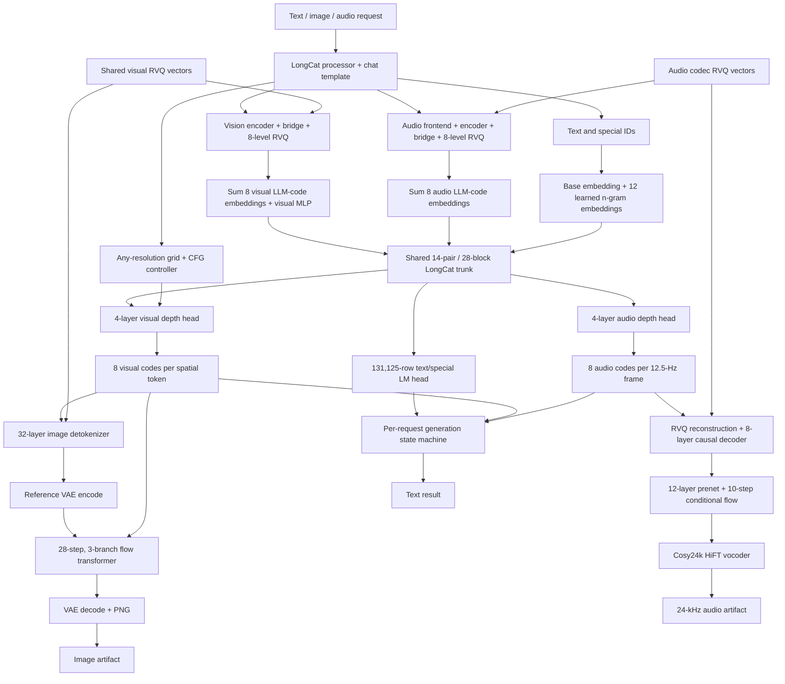
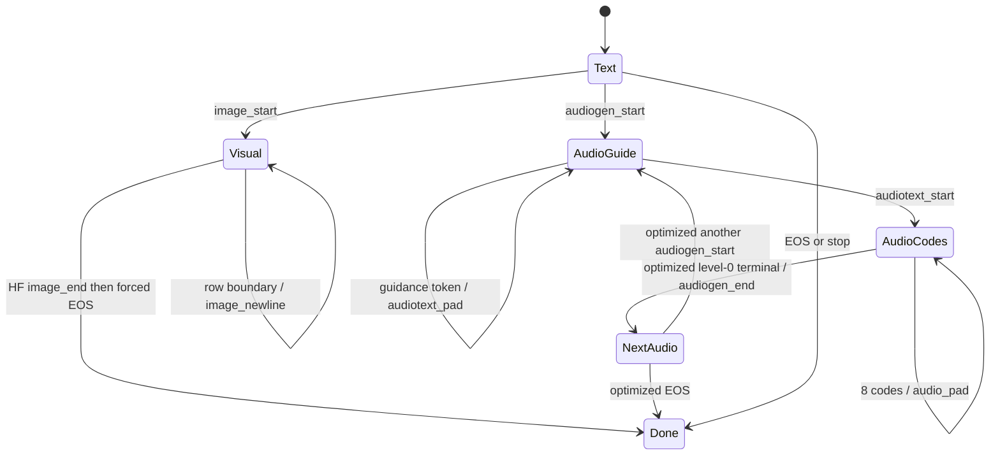

# Technical feasibility audit: full LongCat-Next support in llama.cpp

**Audit date:** 2026-07-25  
**Scope:** conversion/loading, text, learned n-gram embedding, MTP/speculation, image input/output, audio input/output, and OpenAI-compatible `llama-server` integration  
**Baseline:** the supplied `longcat-mtp` branch implementing LongCat-Flash-Lite  
**Implementation status:** analysis only; no support code was implemented

## 1. Executive decision

Full LongCat-Next support is technically feasible as a staged, multi-component
llama.cpp project, with one material exception: **native trained MTP for the released
LongCat-Next checkpoint is not feasible because the official checkpoint publishes no
MTP weights**. The mandatory learned `NgramEmbedding` is present and is feasible; it
is a different mechanism from MTP and from llama.cpp's optional prompt n-gram
speculation.

| Requested capability | Decision | Confidence | Principal condition |
|---|---|---:|---|
| 1. GGUF conversion and loading | **GO** | High | New `longcat-next` architecture, three vocabulary extents, sidecar schema, streamed conversion |
| 2. LongCat text inference | **GO** | High | Adapt the existing Flash-Lite graph rather than rewrite it |
| 3a. Mandatory learned n-gram embedding | **GO** | High | Implement Next's ignored-ID/zero-boundary semantics exactly |
| 3b. Generic llama.cpp n-gram speculation | **GO, text-mode only** | Medium-high | Disable at every modal transition and throughout modal depth generation |
| 3c. Native trained LongCat-Next MTP | **NO-GO for released weights** | Very high | Reopen only if Meituan publishes a checkpoint-matched MTP sidecar |
| 4. Image input and understanding | **GO, production-gated** | Medium-high | New dNaViT/RVQ MTMD encoder; exact preprocessing, RVQ, n-gram, and memory parity |
| 5a. Visual multi-ID generation | **GO for prototype; conditional GO for production** | Medium-high | New depth head/controller and optimized sentinel masking |
| 5b. Deterministic image decoding | **GO for prototype** | Medium | New 32-layer detokenizer; checkpoint header is a Stage-0 gate |
| 5c. Refiner + VAE image output | **NO-GO for initial production; conditional research GO** | Medium | External checkpoint header, 28-step/three-branch parity, VAE force-upcast, and performance gates |
| 6. Audio input and understanding | **GO for prototype; conditional GO for production** | Medium-high | New exact audio frontend, 32-layer encoder, bridge/RVQ MTMD backend |
| 7a. Speech synthesis and voice cloning | **GO for prototype; conditional GO for production** | Medium | New audio depth head, codec decoder, 10-step flow matching, HiFT vocoder |
| 7b. Guaranteed arbitrary music/SFX generation | **NO-GO as a product claim** | High | Official output path and examples establish speech/audio conversation, not a general music/SFX contract |
| 8a. OpenAI-compatible text/image/audio input | **GO incrementally** | High/medium | Existing typed input and transcription routes are reusable |
| 8b. OpenAI-compatible image/audio output | **CONDITIONAL GO** | Medium | `llama-server` currently has text-only output and needs new result/streaming routes |

The official Transformers quick start requires at least three 80 GB GPUs for BF16
loading ([official model README][hf-readme-hardware]). **Interactive all-GPU
residency** on roughly 96 GB VRAM requires quantization, selective precision, and
lazy component placement. A hybrid BF16/CPU-offload configuration can fit in
256 GB host RAM because llama.cpp supports partial GPU offload, but its latency is
an open measurement and is unlikely to be the preferred serving profile
([upstream server GPU/offload options][upstream-server-offload]). The recommended
interactive deployment is a Q5/Q4 text core plus F16/BF16 modality heads and
decoders loaded on demand.

## 2. Evidence standard and source lock

This report uses:

- **Verified fact** — directly present in one of the pinned official repositories,
  official model files/configuration/source, official llama.cpp, or the supplied fork.
- **Derived fact** — arithmetic or a tensor shape mechanically derived from verified
  fields and source expressions.
- **Engineering inference** — proposed GGUF names, packaging, implementation
  boundaries, memory budgets, risks, or feasibility conclusions.

Pinned primary sources:

| Source | Revision |
|---|---|
| `meituan-longcat/LongCat-Next` | `49dc718151f9943a9dca2c1169541934bb85d83e` |
| `meituan-longcat/LongCat-Next-inference` | `70ab100beecaaa77c1f45c0cf9ec89a4faf20fd8` |
| Official HF `meituan-longcat/LongCat-Next` model | `0cf0631862402ff36366e513e4023d22e7e5c84c` |
| Official HF `meituan-longcat/LongCat-Flash-Lite` model | `b62b68827ead0b7fef3ba98b57f18484acaaec06` |
| `ggml-org/llama.cpp` | `555881ebc8b0fc0402b30e09258a32a7bfd13c52` |
| Supplied fork, branch `longcat-mtp` | `ee1435a505ae6a4dda09abfd3e795c8760ba9eb5` |

This was a source/model-file audit. The supplied fork was inspected as the requested
reuse baseline but was not built or executed in this environment; the presence of
its tests is not evidence that numerical parity or every backend currently passes.
P1 below makes that validation an explicit gate.

The official model index contains 13,450 tensor names and reports
150,825,367,872 bytes for the 15-shard main checkpoint
([`model.safetensors.index.json`][hf-index]). The official HF model metadata
reports 74,257,230,752 parameters: 73,101,777,568 BF16 and 1,155,453,184 F32
([official model API][hf-model-api]). The separate image-decoder pointer is
10,248,311,818 bytes, and the separate `cosy24k_vocoder/hift.pt` pointer is
83,364,158 bytes ([image-decoder pointer][hf-output-lfs],
[HiFT pointer][hf-vocoder-lfs]). These file sizes are verified; quantized sizes
later in the report are estimates.

## 3. Complete component and dependency graph



The shared autoregressive trunk does not directly emit pixels or waveform samples.
It emits text/special-token logits or one eight-code vector through a modality depth
head. Generated modal codes are both fed back as the next autoregressive embedding and
sent to a modality detokenizer. This is the three-stage split described and
implemented by the official inference repository: input encoder, LLM core, and
task-aware output head/decoder.

## 4. Model components and their purpose

### 4.1 Shared processor, embedding, and trunk

| Component | Official class/function | Purpose |
|---|---|---|
| Chat/text processor | `LongcatNextProcessor` and official Jinja `chat_template` | Render LongCat roles/tools and replace media paths with placeholder spans |
| Audio frontend | `LongcatNextAudioProcessor` | Decode, resample, chunk, create 128-bin log-mel features and placeholder lengths |
| Shared embedding | `LongcatNextModel.embed_tokens` | 282,624 rows spanning text/special IDs plus eight audio and eight visual code ranges |
| N-gram state | `NgramCache` | Keep the prior three hashable IDs per sequence; map ignored multimodal IDs to zero |
| Learned n-gram embedding | `NgramEmbedding` | Add twelve learned 2/3/4-gram hash embeddings to the base embedding |
| Decoder trunk | `LongcatFlashNgramModel` | Construct 14 logical paired layers / 28 attention sub-blocks |
| MLA attention | imported `LongcatFlashDecoderLayer` path | Low-rank Q and compressed KV, with 64 RoPE and 128 non-RoPE dimensions per head |
| Routed branch | real MoE experts + identity experts | Top-12 routing over 256 learned experts plus 128 parameter-free identity choices |
| Dense branches | `mlps[0]`, `mlps[1]` | One SwiGLU dense MLP in each sub-block; delayed MoE shortcut joins the second |
| Text output | final RMSNorm + `lm_head` | Produce logits over the 131,125 text-plus-special surface |
| Modal depth head | `CasualDepthTransformerHead` | Generate eight codebook levels sequentially inside one outer AR step |
| Mode controller | `LongcatNextForCausalLMGenerationStatus` and `_sample` | Select text/visual/audio head, insert placeholders/control IDs, and collect modal code grids |

Verified dependency details:

- `LongcatNextModel` subclasses `LongcatFlashNgramModel` and instantiates both
  tokenizers in
  [`modeling_longcat_next.py`, `LongcatNextModel.__init__`][hf-next-model].
- Placeholder masking, n-gram embedding, media-embedding replacement, and n-gram
  cache update are in
  [`LongcatNextModel.forward`][hf-next-forward].
- The shared visual/audio depth-head implementation is
  [`CasualDepthTransformerHead`][hf-depth-head].
- The 256 learned plus 128 identity-expert behavior is independently explicit in the
  official SFT forward patch
  [`_deterministic_moe`][lc-sft-moe].

### 4.2 Vision components

| Component | Official class | Purpose |
|---|---|---|
| Image resize/patch preprocessing | HF declares `LongcatNextProcessor.image_processor_class = "Qwen2VLImageProcessor"`; optimized inference uses `OmniImageProcessor` | Produce LongCat's bicubic dynamic-resolution patch sequence and `grid_thw`; the encoder itself is Qwen2.5-VL-derived |
| Visual transformer | `VisualEncoder` | Qwen2.5-VL-style patch embedding, 2-D RoPE, window/full attention, 1,280-wide semantic features |
| Semantic/alignment bridge | `OmniVisualBridge` | Merge 2×2 spatial groups, normalize, project to 3,584-dimensional VQ space, undo window order |
| Visual RVQ | `VisualQuantizer` / `RQBottleneck` | Quantize every merged spatial token into eight residual levels with 16,384 valid codes each |
| LLM visual embedding bridge | `VisualEmbeddingBridge` | Sum eight 3,072-wide joint-embedding rows, then apply one LayerNorm/SwiGLU residual block |
| Visual depth head | `visual_head: CasualDepthTransformerHead` | Generate eight levels of 16,384 valid codes plus an extra output class, with image CFG |
| Coarse image detokenizer | `VisionTransformerDecoder` | Sum VQ code vectors, unmerge patches, run 32 layers with 2-D RoPE, predict RGB patch features |
| Refiner container | `ImageRefinerContainer` | Load conditioning projection, 32-layer diffusion transformer, refiner stacks, and VAE |
| Image refiner | `RefinerPipeline` | Encode coarse image to 16-channel latents; run 28 FlowMatch-Euler steps conditioned on visual codes; VAE-decode to image |

The input and output visual codebooks are the same residual representation, but the
3,584-dimensional VQ embeddings are not the same tensors as the 3,072-dimensional
joint LLM code embeddings. Both families must be retained.
The HF processor declaration and optimized `OmniImageProcessor` are separate
authoritative implementations; the latter makes the bicubic resize explicit
([`LongcatNextProcessor`][hf-processor-media],
[`OmniImageProcessor`][lcni-image-processor]).

### 4.3 Audio components

| Component | Official class | Purpose |
|---|---|---|
| Acoustic frontend | `LongcatNextAudioProcessor.extract_fbank_features` | 16-kHz, 400-point STFT, hop 160, 128-bin Slaney log-mel, Whisper-style normalization |
| Audio encoder | `LongcatNextAudioEncoder` | Two Conv1d+GELU stages and 32 non-causal 1,280-wide Whisper transformer layers |
| Temporal/VQ bridge | `LongcatNextAudioVQBridger` | Pool four encoder frames with gated SwiGLU, then eight residual nearest-codebook searches |
| Audio LLM embedding | `LongcatNextModel.get_audio_embeddings` | Sum eight globally offset 3,072-wide joint-embedding rows |
| Audio depth head | `audio_head: CasualDepthTransformerHead` | Generate one eight-code row per 12.5-Hz audio frame |
| Codec reconstruction | `LongcatNextAudioVQBridger.decode` | Sum eight 5,120-wide codec vectors and project to 1,280 |
| Causal audio decoder | `LongcatNextAudioDecoder` | Stride-4 transposed convolution, eight causal Whisper layers; expose pre-dconv2 hidden state |
| Flow prenet | `FlowmatchingPrenet` | Convert 1,280-wide decoder state through 12 causal layers to an 80-bin mel condition |
| Flow estimator | `ConditionalDecoder` + `ConditionalCFM` | Ten cosine/Euler flow steps with CFG over a causal 1-D U-Net/transformer estimator |
| Waveform vocoder | `Cosy24kVocoder` / `HiFTGenerator` | F0/source generation, ConvTranspose1d/Snake residual synthesis, ISTFT to 24-kHz speech |
| Segment combiner | `decode_save_concat2` | Decode terminal-delimited chunks and reproduce the published transition blend/concatenation |

The active published path uses the audio decoder state *before* its second
transposed convolution and postnet, then runs flow matching. The `vocoder_config`
16-kHz/hop-256 values describe the bypassed coarse path; final output is 24 kHz
through `Cosy24kVocoder`.

## 5. Configuration and tensor inventory

### 5.1 Shared configuration

All values in this table are verified in
[`config.json`][hf-config-json] and the construction/default logic in
[`configuration_longcat_next.py`][hf-config-py].

| Field | Value | Runtime meaning |
|---|---:|---|
| `architectures[0]` / `model_type` | `LongcatNextForCausalLM` / `longcat_next` | Converter/model registration |
| `vocab_size` | 282,624 | Full joint embedding rows |
| `text_vocab_size` | 131,072 | BPE vocabulary and n-gram polynomial base |
| `text_vocab_plus_multimodal_special_token_size` | 131,125 | Text LM-head and server token surface |
| `hidden_size` | 3,072 | LLM residual width |
| `num_layers` | 14 | Logical paired layers |
| effective attention sub-blocks | 28 | Two per logical layer |
| `num_attention_heads` | 32 | MLA Q/value heads |
| `q_lora_rank` / `kv_lora_rank` | 1,536 / 512 | MLA low-rank widths |
| `qk_nope_head_dim` / `qk_rope_head_dim` | 128 / 64 | Per-head non-positional/positional QK |
| `v_head_dim` | 128 | Per-head value width |
| `ffn_hidden_size` / `expert_ffn_hidden_size` | 6,144 / 1,024 | Dense/expert SwiGLU widths |
| `n_routed_experts` / `zero_expert_num` | 256 / 128 | Learned/identity experts; 384 router classes total |
| `moe_topk` / `routed_scaling_factor` | 12 / 6.0 | Routing |
| `rms_norm_eps` | `1e-5` | Trunk RMSNorm |
| `max_position_embeddings` | 131,072 | Published context |
| `rope_theta` / `rope_scaling` | 10,000,000 / absent | Plain RoPE, unlike Flash-Lite YaRN |
| `ngram_vocab_size_ratio` | 78 | N-gram table multiplier |
| `emb_neighbor_num` / `emb_split_num` | 4 / 4 | Orders 2–4, four hash splits each |
| `visual_offset` / `audio_offset` | 150,581 / 131,125 | Starts of visual/audio global code spans |

The three vocabulary extents are a load-time invariant, not interchangeable aliases:

1. **131,072** controls tokenizer BPE and n-gram hashing.
2. **131,125** controls text/special embedding exposure and `lm_head`.
3. **282,624** controls the serialized joint embedding and modal code ranges.

The official optimized loader independently confirms this split by truncating
`model.embed_tokens.weight` and `lm_head.weight` to 131,125 for the LLM core while
slicing modal rows separately
([`NmmFlashForCausalLM.load_weights`][lcni-nmm-flash],
[`LongcatOOverEmbContext`][lcni-context]).

### 5.2 Exact checkpoint-name counts

The official [`model.safetensors.index.json`][hf-index] yields:

| Family | Tensor names |
|---|---:|
| Text/trunk, including full joint embedding and LM head | 11,143 |
| Vision tokenizer | 425 |
| Visual depth head | 71 |
| Audio tokenizer/decoder/flow | 1,740 |
| Audio depth head | 71 |
| **Total** | **13,450** |
| `model.mtp.*` in LongCat-Next | **0** |
| `model.mtp.*` in LongCat-Flash-Lite | **17** |

Every one of the 11,143 LongCat-Next text tensor names exists name-for-name in
LongCat-Flash-Lite. The additional LongCat-Next tensors are modality components; the
Flash-Lite-only family is MTP.

### 5.3 Text tensor families and derived shapes

PyTorch `[out,in]` notation is used. Shapes are derived from the verified source
projections and configuration.

| Official family | Count | Shape |
|---|---:|---:|
| `model.embed_tokens.weight` | 1 | `[282624,3072]` |
| `lm_head.weight` | 1 | `[131125,3072]` |
| `model.norm.weight` | 1 | `[3072]` |
| `model.ngram_embeddings.embedders.i.weight` | 12 | `[10223616+2i+1,256]` |
| `model.ngram_embeddings.post_projs.i.weight` | 12 | `[3072,256]` |
| Q-A / Q-A norm / Q-B, per sub-block | 28 each | `[1536,3072]`, `[1536]`, `[6144,1536]` |
| KV-A / KV-A norm / KV-B, per sub-block | 28 each | `[576,3072]`, `[512]`, `[8192,512]` |
| attention output, per sub-block | 28 | `[3072,4096]` |
| input/post-attention norms | 28 input + 28 post-attention = 56 combined | `[3072]` |
| `mlps.{0,1}.{gate,up,down}` | 84 | gate/up `[6144,3072]`; down `[3072,6144]` |
| router classifier/correction, per logical layer | 14 each | `[384,3072]`, `[384]` |
| real expert gate/up/down | `14×256×3=10752` | gate/up `[1024,3072]`; down `[3072,1024]` |

Derived storage landmarks:

| Family | Parameters | BF16 payload |
|---|---:|---:|
| Twelve n-gram tables | 31,406,985,216 | 58.500 GiB |
| All learned expert matrices | 33,822,867,456 | 63.000 GiB |
| Full joint embedding | 868,220,928 | 1.617 GiB |
| Text/special embedding slice | 402,816,000 | 0.750 GiB |
| Text/special LM head | 402,816,000 | 0.750 GiB |
| Text family with full embedding | about 69.03B | about 128.58 GiB |

### 5.4 Vision configuration and tensor families

Verified configuration:

| Group | Fields |
|---|---|
| Input encoder | hidden 1,280; 32 blocks; 16 heads; FFN 3,420; full attention at 7/15/23/31, otherwise window 112; Qwen2.5-VL-derived patch/window attention; spatial merge 2 |
| Visual VQ | depth 8; eight codebooks, each 16,384; shared residual codebook; code dimension/in channels 3,584; quant projection enabled |
| LLM embedding bridge | hidden 3,072; intermediate 8,192; SiLU |
| Visual depth head | dimension 2,048; 4 layers; FFN scale 16; 16 attention heads |
| Image grid control | start 131106; end 131107; pad 131108; newline 131109 |
| Coarse decoder | hidden 1,024; intermediate 2,730; 32 layers; 16 heads; patch 14; spatial merge 2; distillation taps 3/7/15/23 |
| Diffusion transformer | patch 2; latent channels 16; hidden 2,520; 32 joint blocks plus 2 noise, 2 reference-image, and 2 context refiner blocks (38 instances); 21 Q heads/7 KV heads; 3-axis RoPE `[40,40,40]`; text feature 2,048 |
| VAE | blocks `[128,256,512,512]`; latent 16; group norm 32; sample size 1,024; scale 0.3611; shift 0.1159 |
| Scheduler | 1,000 train steps; dynamic shift; 28 inference steps in `RefinerPipeline` |
| Default image generation | 37×37 code grid; CFG 3; temperature .5; top-p .75; top-k 1,024 |

The 496 official vision names comprise `model.visual_tokenizer.*` (425) and
`visual_head.*` (71). Converter-driving families are:

- `visual_model.patch_embed.*`, `visual_model.blocks.{i}.*`;
- `visual_bridge_model.bridge.{ln_q,mlp}.*`;
- `visual_bridge_model.quantizer.{quant_conv,quantize.codebooks}.*`;
- `visual_embedding_layer.pre_buffer.{pre_layernorm,mlp}.*`;
- `visual_head.{hidden_norm,hidden_proj,transformer_layers,headnorm,heads}.*`.

The external image-decoder file has no published safetensors index. In this audit it
is available only as a 10,248,311,818-byte LFS pointer, so its exact tensor
names/shapes/dtypes are **not checkpoint-verified**. Official load filters verify
only the top-level families:

- `image_decoder.*`, expected from `VisionTransformerDecoder`;
- `image_refiner.base_transformer.*`, expected to contain patch/time/caption
  embeddings, 2+2+2 refiners, 32 joint blocks, output norm/projection;
- `image_refiner.cond_proj.*`;
- `image_refiner.vae.*`, an `AutoencoderKL` state dict.

Everything below those prefixes is class/config-derived until the LFS safetensors
header is fetched and inventoried. That header is a hard P0 gate: conversion and
production support must not rely on guessed Diffusers names
([`VisionTransformerDecoder.from_pretrained`][hf-visual-decoder],
[`ImageRefinerContainer.from_pretrained`][hf-refiner-load]).

### 5.5 Audio configuration and tensor families

| Group | Verified fields |
|---|---|
| Frontend | librosa decode; stereo mean; linear resample to 16,000; centered Hann FFT 400; hop 160; squared magnitude; 128-bin Slaney mel; max 30 s; zero chunk overlap |
| Encoder | `d_model=1280`; 32 layers; 20 heads; FFN 5,120; Conv1d kernel 3; stride 2 |
| Bridge/RVQ | pool 4; sizes `[8192,4096,2048,1024,1024,1024,1024,1024]` |
| Depth head | dimension 3,072; 4 layers; FFN scale 16; 24 heads |
| Decoder | 8 causal layers; 20 heads; FFN 5,120; transposed-conv kernel 3, strides 4 then 2 |
| Flow prenet | 1,280→2,048→512 (SiLU), then bias-free 512→80; 12 layers; 8 heads; FFN 2,048 |
| Conditional flow | 80 noise + 80 condition channels; residual width 256; one down + 12 mid + one up group, each with 4 transformer blocks; attention inner width 8×64; 10 steps; CFG .7; cosine Euler |
| Final vocoder | 80 mel bins; 24 kHz; HiFT with F0 predictor; upsample `[8,5,3]`; ISTFT FFT 16/hop 4 |

Exact audio-related index count is 1,811. Important families and derived inference
sizes:

| Component | Names/families | Derived parameters | BF16 planning payload |
|---|---|---:|---:|
| Audio depth head | 71 names | 1.428B | 2.857 GB |
| Audio encoder | convs, position, `32×15` block tensors, final LN | 0.637B | 1.274 GB |
| Bridge + inference VQ | gate/up/down, LN, projection, eight `embed` tables | 0.185B | 0.370 GB |
| Audio decoder | dconv/GN, position, `8×15` blocks, postnet | 0.168B | 0.335 GB |
| Flow prenet | MLP, position, 12 blocks, norms/output | 0.044B | 0.088 GB |
| Conditional flow estimator | time MLP, down/mid/up/final | 0.071B | 0.142 GB |
| Audio stack before external vocoder | stored components; inference-only VQ; includes 208,896 depth-FFN bias scalars that the published forward does not read | 2.533B | 5.066 GB |
| Joint LLM audio span | 19,457 rows × 3,072 | 0.060B | 0.120 GB |

The RVQ checkpoint also stores `cluster_size` and `embed_avg` training-state tensors
at every level. Inference reads `embed`; the other two can be omitted from
inference-only GGUFs after a manifest-level assertion.

The external `cosy24k_vocoder/hift.pt` is available in this audit only as an
83,364,158-byte LFS pointer, not an inspectable state dict. Its logical tensor
families and topology are source-verified through `Cosy24kVocoder`/`HiFTGenerator`,
but exact checkpoint names/shapes/dtypes remain a P0 inventory gate
([`Cosy24kVocoder` loader][hf-vocoder-load]). The 1,811 main-checkpoint audio names
above are checkpoint-verified; the external vocoder inventory is not.

Global audio offsets are
`[131125,139317,143413,145461,146485,147509,148533,149557]`.
Only level-0 local ID 8,192 is the audio terminal. Boundary rows overlap the next
codebook's row zero; the final audio boundary 150,581 equals `visual_offset`. Offset
arrays must therefore be serialized explicitly and validated, not reconstructed from
an assumed `size+1` gap.

The contiguous joint-embedding audio span has 19,457 unique rows. Eight local
`C_l+1` conditioning tables contain 19,464 rows in total because seven boundary
rows are intentionally shared. Conversion must distinguish the unique LLM span
from level-local depth-head tables; extracting only `C_l` rows would drop terminal
or boundary IDs needed by the output head.

## 6. LongCat-Next generation state machine

The canonical semantic reference is
[`LongcatNextForCausalLMGenerationStatus`, `prepare_inputs_for_generation`,
`get_multimodal_logits_and_ids`, and `_sample`][hf-next-generate]. The official
SGLang-oriented runtime uses a second, operational state machine in
[`modules/state_machine.py`][lcni-state] with control details in
[`modules/output_processor.py`][lcni-output]. Both should become golden traces.



The `Visual → Done` edge is canonical Transformers behavior. `NextAudio` is specific
to the optimized inference runtime; it is not a claim that the two source runtimes
share one identical outer loop.

### 6.1 Common outer-step contract

1. At decode iteration `t`, the trunk consumes the token/embedding selected at
   `t-1`; `prepare_inputs_for_generation` examines that last outer token.
2. The state determines whether the current trunk hidden state is sent to `lm_head`,
   `visual_head`, `audio_head`, or two heads concurrently.
3. A modal depth head performs **eight inner autoregressive levels**. Level `l`
   receives the trunk hidden state plus cumulative embeddings of levels `<l`, then
   samples its own `C_l+1` logits.
4. The eight local IDs are offset into the joint vocabulary and stored in a separate
   modal-code buffer. The outer text stream receives only a placeholder/control ID.
5. On the next outer step, the modal code rows are summed into a 3,072-wide embedding
   and replace or augment the placeholder's ordinary embedding.
6. The learned n-gram path never sees raw modal code IDs. It sees zero/pad at modal
   positions, except aligned audio-guidance text positions that may carry ordinary
   text IDs.

### 6.2 Text state

- Produce 131,125 text/special logits.
- Ordinary EOS/stop behavior applies.
- `<longcat_img_start>` (131106) causes visual entry on the next iteration.
- `<longcat_audiogen_start>` (131123) causes audio entry.
- `<longcat_audiotext_start>` (131120) is an internal audio scheduling control; it
  enables code generation but does not itself create the outer audio mode.
- Generic prompt n-gram speculation may operate only here and must stop before a
  transition token is committed.

### 6.3 Visual state

On entry:

- reset `current_image_token_num=0`;
- format and insert
  `<longcat_img_token_size>{h} {w}</longcat_img_token_size>` before the start token;
- duplicate the sequence into conditional/unconditional rows when CFG is enabled;
  the unconditional prefix is zeroed as in the official source.

At a content position:

- run visual depth levels 0…7;
- each level exposes 16,385 logits: valid RVQ IDs 0…16,383 plus local sentinel
  16,384;
- apply `cfg_scale*(cond-uncond)+uncond` at each level;
- force conditional and unconditional rows to use the same sampled code;
- append the eight global visual IDs to `visual_ids`;
- feed outer `<longcat_img_pad>` (131108).

The optimized official runtime masks local ID 16,384 and synchronizes the CFG pair;
the HF reference does not apply that mask. llama.cpp should follow the optimized
behavior and never send sentinel 16,384 to the RVQ decoder
([`output_processor.py`][lcni-output]).

Grid control is host-driven, not predicted by the visual head. For width `w`, every
`w+1`th outer position is `<longcat_img_newline>` (131109). At exactly `h` rows, emit
`<longcat_img_end>` (131107), return to text, append EOS, and terminate the canonical
Transformers generation. For the published 37×37 grid this is 1,369 eight-code
positions plus 36 newline controls and one end control: 1,406 outer AR positions
after image start and 10,952 depth-head evaluations, with paired CFG trunk rows
(derived).

### 6.4 Audio state

The audio path has two coupled streams:

- an LM-head guidance/transcript stream in `audio_text_ids`;
- an eight-code audio stream in `audio_ids`.

Serial mode, the published default:

1. `<longcat_audiogen_start>` resets guidance-end and audio-start flags.
2. The LM head generates guidance text. The outer stream carries
   `<longcat_audiotext_pad>` placeholders while the real guidance IDs are stored
   separately.
3. The first generated audiotext-pad marks guidance completion.
4. The controller emits `<longcat_audiotext_start>`; on the following iteration
   `is_audio_start=true`.
5. Every audio-code outer step runs all eight head levels, appends one code row, and
   feeds `<longcat_audio_pad>` (131105).
6. A level-0 local ID of 8,192 terminates the segment and emits
   `<longcat_audiogen_end>` (131124).
7. The Transformers path returns to text. The optimized state machine may enter
   `NEXT_AUDIO_STAGE`, where EOS aborts or another audiogen-start begins a new
   segment.

Parallel mode schedules audiotext-start before guidance is complete and can evaluate
the text and audio heads in the same outer interval. It is a separate correctness
surface and should follow serial parity.

### 6.5 Required llama.cpp state per sequence

**Engineering inference:** each llama sequence/slot needs:

- `mode`, `last_mode`, visual grid/counter, CFG pairing;
- audio guidance-end, audio-start, serial/parallel delay, segment counter;
- visual/audio code matrices and eight per-level repetition histories;
- the three-token learned n-gram history;
- pending outer control token and separately streamable guidance text;
- component availability and deterministic RNG streams.

State must participate in sequence copy, removal, shifting, prefix-cache restore,
slot reset, speculative accept/reject, cancellation, and batching. A token-only
rollback is insufficient because counters and modal code rows also change.

## 7. Learned n-gram, generic n-gram speculation, and MTP

These are three distinct mechanisms.

### 7.1 Mandatory learned `NgramEmbedding`

Verified algorithm from
[`NgramCache`, `EmbeddingWithMask`, and `NgramEmbedding`][hf-ngram]:

1. Keep the prior `n-1=3` IDs per sequence.
2. Replace IDs 131072…131124 with zero in history.
3. Treat zero and EOS 2 as segment boundaries.
4. For n-gram orders 2, 3, and 4, compute four polynomial hashes using base 131,072.
5. Table `i` has `78×131072 + 2i + 1` rows and width 256.
6. A zero hash is masked to the zero vector; it is not a lookup of learned row zero.
7. Project all twelve vectors to 3,072 and add them to the base embedding.
8. Divide ordinary text positions by 13. Ignored special positions keep their
   unscaled base/control embedding and skip the twelve learned contributions.

This is part of every correct forward pass. It is not speculative decoding.

### 7.2 Generic llama.cpp prompt n-gram speculation

This is weight-free target-verified drafting. It is feasible for the text state using
upstream/fork speculative infrastructure. It must be disabled:

- throughout visual/audio depth-code generation;
- on or immediately before modal control tokens;
- while conditional/unconditional CFG rows are coupled;
- across image newline/end insertion and audio segment boundaries.

Acceptance/rollback must include the LongCat state object, not only KV tokens.

### 7.3 Native learned MTP

Verified checkpoint evidence:

- LongCat-Next's official model index contains zero `model.mtp.*` names.
- `LongcatNextModel` and `LongcatNextForCausalLM` both set
  `_keys_to_ignore_on_load_unexpected = [r"model\.mtp.*"]`.
- The official Flash-Lite index contains exactly 17 MTP names: its auxiliary
  embedding/norm, `eh_proj`, `enorm`, `hnorm`, one MLA block, and one dense MLP.
- The supplied fork converts those tensors and implements their one-block graph in
  [`LongcatFlashNgramModel._remap_mtp_tensor`][fork-converter-mtp] and
  [`graph_mtp::graph_mtp`][fork-model-mtp].

**Conclusion:** a generation algorithm cannot manufacture absent trained weights.
Flash-Lite MTP tensors are not compatible merely because their shapes fit: the target
trunk weights, vocabulary surface, RoPE/context, and hidden distribution differ.
Native LongCat-Next MTP is therefore a hard no-go for the released checkpoint.

The existing MTP graph is a useful future implementation template only if a
LongCat-Next-specific auxiliary checkpoint is released or separately trained and
bound to an exact base-model fingerprint.

## 8. Comparison with the supplied LongCat-Flash-Lite implementation

### 8.1 Verified structural equality

This table compares the pinned official Next and Flash-Lite configurations and
checkpoint indexes, then classifies the supplied fork's implementation boundary
([Next config][hf-config-json], [Flash-Lite config][hf-lite-config],
[Next index][hf-index], [Flash-Lite index][hf-lite-index]).

| Property | Flash-Lite | LongCat-Next | Reuse result |
|---|---:|---:|---|
| hidden width | 3,072 | 3,072 | unchanged |
| logical/effective blocks | 14 / 28 | 14 / 28 | unchanged |
| attention heads | 32 | 32 | unchanged |
| Q/KV ranks | 1,536 / 512 | 1,536 / 512 | unchanged |
| QK no-RoPE/RoPE | 128 / 64 | 128 / 64 | unchanged |
| V head | 128 | 128 | unchanged |
| dense/expert FFN | 6,144 / 1,024 | 6,144 / 1,024 | unchanged |
| learned/identity experts | 256 / 128 | 256 / 128 | unchanged |
| top-k / scale | 12 / 6 | 12 / 6 | unchanged |
| n-gram neighbor/split/ratio | 4 / 4 / 78 | 4 / 4 / 78 | math topology unchanged |
| context | 327,680 | 131,072 | metadata change |
| RoPE | base 5M, YaRN ×10 | base 10M, no scaling | graph parameters change |
| token extent | 131,072 | 131,072 / 131,125 / 282,624 | loader/converter change |
| ignored n-gram IDs | none | 131072…131124 | graph/history change |
| MTP | 17 tensors | none | disable for Next |
| vision/audio | absent | present | entirely new model/controller paths |

The fork differs from the pinned upstream in 29 files, adding the converter,
LongCat model graph, GGUF schema/mappings, tokenizer handling, n-gram/router tests,
MTP graph/driver integration, and CUDA duplicate-ID `MUL_MAT_ID` corrections.

### 8.2 Code reusable algorithmically unchanged

Subject to rebase and numerical tests:

- `LongcatFlashNgramModel._remap_double_block`;
- logical 14-layer to physical 28-block mapping;
- KV-B split into K-B and V-B layouts;
- stacking 256 individual learned experts into GGUF 3-D tensors;
- all trunk MLA/norm/dense/router/expert tensor mappings;
- absorbed MLA graph, Q/KV rank scaling, compressed KV cache;
- paired even/odd residual schedule and delayed MoE shortcut;
- correction-bias-for-selection versus unbiased-probability-for-weight routing;
- identity-expert residual aggregation;
- final RMSNorm and text projection;
- CUDA duplicate-ID `MUL_MAT_ID` corrections, if still applicable after rebase;
- `tests/test-longcat-router.cpp` and Flash-Lite n-gram regression cases;
- generic llama.cpp sampler, KV, quantization, split-GGUF, offload, and scheduler
  infrastructure;
- upstream MTMD byte/media ingestion, miniaudio/image decoding, and low-level
  FFT/mel helpers;
- upstream Whisper encoder graph skeleton;
- upstream WAV writing, ISTFT, Conv1d/Conv2d and transposed-convolution precedents.

File/function anchors are
[`conversion/longcat_flash_ngram.py`][fork-converter],
[`llama_model_longcat_flash_ngram::graph::graph`][fork-model-main],
[`llm_graph_build_longcat_moe_route`][fork-router], and the fork's
[`LongCat tests`][fork-tests].

### 8.3 Code requiring adaptation

1. Register `LongcatNextForCausalLM` and a distinct `LLM_ARCH_LONGCAT_NEXT`.
2. Separate tokenizer/hash, LM-head, and full-embedding extents.
3. Size n-gram tables from 131,072 rather than `n_vocab`.
4. Add ignored-ID masking, zero/EOS boundaries, masked row-zero, and conditional
   `/13` normalization.
5. Connect n-gram history and modal controller to every sequence lifecycle operation.
6. Use 10M-base plain RoPE and a 131,072 context; do not inherit Flash YaRN.
7. Export the official Jinja template and 53 added special IDs correctly.
8. Split/store joint audio/visual embedding ranges in component files.
9. Expose the final trunk hidden state to text and modal heads.
10. Make output tensor rows 131,125 even when a full or sliced input embedding has a
    different row count.
11. Gate all speculative methods by LongCat generation state.
12. Rebase/audit duplicate-expert-ID behavior on every enabled backend, not CUDA only.
13. Adapt MTMD embedding injection and the audio frontend. Upstream MTMD constructs
    embedding-only batches with `token == nullptr`, while the fork's
    `llm_graph_input_ngram::set_input` immediately returns in that case. Next needs
    original token identity for n-gram zeroing/history **and** a final media
    embedding override (or graph-level injection); splitting the prompt into token
    and embedding batches changes post-media n-gram history and is incorrect
    ([upstream `mtmd-helper.cpp`][upstream-mtmd-batch],
    [fork `llama-graph.cpp`][fork-ngram-input]).
14. Match LongCat's exact audio Slaney/centered-STFT/drop-last/valid-zero behavior;
    generic MTMD mel output is only a building block.

### 8.4 Entirely new llama.cpp/GGML-facing functionality

- visual and audio GGUF converters/loaders;
- LongCat MTMD encoder implementations returning exact 3,072-wide embeddings;
- eight-level reusable visual/audio depth-head graph and sampling driver;
- multimodal per-sequence state machine and code-grid buffers;
- visual CFG pair scheduling;
- image detokenizer/refiner/VAE runtime;
- audio codec decoder/flow/HiFT runtime;
- bundle manifests, lazy component loading, base-model fingerprint validation;
- non-text output results, streaming/cancellation, PNG/WAV encoding, model capability
  negotiation;
- specialized LongCat tool/reasoning parser if the generic differential autoparser
  fails the official XML-format golden tests.

No new primitive is mandatory for the text trunk. Most “new GGML work” is graph
construction, host scheduling, and optional performance kernels.

## 9. Required GGUF architecture keys and packaging metadata

The following is an **engineering proposal**. Keys already represented by the
baseline/upstream GGUF schema should use their normal architecture-templated spelling
under `longcat-next`; modality and bundle keys are new.

### 9.1 Core keys

```text
general.architecture                                  = "longcat-next"
longcat-next.context_length                           = 131072
longcat-next.embedding_length                         = 3072
longcat-next.block_count                              = 28
longcat-next.feed_forward_length                      = 6144
longcat-next.attention.head_count                     = 32
longcat-next.attention.head_count_kv                  = 1
longcat-next.attention.layer_norm_rms_epsilon         = 1e-5
longcat-next.attention.q_lora_rank                    = 1536
longcat-next.attention.kv_lora_rank                   = 512
longcat-next.attention.key_length                     = 576
longcat-next.attention.value_length                   = 512
longcat-next.attention.key_length_mla                 = 192
longcat-next.attention.value_length_mla               = 128
longcat-next.rope.dimension_count                     = 64
longcat-next.rope.freq_base                           = 10000000
longcat-next.expert_feed_forward_length               = 1024
longcat-next.expert_count                             = 256
longcat-next.expert_zero_count                        = 128
longcat-next.expert_used_count                        = 12
longcat-next.expert_weights_scale                     = 6.0
longcat-next.leading_dense_block_count                = 0
longcat-next.ngram.neighbor_num                       = 4
longcat-next.ngram.split_num                          = 4
longcat-next.ngram.vocab_size_ratio                   = 78
```

Required new disambiguation keys:

```text
longcat-next.text_vocab_size                          = 131072
longcat-next.text_special_vocab_size                  = 131125
longcat-next.full_embedding_size                      = 282624
longcat-next.ngram.base_vocab_size                    = 131072
longcat-next.ngram.ignored_token_id_start             = 131072
longcat-next.ngram.ignored_token_id_count             = 53
```

There must be **no** `nextn_predict_layers` key in a GGUF converted from the released
LongCat-Next checkpoint.

### 9.2 Modal/control keys

```text
longcat-next.visual.offset                            = 150581
longcat-next.visual.codebook_sizes                    = [16384 x 8]
longcat-next.visual.codebook_offsets                  = [150581,166965,...,265269]
longcat-next.visual.{start,end,pad,newline}_token_id
longcat-next.visual.default_token_h                   = 37
longcat-next.visual.default_token_w                   = 37
longcat-next.visual.head.logit_sizes                  = [16385,16385,16385,16385,16385,16385,16385,16385]
longcat-next.visual.head.extra_class_policy           = "mask"

longcat-next.vision.encoder.embedding_length          = 1280
longcat-next.vision.encoder.block_count               = 32
longcat-next.vision.encoder.head_count                = 16
longcat-next.vision.encoder.feed_forward_length       = 3420
longcat-next.vision.encoder.full_attention_blocks     = [7,15,23,31]
longcat-next.vision.encoder.window_size               = 112
longcat-next.vision.patch_size                        = 14
longcat-next.vision.temporal_patch_size               = 2
longcat-next.vision.spatial_merge_size                = 2
longcat-next.vision.processor.resize                  = "bicubic"
longcat-next.vision.processor.min_pixels              = 50176
longcat-next.vision.processor.max_pixels              = 3211264
longcat-next.vision.processor.min_merged_tokens       = 64
longcat-next.vision.processor.max_merged_tokens       = 4096
longcat-next.vision.processor.mean                    = [0.48145466,0.4578275,0.40821073]
longcat-next.vision.processor.std                     = [0.26862954,0.26130258,0.27577711]
longcat-next.vision.rvq.depth                         = 8
longcat-next.vision.rvq.dimension                     = 3584
longcat-next.vision.rvq.shared                        = true
longcat-next.vision.rvq.valid_rows                    = 16384
longcat-next.vision.rvq.stored_rows                   = 16385
longcat-next.vision.rvq.search_dtype                  = "f32"
longcat-next.vision.llm_bridge.feed_forward_length    = 8192
longcat-next.vision.llm_bridge.activation             = "silu"
longcat-next.vision.head.embedding_length             = 2048
longcat-next.vision.head.block_count                  = 4
longcat-next.vision.head.head_count                   = 16
longcat-next.vision.head.feed_forward_scale           = 16

longcat-next.audio.offset                             = 131125
longcat-next.audio.codebook_sizes                     = [8192,4096,2048,1024,1024,1024,1024,1024]
longcat-next.audio.codebook_offsets                   = [131125,139317,143413,145461,146485,147509,148533,149557]
longcat-next.audio.head.logit_sizes                   = [8193,4097,2049,1025,1025,1025,1025,1025]
longcat-next.audio.head.terminal_level                = 0
longcat-next.audio.head.terminal_id                   = 8192
longcat-next.audio.{start,end,pad,delim}_token_id
longcat-next.audio_text.{start,end,pad}_token_id
longcat-next.audio_generation.{start,end}_token_id

longcat-next.audio.processor.sample_rate              = 16000
longcat-next.audio.processor.fft_size                 = 400
longcat-next.audio.processor.hop_length               = 160
longcat-next.audio.processor.mel_bins                 = 128
longcat-next.audio.processor.max_seconds              = 30
longcat-next.audio.processor.split_overlap            = 0
longcat-next.audio.encoder.embedding_length           = 1280
longcat-next.audio.encoder.block_count                = 32
longcat-next.audio.encoder.head_count                 = 20
longcat-next.audio.encoder.feed_forward_length        = 5120
longcat-next.audio.encoder.position_count             = 1500
longcat-next.audio.encoder.conv_stride                = 2
longcat-next.audio.bridge.pool_size                   = 4
longcat-next.audio.rvq.dimension                      = 5120
longcat-next.audio.rvq.search_dtype                   = "f32"
longcat-next.audio.head.embedding_length              = 3072
longcat-next.audio.head.block_count                   = 4
longcat-next.audio.head.head_count                    = 24
longcat-next.audio.head.feed_forward_scale            = 16
```

The image-output sidecar additionally needs the following class-instantiation
metadata, independent of exact tensor names:

```text
longcat-next.image_decoder.embedding_length           = 1024
longcat-next.image_decoder.feed_forward_length        = 2730
longcat-next.image_decoder.block_count                = 32
longcat-next.image_decoder.head_count                 = 16
longcat-next.image_decoder.patch_size                 = 14
longcat-next.image_decoder.spatial_merge_size         = 2
longcat-next.image_decoder.distill_taps               = [3,7,15,23]
longcat-next.image_refiner.patch_size                 = 2
longcat-next.image_refiner.latent_channels            = 16
longcat-next.image_refiner.embedding_length           = 2520
longcat-next.image_refiner.block_count                = 32
longcat-next.image_refiner.refiner_block_count        = 2
longcat-next.image_refiner.head_count                 = 21
longcat-next.image_refiner.head_count_kv              = 7
longcat-next.image_refiner.rope.axes_dims             = [40,40,40]
longcat-next.image_refiner.rope.axes_lengths          = [10000,10000,10000]
longcat-next.image_refiner.text_feature_length        = 2048
longcat-next.image_refiner.timestep_scale             = 1000
longcat-next.image_refiner.inference_steps            = 28
longcat-next.image_refiner.text_guidance              = 1.5
longcat-next.image_refiner.image_guidance             = 1.5
longcat-next.image_refiner.vae.block_channels         = [128,256,512,512]
longcat-next.image_refiner.vae.latent_channels        = 16
longcat-next.image_refiner.vae.group_count            = 32
longcat-next.image_refiner.vae.scaling_factor         = 0.3611
longcat-next.image_refiner.vae.shift_factor           = 0.1159
longcat-next.image_refiner.vae.force_upcast           = true
```

The audio-output sidecars need decoder, flow, and vocoder configuration keys for
the eight-layer 1,280-wide codec decoder; 12-layer/512-wide prenet; conditional
flow down/mid/up topology, 100-frame static chunk mask, ten Euler steps, CFG 0.7;
and HiFT 24-kHz output, `[8,5,3]` upsampling, FFT 16, hop 4, and Snake/F0 settings.
These should be serialized as individual numeric/array keys, not an opaque JSON
blob.

Sidecar/bundle keys should include:

```text
longcat-next.bundle.uuid
longcat-next.bundle.schema_version
longcat-next.component.role
longcat-next.component.requires[]
longcat-next.base.config_sha256
longcat-next.base.tokenizer_sha256
longcat-next.base.tensor_manifest_sha256
```

Loaders must fail closed if fingerprints, codebook offsets/sizes, hidden width, or
special-token IDs differ.

## 10. Required GGUF tensor mappings

### 10.1 Core/trunk

| Official tensor | GGUF tensor |
|---|---|
| `model.embed_tokens.weight[:131125]` | `token_embd.weight` |
| `model.norm.weight` | `output_norm.weight` |
| `lm_head.weight` | `output.weight` |
| `model.ngram_embeddings.embedders.i.weight` | `ngram_embd.i.weight` |
| `model.ngram_embeddings.post_projs.i.weight` | `ngram_proj.i.weight` |

For logical layer `l`, sub-block `s`, let `b=2l+s`:

| Official suffix | GGUF suffix |
|---|---|
| `input_layernorm.s.weight` | `blk.b.attn_norm.weight` |
| `post_attention_layernorm.s.weight` | `blk.b.ffn_norm.weight` |
| `self_attn.s.q_a_proj.weight` | `blk.b.attn_q_a.weight` |
| `self_attn.s.q_a_layernorm.weight` | `blk.b.attn_q_a_norm.weight` |
| `self_attn.s.q_b_proj.weight` | `blk.b.attn_q_b.weight` |
| `self_attn.s.kv_a_proj_with_mqa.weight` | `blk.b.attn_kv_a_mqa.weight` |
| `self_attn.s.kv_a_layernorm.weight` | `blk.b.attn_kv_a_norm.weight` |
| K split of `self_attn.s.kv_b_proj.weight` | `blk.b.attn_k_b.weight` |
| V split of `self_attn.s.kv_b_proj.weight` | `blk.b.attn_v_b.weight` |
| `self_attn.s.o_proj.weight` | `blk.b.attn_output.weight` |

Even block `b=2l`:

| Official tensor | GGUF tensor |
|---|---|
| `mlp.router.classifier.weight` | `blk.b.ffn_gate_inp.weight` |
| `mlp.router.e_score_correction_bias` | `blk.b.exp_probs_b.bias` |
| stacked `mlp.experts.*.gate_proj.weight` | `blk.b.ffn_gate_exps.weight` |
| stacked `mlp.experts.*.up_proj.weight` | `blk.b.ffn_up_exps.weight` |
| stacked `mlp.experts.*.down_proj.weight` | `blk.b.ffn_down_exps.weight` |
| `mlps.0.{gate,up,down}_proj.weight` | `blk.b.ffn_{gate,up,down}_shexp.weight` |

Odd block `b=2l+1` maps `mlps.1.{gate,up,down}_proj.weight` to
`blk.b.ffn_{gate,up,down}.weight`.

KV-B must retain the baseline split/layout: GGML K-B `{128,512,32}` and V-B
`{512,128,32}`. Conversion must stream expert stacking and validate that every source
name is consumed exactly once.

### 10.2 Modal code embeddings and depth heads

Instead of keeping a 282,624-row text-core tensor, extract:

```text
audio_llm_embd.codebook.{0..7}.weight
visual_llm_embd.codebook.{0..7}.weight
```

Visual slice `i` is exactly
`embed_tokens[150581+i*16384 : 150581+(i+1)*16384+1]`, shape
`[16385,3072]`. Adjacent slices intentionally overlap by one row. Audio slice `i`
is `embed_tokens[offset_i : offset_i+C_i+1]`; its eight local tables total
19,464 rows while the unique contiguous global span has 19,457 rows. The input
encoder sidecars may duplicate these spans to satisfy the existing MTMD “return
final LLM embeddings” interface
([`LongcatOOverEmbContext`][lcni-context]).

For `visual_head` or `audio_head`:

| Official family | Proposed GGUF family |
|---|---|
| `hidden_norm.weight` | `{modal}_head.input_norm.weight` |
| `hidden_proj.weight` | `{modal}_head.input_proj.weight` |
| `transformer_layers.b.layernorm1.weight` | `{modal}_head.blk.b.attn_norm.weight` |
| `transformer_layers.b.layernorm2.weight` | `{modal}_head.blk.b.ffn_norm.weight` |
| `self_attention.{q,k,v,out}_proj.*` | `{modal}_head.blk.b.attn_{q,k,v,output}.*` |
| `linear1.weight`, `linear2.weight` | `{modal}_head.blk.b.ffn_{up,down}.weight` |
| `headnorm.weight` | `{modal}_head.output_norm.weight` |
| `heads.l.{weight,bias}` | `{modal}_head.codebook.l.{weight,bias}` |

The published depth FFN forward reshapes and uses the two linear weights but not
their stored biases. Applying those biases would be a parity bug; converter policy
should either omit them with an assertion or keep them explicitly marked unused.
The FFN weights also implement depth-specific einsum slicing rather than an
ordinary one-matrix-up/one-matrix-down MLP; the runtime must preserve the official
reshape and batched-matmul semantics. Every level output has `C_l+1` logits.
Visual `+1` is masked in optimized generation; audio level-0 `+1` is the terminal
sentinel and the other audio extra rows remain part of local conditioning.

### 10.3 Vision input/output families

Proposed input mappings:

```text
model.visual_tokenizer.visual_model.*                    -> vision_enc.*
model.visual_tokenizer.visual_bridge_model.bridge.*      -> vision_bridge.*
...quantizer.quant_conv.*                                -> vision_vq.pre.*
...quantizer.quantize.codebooks.{l}.*                    -> vision_vq.codebook.{l}.*
...visual_embedding_layer.pre_buffer.*                   -> vision_llm_bridge.*
```

Converter-critical shapes/semantics are:

| Source family | Verified/class-derived storage | Conversion requirement |
|---|---|---|
| patch projection | Conv3d `[1280,3,2,14,14]`; flattened input row 1,176 | Preserve temporal/channel/spatial order for im2col or Conv3d lowering |
| encoder attention QKV | fused `[3840,1280]` (+ stored bias) | Split into Q/K/V or retain a fused projection consistently |
| encoder MLP | gate/up/down around 1,280 and 3,420 | Preserve Qwen2.5-VL SwiGLU layout |
| bridge norm/MLP | normalize 1,280; merge to 5,120; `5120→5120→3584` | Reproduce merge-before-MLP ordering and reverse window permutation |
| quant projection | LayerNorm and `3584→3584→3584` GELU | Keep before RVQ search |
| logical shared VQ | `.embed [16385,3584]` F32; valid search rows 0…16,383 | Exclude final sentinel row from nearest search |
| VQ training state | `.embed_ema [16384,3584]`, `.cluster_size_ema [16384]` | May be dropped only after manifest assertions |
| visual LLM prebuffer | LayerNorm/SwiGLU residual, `3072→8192→3072` | Preserve residual and activation |
| visual depth head | `3072→2048`; four layers; Q/K/V/out 2,048; `linear1 [32768,2048]`, `linear2 [2048,32768]`; eight `[16385,2048]` output heads | Preserve depth-einsum slicing and unused-bias policy |

`shared_codebook=true` is configuration-verified, but the main index exposes eight
physical codebook names. Do not deduplicate from module aliasing alone: hash-compare
all eight payloads first. The official input VQ class performs F32 search and stores
one extra row ([`VQEmbedding`/`RQBottleneck`][hf-visual-vq]).

External image output:

```text
image_decoder.*                    -> image_dec.*
image_refiner.cond_proj.*          -> image_refiner.cond.*
image_refiner.base_transformer.*   -> image_refiner.transformer.*
image_refiner.vae.*                -> image_refiner.vae.*
```

Those nested mappings are class-derived and must remain provisional until the
external safetensors header is inventoried. The coarse depth head/decoder attention
uses Q/V/output biases and no K bias; the latent refiner's Diffusers attention
constructors use neither projection nor output biases. Apply bias rules per
component, not globally ([`TransformerBlock`][hf-refiner-block]).
Keep decoder/refiner storage in F16/BF16 for parity, but honor the VAE
`force_upcast=true` runtime path and retain F32-sensitive operations. Preserve
GroupNorm/LayerNorm/RMSNorm parameters, 3-axis RoPE, VAE scale/shift, scheduler
data, and all three refiner stacks.

### 10.4 Audio input/output families

```text
model.audio_tokenizer.audio_model.*                     -> audio_enc.*
...audio_bridge_model.{gate,up,down}_proj.weight        -> audio_bridge.ffn_{gate,up,down}.weight
...audio_bridge_model.layer_norm.*                      -> audio_bridge.output_norm.*
...audio_bridge_model.proj_decoder.*                    -> audio_bridge.decoder_proj.*
...audio_bridge_model.vq_list.l.codebook.embed          -> audio_vq.codebook.l.weight
...audio_decoder.*                                      -> audio_dec.*
...audio_flow_matching_decoder.prenet.*                 -> audio_flow.prenet.*
...conditional_decoder.time_mlp.*                       -> audio_flow.time.*
...conditional_decoder.down_blocks.*                    -> audio_flow.down.*
...conditional_decoder.mid_blocks.*                     -> audio_flow.mid.*
...conditional_decoder.up_blocks.*                      -> audio_flow.up.*
...conditional_decoder.{final_block,final_proj}.*       -> audio_flow.{final_block,final_proj}.*
```

Drop audio VQ `cluster_size` and `embed_avg` in inference-only packages. Fold
weight-normalized `hift.pt` convolutions and map them into:

```text
vocoder.condnet.*              # F0 predictor and classifier
vocoder.m_source.l_linear.*
vocoder.conv_pre.*
vocoder.ups.*
vocoder.source_downs.*
vocoder.source_resblocks.*
vocoder.resblocks.*
vocoder.conv_post.*
vocoder.snake.*                # alpha parameters
```

Preserve Snake parameters and ISTFT/sample-rate metadata.

## 11. GGML operation coverage and missing kernels

### 11.1 Existing operations that cover the architecture

No published LongCat-Next component requires a fundamentally new mathematical
primitive. The official GGML API already exposes the required row lookup, matrix,
normalization, attention, convolution, resampling, and selection operations
([`ggml.h`: tensor/activation/matrix operations][ggml-core-ops],
[`ggml.h`: convolution/resampling/selection operations][ggml-media-ops]).

| LongCat-Next component | Implementable with existing GGML operations | Remaining engineering work |
|---|---|---|
| Joint/text/modal embeddings | `ggml_get_rows`, `ggml_add`, `ggml_mul` | Enforce three vocabulary extents and per-level offsets |
| Learned n-gram embedding | host-side hash/update + twelve `ggml_get_rows` + reduction | Persist per-sequence history across token and embedding batches |
| MLA Q/K/V | `ggml_mul_mat`, reshape/permute/contiguous, `ggml_rope`, `ggml_flash_attn_ext` | Port the existing Flash-Lite graph with Next metadata |
| Dense SwiGLU | `ggml_mul_mat`, `ggml_silu`, `ggml_mul` | None beyond tensor mapping |
| Routed and identity experts | `ggml_top_k`/`ggml_argsort_top_k`, `ggml_soft_max`, `ggml_mul_mat_id`, scatter/reduce | Retain the fork's duplicate-expert-ID backend fixes and validate every backend |
| Modal depth heads | RMSNorm, ordinary QKV attention, causal mask, SwiGLU, eight output projections | New controller and eight sequential substeps per outer token |
| Visual patch encoder | `ggml_im2col_3d` + `ggml_mul_mat` or a temporal-folded Conv2d, LayerNorm, attention, GELU/SwiGLU | Exact dynamic window ordering and 2-D position construction |
| Visual/audio residual VQ | `ggml_sqr`, row reductions, `ggml_mul_mat`, add, `ggml_argmax` on negated distance | A fused/tiled nearest-code kernel is desirable, not correctness-critical |
| Visual detokenizer | row lookup, Conv2d/im2col, attention, LayerNorm, 2-D RoPE, linear patch projection | New model graph and spatial restoration |
| Image refiner transformer | Conv2d/im2col, linear, RMSNorm/LayerNorm, attention, timestep embedding, SiLU/GELU, add/mul | 3-axis reset-frequency RoPE helper and host scheduler/controller |
| Image VAE | Conv2d, `ggml_group_norm`, SiLU, nearest/bilinear interpolate, pad | New encoder/decoder graph and exact padding semantics |
| Audio encoder | host STFT/mel, Conv1d, GELU, attention, LayerNorm | Exact Slaney filterbank and 30-second chunk semantics |
| Audio codec decoder | row lookup, ConvTranspose1d or matmul+`ggml_col2im_1d`, causal attention | Mixed-precision CUDA ConvTranspose1d gap |
| Flow prenet/estimator | Conv1d, attention, masks, SiLU, exp/log/tanh composition for Mish | New 10-step, two-pass CFG loop |
| HiFT vocoder | Conv1d/ConvTranspose1d, sine, tanh, leaky-ReLU/Snake composition | Weight-norm folding and synthesis graph |
| Waveform reconstruction | existing MTMD FFT/IFFT and streaming ISTFT host utilities | Adapt to HiFT's FFT-16/hop-4 magnitude/phase convention |

The upstream MTMD audio code already contains Slaney-style mel-filter construction,
FFT/IFFT, Whisper-compatible preprocessing variants, and a streaming ISTFT
implementation ([`mtmd-audio.cpp`][upstream-mtmd-audio]). These are useful building
blocks, but the LongCat frontend still needs a golden-output parity test because
windowing, padding, normalization, and chunk boundaries are model contracts.

### 11.2 Functionality absent or insufficient today

The following are **new llama.cpp runtime functionality**, even when their
underlying scalar operations already exist:

1. A `longcat-next` model loader with distinct joint-embedding, text-head, tokenizer,
   and n-gram vocabulary extents.
2. Token-aware multimodal embedding injection. The current MTMD contract supplies
   final embeddings, while Next's n-gram state must still observe the original
   placeholder/control IDs.
3. Eight-level modal depth sampling, image CFG batch duplication, audio guidance
   phases, forced control-token insertion, and per-sequence modal state.
4. New dNaViT/visual-RVQ and Whisper-like/audio-RVQ MTMD projector types.
5. Image detokenizer, diffusion-refiner/VAE, audio codec/flow, and HiFT graphs.
6. Lazy multi-file bundle discovery, compatibility validation, and lifecycle.
7. Server-side binary artifact production, cancellation, limits, and output
   serialization.

The following kernels are **performance gaps, not prototype blockers**:

| Gap | Why it matters | Prototype fallback | Production recommendation |
|---|---|---|---|
| Fused/tiled residual-VQ L2 search | Eight searches over large codebooks otherwise materialize or repeatedly scan large distance matrices | Matmul identity `||x||² + ||e||² - 2x·e` plus argmin/negative argmax | Backend kernel that tiles queries/codebook and returns IDs without storing full distances |
| BF16/F16 CUDA ConvTranspose1d | The current CUDA implementation dispatches an F32/F32 path ([`conv-transpose-1d.cu`][cuda-convtranspose1d]) | Weight/input conversion or matmul + `ggml_col2im_1d` | Mixed-precision CUDA kernel |
| Reset-frequency 3-axis RoPE helper | Refiner tokens use three axes with per-axis frequency ranges | Slice heads and compose three ordinary RoPE applications | Dedicated helper/kernel after parity is proven |
| Fused Mish | Flow blocks invoke Mish repeatedly | `x * tanh(log(1 + exp(x)))` composition | Optional backend fusion |
| Modal-code sampler/controller | Standard sampler emits one token stream, not eight code levels plus forced IDs | Host loop invoking eight projections/samplers | First-class sequence-local controller, not necessarily a GGML op |

**Conclusion:** text and input-modality prototypes need no new GGML primitive.
Production image/audio output benefits from two new optimized kernels
(residual-VQ search and mixed-precision ConvTranspose1d), but neither is a
correctness prerequisite.

## 12. Separate modality feasibility analyses

### 12.1 Image input and understanding

**Verified architecture.** The official path is
`LongcatNextProcessor` → `VisualEncoder` → `OmniVisualBridge` →
`VisualQuantizer` → `VisualEmbeddingBridge` → shared LLM. The encoder constructs
dynamic windows, uses selected full-attention layers, merges 2×2 patch groups, and
returns eight residual codes per merged position
([`modular_longcat_next_visual.py`: encoder/bridge/quantizer][hf-visual-input]).
The official processor inserts one image placeholder for every merged grid cell
([`processing_longcat_next.py`][hf-processor-media]). The published preprocessing
configuration uses patch 14, temporal duplication 2, merge 2, bicubic resize,
minimum 50,176 pixels, maximum 3,211,264 pixels, a flattened patch-row width of
1,176, 64…4,096 merged positions, and the published mean/std
([`preprocessor_config.json`][hf-preprocessor],
[`nmm_infer/config.json`][hf-nmm-config]).
The pinned upstream Qwen2/2.5 MTMD preprocessing selects bilinear interpolation,
so it cannot be reused verbatim; LongCat needs a distinct projector/processor type
([`clip.cpp`][upstream-qwen-resize]).

**Implementation design.**

- Add a LongCat visual MTMD projector rather than aliasing the existing Qwen
  projector. Upstream Qwen projector code is useful structurally, but preprocessing
  must match LongCat's bicubic resize, ordering, merge, and placeholder count.
- Retain VQ codebooks in F32 for the parity phase. Search each of the eight levels
  residually; add the corresponding joint-embedding slices; run the visual LLM
  bridge; then replace the original placeholder positions.
- Pass the original token IDs alongside final media embeddings so the learned
  n-gram cache sees zeroed multimodal IDs and correct sequence boundaries.
- Golden tests must compare resized grids, `window_index`, `cu_seqlens`, RVQ IDs,
  bridge embeddings, and final text logits against the official implementation.

**Resource estimate (engineering inference).** About 2.3–2.6 GiB of BF16/F32
weights are needed for the visual encoder, bridge, inference VQ/codebooks, and
copied joint-embedding slices. A fused implementation should budget roughly
4–6 GiB additional workspace; an initial unfused graph may need 8–12 GiB at the
largest supported input.

**Decision:** **GO for prototype; conditional GO for production.** There is no
architectural blocker. Production depends on exact preprocessing/RVQ parity,
bounded dynamic-resolution memory, and backend coverage.

### 12.2 Image generation

**Verified architecture and control flow.** When the text head emits
`image_start`, the generator inserts the configured any-resolution prefix, may
duplicate the sequence for CFG, and invokes a four-layer visual depth head for
eight 16,385-logit levels (16,384 valid codes plus an extra class). It inserts
`image_pad` after each spatial code,
`image_newline` at row boundaries, then `image_end` and EOS
([`modeling_longcat_next.py`: depth sampling and visual loop][hf-visual-generate]).
The default is a 37×37 visual-token grid with visual CFG 3.0, temperature 0.5,
top-p 0.75, and top-k 1,024
([`generation_config.json`][hf-generation-config]).

The coarse `VisionTransformerDecoder` sums eight 3,584-wide VQ vectors, restores
the 2×2 merge, runs 32 visual layers, and emits RGB patch features
([`modular_longcat_next_visual.py`: image decoder][hf-visual-decoder]). For 37×37
codes, this yields a 74×74 unmerged grid and a 1,036×1,036 structural image
(derived from merge 2 × patch 14). The refiner rounds this to 1,040×1,040,
forming a 130×130 latent, 4,225 noise tokens, 4,225 reference tokens, and 1,369
semantic tokens—about 9,819 transformer tokens. The official output then runs
28 FlowMatch-Euler steps. With both default
guidance scales at 1.5, each guided step evaluates unconditional, reference-image,
and text-conditioned transformer branches
([`image_refiner.py`, `RefinerPipeline`][hf-image-refiner]).

**Implementation design.**

- First milestone: generate and export raw eight-level visual code grids.
- Second: implement only the deterministic 32-layer coarse decoder and compare
  pixel features/structural images.
- Third: implement conditioning projection, 3-axis-RoPE transformer/refiner
  stacks, scheduler, RNG, and 16-channel VAE. Keep this sidecar BF16/F16.
- Generate PNG/WebP on the host. Do not intermix binary image chunks with token
  deltas in the existing chat-completion SSE schema.

**Resource/performance estimate (engineering inference).** The visual depth head is
about 1.64 GiB BF16; visual code embeddings, prebuffer, and one F32 shared codebook
are about 1.11 GiB; the official image-decoder sidecar is 9.54 GiB on disk.
Budget another 14–20 GiB of device workspace for refiner/VAE inference. The
default guided refiner performs
approximately 84 transformer evaluations (28 steps × 3 branches), so latency—not
operator availability—is the largest risk.

**Decision:** visual multi-ID generation is **GO for a prototype, conditional GO
for production**. The deterministic decoder is **GO for a prototype**, after its
checkpoint header is inventoried. The refiner/VAE is **NO-GO for the initial
production milestone and conditional research GO** until exact tensor, force-upcast,
parity, peak-memory, and latency gates pass. None should gate text or image
understanding.

### 12.3 Audio input and understanding

**Verified architecture.** The official frontend decodes with librosa, averages
stereo channels, linearly resamples to 16 kHz, and makes non-overlapping chunks of
at most 30 seconds. It uses a centered Hann 400-point STFT with hop 160, drops the
last frame, squares the magnitude, applies the Slaney-normalized/scaled 128-bin mel
filter, then computes `log10(clamp(x, 1e-10))`, floors at `max-8`, maps
`(x+4)/4`, and zeros invalid frames. The default does not apply independent
mean/variance normalization
([`processing_longcat_next.py`][hf-audio-processor]).
`LongcatNextAudioEncoder` uses two Conv1d stages followed by 32 non-causal,
1,280-wide, 20-head transformer layers. `LongcatNextAudioVQBridger` pools four
encoder positions, applies a gated 1,280→5,120→5,120 bridge, and performs eight
residual VQ searches over sizes 8,192, 4,096, 2,048, and five 1,024 codebooks
([`modular_longcat_next_audio.py`: encoder/bridge][hf-audio-input]). The stride-2
encoder and pool-4 bridge convert 100-Hz mel frames to 12.5-Hz modal codes
(derived).

**Implementation design.**

- Reuse upstream MTMD audio decode/resample/FFT infrastructure, but implement the
  exact LongCat padding, split, normalization, positional-table, and valid-length
  rules.
- Add an audio MTMD projector containing encoder, bridge, and inference codebook
  embeddings. Drop EMA training state only after tensor-level parity.
- Map eight local code IDs into their cumulative global embedding offsets and
  replace the correct `audio_pad` positions while retaining the original IDs for
  n-gram state.
- Test short, exactly-30-second, multi-chunk, mono/stereo, non-16-kHz, silence,
  and malformed inputs.

**Resource estimate (engineering inference).** Audio input weights are about
1.6–1.8 GiB BF16/F32 including relevant joint-embedding slices. Budget
2–4 GiB workspace per active encoder request in the initial implementation.

**Decision:** **GO for prototype; conditional GO for production.** Speech
recognition, translation, and audio-question answering use the normal text head
after audio embedding injection; no audio decoder is required.

### 12.4 Speech and audio generation

**Verified architecture and control flow.** `audiogen_start` enters an
audio-guidance text phase; after `audiotext_pad` the generator inserts
`audiotext_start`, then generates eight audio-code levels per 12.5-Hz frame.
`audio_pad` advances frames; a level-0 sentinel equal to the first codebook size
terminates the stream and forces `audiogen_end`
([`modeling_longcat_next.py`: audio loop][hf-audio-generate]). The output path sums
eight 5,120-wide codec vectors, projects to 1,280, applies a stride-4 transposed
convolution and eight causal transformer layers, then uses the decoder hidden state
before the second transposed convolution
([`modular_longcat_next_audio.py`: codec decoder][hf-audio-codec]).

`FlowmatchingPrenet` applies 12 causal transformer layers and produces an 80-bin
mel condition. `ConditionalCFM` performs ten Euler steps; the released inference
path evaluates conditioned and zero-conditioned estimators for CFG. Each estimator
contains down/mid/up transformer stacks with 56 basic blocks in total, so a
ten-step segment performs roughly 1,120 block evaluations (derived)
([`modular_longcat_next_audio.py`: flow path][hf-audio-flow]).
`Cosy24kVocoder` uses a HiFT generator with upsample rates 8, 5, and 3 and
FFT-16/hop-4 ISTFT to produce 24-kHz waveform audio
([`cosy24k_vocoder.py`][hf-vocoder]).

**Implementation design.**

- Stage the audio depth head and raw code export before any waveform decoder.
- Port codec reconstruction/causal decoder, then prenet/flow, then the independently
  packaged HiFT vocoder. Fold PyTorch weight normalization during conversion.
- Use a host scheduler and RNG with recorded seeds. Match segment boundaries,
  terminal sentinel handling, the published transition blend/concatenation, and
  voice-reference conditioning.
- The official 100-frame flow attention chunk mask is block-causal rather than
  strictly token-causal: it exposes all previous chunks and the whole current
  chunk. Copy it literally.

`decode_save_concat2` is not conventional overlap-add: it appends the complete
preceding waveform, a blended overlap region, and the complete following waveform,
so the boundary region is duplicated. That published parity quirk must be tested
before deciding whether to preserve it as the default
([`modular_longcat_next_audio.py`: segment combiner][hf-audio-combine]).
The HiFT `SineGen` also samples random overtone phases and Gaussian voiced/unvoiced
noise, so validation requires a fixed RNG plus waveform tolerances, not assumed
bit-identical output ([`cosy24k_vocoder.py`: `SineGen`][hf-vocoder-sine]).

**Resource/performance estimate (engineering inference).** The main checkpoint
contains approximately 5.07 GB of audio-specific weights: ~2.86 GB audio head,
~1.27 GB encoder, ~0.37 GB bridge/VQ, ~0.34 GB codec decoder, ~0.09 GB prenet,
and ~0.14 GB flow estimator, before the ~83 MB external vocoder. With 2–4 GiB
workspace, this fits comfortably beside a quantized core on 96 GiB VRAM. Flow
latency and segment scheduling are the production risks.

**Decision:** **GO for prototype; conditional GO for production speech/voice
cloning.** Do not promise arbitrary music or sound-effect generation: the official
code and examples establish conversational audio/speech generation, not a
general-purpose audio-synthesis quality contract.

## 13. OpenAI-compatible `llama-server` integration

### 13.1 What upstream already provides

The pinned server parser accepts Chat Completions content parts of type
`image_url` and `input_audio`, normalizes them into media markers, and passes media
to MTMD ([`server-common.cpp`][upstream-server-media]). It exposes
`/v1/chat/completions`, `/v1/responses`, and
`/v1/audio/transcriptions` ([`server.cpp` routes][upstream-server-routes]).
Model discovery advertises image/audio input when MTMD supports them, but currently
hard-codes `output_modalities` to `["text"]`
([`server-models.cpp`][upstream-server-models]).

The Responses converter supports `input_image`; at the pinned revision it does not
have an equivalent `input_audio` conversion branch
([`server-chat.cpp`][upstream-responses-input]). Therefore:

- Chat Completions typed image/audio input is a reusable path.
- Responses image input is reusable.
- Responses audio input requires a small schema-conversion extension.
- `/v1/audio/transcriptions` is reusable as a transport/response contract once the
  LongCat audio encoder is available.

### 13.2 Required additions

| Surface | Required behavior | Feasibility |
|---|---|---|
| `/v1/chat/completions` | Text output from text/image/audio inputs; keep normal token SSE | GO |
| `/v1/responses` | Same, plus add `input_audio` conversion | GO |
| `/v1/audio/transcriptions` | Run audio encoder + shared trunk + text head | GO |
| Image generation | Add an OpenAI-compatible `/v1/images/generations`-style route or a separately versioned experimental route; return URL/base64 artifact and revised prompt/text metadata | Conditional GO |
| Speech generation | Add `/v1/audio/speech`-style route; return a completed WAV/PCM stream or documented chunked-audio events | Conditional GO |
| Model metadata | Advertise output `image`/`audio` only when all required sidecars are loaded and validated | GO |

The current server has no image-generation or speech-generation route, response
object, or artifact manager; the registered route list demonstrates that absence.
`--model-vocoder` is described as “default: unused” in common argument handling and
is not a server synthesis implementation
([`arg.cpp`][upstream-vocoder-arg]).

New server work must include:

- bundle-path flags and model-capability validation;
- maximum pixels, audio duration, generation seconds, diffusion steps, and artifact
  byte limits;
- request cancellation propagated through modal depth loops, refiner/flow steps,
  and vocoder;
- deterministic seed reporting;
- secure temporary-artifact lifecycle or direct base64 response;
- scheduler isolation so a modal request cannot corrupt another sequence's mode,
  n-gram history, RNG, or CFG batch;
- back-pressure rules for long audio and binary output;
- golden chat-template/tool-call tests. The official template uses
  `<longcat_tool_call>`, XML-like key/value argument tags, and thinking tags
  ([`tokenizer_config.json`][hf-tokenizer-config],
  [`parse_model_response.py`][hf-response-parser]); add a specialized parser only
  if llama.cpp's differential Jinja parser fails those goldens.

**Decision:** text plus multimodal-input OpenAI compatibility is **GO**.
Image/audio output is **conditional GO** and should be shipped behind explicit
experimental capability flags until cancellation, resource limits, and artifacts
are production-safe.

## 14. Proposed multi-file GGUF packaging

This is an **engineering proposal**, not a published Meituan format. The central
design goals are independent quantization, lazy placement, unambiguous dependency
validation, and avoiding a mandatory 10-GiB image decoder for text-only use.

| File | Contents | Precision policy | Depends on |
|---|---|---|---|
| `LongCat-Next-core-<quant>.gguf` | tokenizer/template; 131,125-row text/special embedding slice; twelve n-gram tables; 28-block trunk; final norm; 131,125-row LM head | Q4_K/Q5_K/Q6_K core; n-gram tables and sensitive MLA/router tensors selectively Q6/Q8/F16 after tests | none |
| `LongCat-Next-vision-encoder-f16.gguf` | processor metadata; visual patch encoder; merger/bridge; F32 RVQ codebooks; visual LLM embedding slices; visual embedding bridge | BF16/F16, F32 codebooks | exact core UUID/schema |
| `LongCat-Next-vision-head-f16.gguf` | four-layer visual depth head and its eight local code embeddings | BF16/F16 | core |
| `LongCat-Next-image-decoder-f16.gguf` | copied/hash-validated visual VQ vectors; deterministic image detokenizer; refiner conditioning; 3-axis transformer/refiner stacks; VAE; scheduler metadata | BF16/F16, F32 VQ, VAE force-upcast at runtime | vision head; compatible visual-VQ hash |
| `LongCat-Next-audio-encoder-f16.gguf` | frontend metadata; Conv/32-layer encoder; pooling bridge; F32 inference VQ codebooks; audio joint-embedding slices | BF16/F16, F32 codebooks | core |
| `LongCat-Next-audio-head-f16.gguf` | four-layer audio depth head and local code embeddings | BF16/F16 | core |
| `LongCat-Next-audio-decoder-f16.gguf` | copied/hash-validated audio decoder VQ tables; codec reconstruction/causal decoder; flow prenet; conditional flow estimator; segment metadata | BF16/F16, F32 VQ | audio head; compatible audio-VQ hash |
| `LongCat-Next-cosy24k-f16.gguf` | folded HiFT vocoder weights; sample-rate/upsample/ISTFT metadata | F16/F32 as parity requires | audio decoder |

For the first prototype, bundling both modal depth heads into the core file is
reasonable because it simplifies access to the trunk's final hidden state. The
split-head design should become the production target only after llama.cpp has a
stable sidecar graph interface.

Text-to-image and text-to-speech must not require loading the input encoders merely
to obtain VQ reconstruction vectors. The proposed output sidecars therefore
duplicate those tables and store the source payload hash; an alternative is a
dedicated shared-codebook sidecar. In either design, input/output tables must fail
closed on a hash mismatch. This duplication can make the audio sidecars total about
5.7 GB even though unique audio-stack storage is about 5.1 GB.

Every file should contain:

- `general.architecture`, `general.type`, source model/revision, converter revision,
  file role, bundle UUID, and schema version;
- `longcat-next.bundle.core_uuid` and dependency role/UUID pairs;
- exact joint/text/special vocabulary extents and cumulative modal offset/size
  arrays where relevant;
- tensor-name manifest hash and source-index hash;
- processor/scheduler/version metadata required for deterministic parity;
- quantization policy and preserved storage dtype per tensor family.

The loader must reject mixed revisions, offset arrays, codebook sizes, hidden widths,
or bundle UUIDs before allocating graphs. Copying the ~0.75-GiB visual and
~0.11-GiB audio joint-embedding slices into their input sidecars is acceptable for
the existing MTMD “final embedding” contract. A later shared tensor store could
remove duplication, but should not block correctness.

The converter must stream source tensors and write each destination shard
incrementally. Holding the 140.47-GiB BF16 core, a 40–55-GiB quantized destination,
and all conversion temporaries simultaneously is too close to the 256-GiB host
limit.

## 15. VRAM and RAM allocation plan

### 15.1 Verified/derived fixed costs

| Item | Size |
|---|---:|
| Official main checkpoint index | 150,825,367,872 bytes = **140.47 GiB** |
| Official image-decoder sidecar pointer | 10,248,311,818 bytes = **9.54 GiB** |
| Official HiFT pointer | 83,364,158 bytes = **0.078 GiB** |
| Full 131,072-token KV cache, one sequence, 28 blocks, F16 K/V | **7.4375 GiB** |
| 32,768-token KV cache | **1.8594 GiB** |
| 8,192-token KV cache | **0.4648 GiB** |

The actual cached per-token dimensions in the existing MLA graph are 576 K
elements (512 compressed KV + 64 RoPE K) and 512 V elements
([supplied fork, LongCat MLA graph][fork-model-main]). Therefore:

`28 × (576 + 512) × 2 = 60,928 bytes/token`,

which yields the values above. This is a graph/storage contract that must be
rechecked after the final port; it is not inferred from ordinary full-head KV.

Theoretical all-parameter payloads for 74,257,230,752 scalars are 69.157 GiB at
8 bits, 51.868 GiB at 6 bits, 43.223 GiB at 5 bits, and 34.579 GiB at 4 bits. If
the reported 1,155,453,184 F32 scalars remain F32 and only the
73,101,777,568 BF16 scalars are quantized, the corresponding payloads are
72.386, 55.365, 46.855, and 38.345 GiB. Real GGUF files are larger because
quantization blocks carry scales/metadata and other sensitive tensors may remain
F16/F32.

### 15.2 Recommended 96-GiB VRAM profiles

| Profile | Core weights | KV | Active modal weights | Scratch/workspace + reserve | Expected total |
|---|---:|---:|---:|---:|---:|
| Text, 32k context | Q5 selective **50–56 GiB** | **1.9 GiB** | none | trunk **8–12**, runtime/server **6–8** | **66–78 GiB** |
| Text, full 131k context | Q5 selective **50–56** | **7.4** | none | **14–20** | **71–83 GiB** |
| Image/audio understanding, 32k | Q5 selective **50–56** | **1.9** | one encoder **1.8–2.6** | trunk/media **12–20**, reserve **6–8** | **72–89 GiB** |
| Speech generation, 32k | Q5 selective **50–56** | **1.9** | audio head/decoder/flow/vocoder **~4.0** | trunk/flow **12–18**, reserve **4–6** | **72–86 GiB** |
| Image generation, 32k | Q4/Q5 selective **42–54** | **1.9** | head/code + image sidecar **~12.3** | trunk/refiner/VAE **22–30**, reserve **4–6** | **82–104 GiB** |

Operational recommendations:

1. Default to 32k context for multimodal generation; expose 131k only with a
   documented lower-concurrency profile.
2. Use Q5 for text/understanding and speech. Use Q4 or phase-swap/offload core
   layers for full image refinement if measured peak exceeds 96 GiB.
3. Load only one large output stack at a time. Evict image decoder/refiner before
   audio flow/vocoder and vice versa.
4. Pin n-gram tables selectively: they contain about 31.41B parameters
   (~58.5 GiB BF16), so their quantization/placement dominates core design.
5. Start with one active multimodal generation request per 96-GiB device; raise
   concurrency only after measuring graph peaks and KV fragmentation.
6. Keep final norms, routers, small projections, VQ codebooks, depth heads, and
   decoder/refiner weights at higher precision until parity/quality testing proves
   safe reductions.

The image figures assume the eight physical visual VQ payloads hash-identically and
can share one 0.219-GiB F32 table. If they do not, retaining all eight adds roughly
1.53 GiB. A representative single-request, bounded-context 45-GiB-core scenario is
about 63–64 GiB for image understanding, 85–86 GiB for refined generation, and
about 87 GiB with all vision weights resident, assuming approximately 8 GiB
service/KV reserve and 8 GiB input or 20 GiB output workspace. These are planning
estimates; full context or multiple slots can erase the margin.

### 15.3 256-GiB DDR5 host plan

| Host allocation | Budget |
|---|---:|
| Memory-mapped quantized core and active sidecars | **65–85 GiB** |
| Inactive sidecar mappings/file cache | **15–25 GiB** |
| CPU fallback/offloaded tensor pages | **40–80 GiB**, profile-dependent |
| conversion-time source or destination window | **25–55 GiB** |
| server media, tokenizer, request state, OS/page cache reserve | **35–55 GiB** |

Normal inference fits with room to spare if files are memory-mapped and inactive
components are lazy. Conversion must be streamed: raw core (140.47 GiB) + image
decoder (9.54 GiB) + quantized output (roughly 40–55 GiB) + 25–40 GiB temporary
workspace reaches about 215–245 GiB before OS/page-cache margin if materialized at
once.

**System conclusion:** 96-GiB VRAM / 256-GiB RAM is a viable **quantized,
low-concurrency, lazy-loading interactive** target. Hybrid BF16 with substantial
CPU offload is memory-feasible but performance-unproven. The device cannot
comfortably keep Q5 core, full-context KV, image refiner, audio stack, and large
workspaces resident simultaneously.

## 16. Risk register

| ID | Risk | Likelihood | Impact | Mitigation / exit evidence |
|---|---|---:|---:|---|
| R1 | Released Next checkpoint has no trained MTP tensors | Certain | High | Mark native MTP unsupported; accept only a signed/checkpoint-matched future sidecar |
| R2 | Three vocabulary extents are conflated | Medium | Critical | Loader invariants; shape tests for 131,072 / 131,125 / 282,624 |
| R3 | N-gram history is lost on embedding-only MTMD batches | High | Critical | Token-aware embedding injection; multi-turn/mixed-batch parity tests |
| R4 | N-gram ignored-ID, zero-boundary, or `/13` scaling differs | Medium | High | Golden embeddings/logits across BOS/EOS/special/media transitions |
| R5 | Duplicate routed expert IDs fail or regress on a backend | Medium | High | Preserve fork fixes; CPU/CUDA/Vulkan/Metal conformance matrix where available |
| R6 | Source/output tensor aliases or unused training state are converted incorrectly | Medium | High | Index manifest accounting; tensor-by-tensor accepted/dropped report |
| R6a | External image-decoder/HiFT files lack published indexes and were available here only as LFS pointers | Certain until P0 | Critical | Fetch headers/state dicts; inventory exact names/shapes/dtypes; forbid guessed conversion |
| R7 | Image resize/order/window/RVQ mismatch | High | High | Golden processor tensors, window indices, RVQ IDs, and bridge embeddings |
| R8 | Dynamic-resolution vision input exhausts workspace | Medium | High | Enforce pixel/token caps; tiled attention/RVQ; preflight memory estimator |
| R9 | Modal CFG/state machine corrupts batched or resumed sequences | High | Critical | Sequence-local state; transition/property tests; cancel/resume tests |
| R10 | Image refiner 3-axis RoPE/order/scheduler diverges | Medium-high | High | Stage-level latent/noise/pixel parity at fixed seed; keep F16/BF16 |
| R11 | Default image refinement is too slow | High | High | Raw-code/coarse modes; lazy phase swap; measure 28×3 passes before product commitment |
| R12 | Audio preprocessing or VQ differs at chunk boundaries | Medium-high | High | Exact 16-kHz/STFT/mel goldens and 30-s boundary corpus |
| R13 | Flow chunk mask, CFG, sentinel segmentation, or published transition blend differs | Medium | High | Fixed-code decoder/mel/waveform parity; segment/blend tests |
| R14 | HiFT weight-norm folding or ISTFT semantics are wrong | Medium | High | Compare intermediate F0, spectrum, phase, and waveform; retain F32 where needed |
| R15 | Quantization damages router, n-gram, modal-code, or output quality | High | High | Family-wise ablation; per-tensor precision allowlist; reference task suite |
| R16 | 96-GiB peak exceeds estimate due to graph duplication/fragmentation | Medium-high | High | Instrument peak allocation; Q4 image profile; offload/evict between phases |
| R17 | Multi-file bundle revisions are mixed silently | Medium | Critical | UUID/schema/index-hash dependency checks before graph allocation |
| R18 | Server output routes enable unbounded compute/media or leak artifacts | Medium | Critical | Hard limits, cancellation, secure lifecycle, one-request default, capability flags |
| R19 | Official tool-call template is parsed incorrectly | Medium | Medium-high | Official-template golden conversations; specialized parser only if needed |
| R20 | Upstream llama.cpp evolves while the custom branch remains large | High | Medium-high | Rebase early, split changes by subsystem, maintain upstream-focused tests |

The highest-risk interfaces are not matrix multiplication: they are vocabulary
semantics, sequence-local multimodal state, exact media preprocessing, and the
multi-stage output schedulers.

## 17. Staged prototype and validation plan

No stage should start by porting all modalities simultaneously.

| Stage | Scope | Required exit gate |
|---|---|---|
| P0 — evidence harness | Freeze revisions; fetch and inventory the external image-decoder safetensors header and HiFT state dict; enumerate every tensor; produce official PyTorch golden dumps for processor output, embeddings, selected hidden states, logits, modal codes, decoder latents/waveforms | Reproducible fixtures with tensor names/shapes/dtypes, source-manifest accounting, and fixed seeds |
| P1 — baseline rebase | Rebase/isolate the supplied Flash-Lite changes on pinned upstream; retain expert/backend tests | Flash-Lite text + MTP tests pass on target backends |
| P2 — core conversion/load | Register `longcat-next`; implement three extents, Next config/RoPE, tensor remap/stack, streamed GGUF | 100% source tensor accounted for as mapped, intentionally sliced, or explicitly dropped |
| P3 — text + learned n-gram | Port trunk; implement exact n-gram cache/history/scaling; tokenizer/template; text server path | Embeddings, selected layers, logits, greedy and sampled text match goldens within dtype tolerance |
| P4 — image input | Add exact processor, visual encoder/bridge/RVQ and MTMD injection | Grid/order/RVQ/embedding/logit parity across size/aspect corpus |
| P5 — audio input | Add exact frontend, encoder/bridge/RVQ and MTMD injection | Mel/length/RVQ/embedding/logit parity across sample rates and 30-s boundaries |
| P6 — modal heads/controller | Add sequence-local state machine, eight-level heads, CFG/guidance, forced IDs; export raw codes | Text↔visual↔audio transition goldens; batching/cancel/reset tests; raw code parity |
| P7 — deterministic image | Port 32-layer coarse detokenizer and structural image exporter | Pixel-feature and structural-image parity |
| P8 — image refiner | Port conditioning/refiner/VAE/scheduler/RNG; optimize only after parity | Fixed-seed latent-step and final-image parity; measured peak/latency fits product budget |
| P9 — audio output | Port codec decoder, prenet/flow, HiFT, segmentation/published transition blend | Code→hidden→mel→waveform parity and intelligibility/voice-reference evaluation |
| P10 — output APIs | Add image/speech routes, binary artifacts/stream events, capabilities, quotas/cancellation | Schema tests, security/load tests, cleanup tests, OpenAI-client compatibility |
| P11 — quantization/performance | Per-family precision study, backend kernels, offload/phase swap, concurrency | Quality thresholds, 96-GiB peak, latency target, backend conformance |

Recommended stop/go checkpoints:

- Stop after P3 if text parity cannot be achieved; modal work would be built on an
  invalid trunk.
- Stop after P6 if modal code parity fails; do not use pixel/waveform quality to
  disguise a generation-state mismatch.
- Treat P8 and P9 as independent product decisions. One can ship without the other.
- Do not declare production support until quantized goldens are separated from
  BF16/F16 reference tolerances and the server enforces resource/cancellation rules.

## 18. Final capability conclusions

| Capability | Final conclusion | Minimum credible deliverable |
|---|---|---|
| GGUF conversion/loading | **GO** | Streamed core + validated sidecars; exact tensor accounting and bundle hashes |
| LongCat text inference | **GO** | Adapted Flash-Lite MLA/MoE graph with Next config, extents, n-gram semantics |
| Learned n-gram embedding | **GO; mandatory** | Twelve-table history implementation matching official zero/ignored-ID rules |
| Generic n-gram speculation | **GO only in pure text state** | Automatically suspend across every visual/audio state and control transition |
| Native trained MTP | **NO-GO for the released checkpoint** | No compatible MTP tensors exist; future sidecar must be official and revision-matched |
| Image input/understanding | **GO prototype; conditional GO production** | Exact dNaViT/bridge/RVQ MTMD backend with bounded dynamic resolution |
| Visual multi-ID generation | **GO prototype; conditional GO production** | Eight-level visual head with CFG, sentinel mask, and grid controller |
| Deterministic image decoding | **GO prototype** | Requires external checkpoint header inventory before conversion |
| Full refiner/VAE image output | **NO-GO initial production; conditional research GO** | Header-verified weights, VAE force-upcast, fixed-seed latent parity, acceptable 28-step latency |
| Audio input/understanding | **GO prototype; conditional GO production** | Exact 16-kHz frontend + encoder/bridge/RVQ MTMD backend |
| Speech/audio generation | **GO speech prototype; conditional GO production** | Audio depth head → codec/flow → HiFT with segmentation/published transition blend |
| Arbitrary music/SFX guarantee | **NO-GO as a declared capability** | Requires separate official evidence and quality validation |
| OpenAI-compatible text/image/audio input | **GO incrementally** | Reuse typed media and transcription surfaces; add Responses audio conversion |
| OpenAI-compatible image/audio output | **CONDITIONAL GO** | New bounded, cancellable artifact/streaming routes and truthful capability metadata |

The efficient engineering boundary is therefore:

1. ship a correct quantized text core and learned n-gram implementation first;
2. add input modalities as independently testable MTMD sidecars;
3. add the modal state machine and raw code output;
4. treat image refinement and speech waveform synthesis as independent,
   lazy-loaded products;
5. leave native LongCat-Next MTP disabled unless matching official weights appear.

This conclusion is based on the pinned released sources and files. It does not infer
unpublished training modules or weights, and this audit made no implementation
changes.

## Primary-source references

[hf-next-model]: https://huggingface.co/meituan-longcat/LongCat-Next/blob/0cf0631862402ff36366e513e4023d22e7e5c84c/modeling_longcat_next.py#L90-L121
[hf-next-forward]: https://huggingface.co/meituan-longcat/LongCat-Next/blob/0cf0631862402ff36366e513e4023d22e7e5c84c/modeling_longcat_next.py#L123-L210
[hf-depth-head]: https://huggingface.co/meituan-longcat/LongCat-Next/blob/0cf0631862402ff36366e513e4023d22e7e5c84c/modular_longcat_next.py#L10-L157
[hf-readme-hardware]: https://huggingface.co/meituan-longcat/LongCat-Next/blob/0cf0631862402ff36366e513e4023d22e7e5c84c/README.md#L101-L108
[hf-model-api]: https://huggingface.co/api/models/meituan-longcat/LongCat-Next/revision/0cf0631862402ff36366e513e4023d22e7e5c84c
[hf-output-lfs]: https://huggingface.co/meituan-longcat/LongCat-Next/blob/0cf0631862402ff36366e513e4023d22e7e5c84c/image_decoder/image_decoder.safetensors
[hf-vocoder-lfs]: https://huggingface.co/meituan-longcat/LongCat-Next/blob/0cf0631862402ff36366e513e4023d22e7e5c84c/cosy24k_vocoder/hift.pt
[lc-sft-moe]: https://github.com/meituan-longcat/LongCat-Next/blob/49dc718151f9943a9dca2c1169541934bb85d83e/sft/model/fsdp_utils.py#L389-L527
[hf-config-json]: https://huggingface.co/meituan-longcat/LongCat-Next/blob/0cf0631862402ff36366e513e4023d22e7e5c84c/config.json
[hf-config-py]: https://huggingface.co/meituan-longcat/LongCat-Next/blob/0cf0631862402ff36366e513e4023d22e7e5c84c/configuration_longcat_next.py#L7-L150
[hf-lite-config]: https://huggingface.co/meituan-longcat/LongCat-Flash-Lite/blob/b62b68827ead0b7fef3ba98b57f18484acaaec06/config.json
[hf-lite-index]: https://huggingface.co/meituan-longcat/LongCat-Flash-Lite/blob/b62b68827ead0b7fef3ba98b57f18484acaaec06/model.safetensors.index.json
[lcni-nmm-flash]: https://github.com/meituan-longcat/LongCat-Next-inference/blob/70ab100beecaaa77c1f45c0cf9ec89a4faf20fd8/modules/nmm_flash.py#L15-L48
[lcni-context]: https://github.com/meituan-longcat/LongCat-Next-inference/blob/70ab100beecaaa77c1f45c0cf9ec89a4faf20fd8/modules/context.py#L16-L72
[lcni-image-processor]: https://github.com/meituan-longcat/LongCat-Next-inference/blob/70ab100beecaaa77c1f45c0cf9ec89a4faf20fd8/processor/flash_omni/processor_omni.py#L166-L252
[hf-index]: https://huggingface.co/meituan-longcat/LongCat-Next/blob/0cf0631862402ff36366e513e4023d22e7e5c84c/model.safetensors.index.json
[lcni-state]: https://github.com/meituan-longcat/LongCat-Next-inference/blob/70ab100beecaaa77c1f45c0cf9ec89a4faf20fd8/modules/state_machine.py#L18-L148
[lcni-output]: https://github.com/meituan-longcat/LongCat-Next-inference/blob/70ab100beecaaa77c1f45c0cf9ec89a4faf20fd8/modules/output_processor.py#L120-L318
[hf-next-generate]: https://huggingface.co/meituan-longcat/LongCat-Next/blob/0cf0631862402ff36366e513e4023d22e7e5c84c/modeling_longcat_next.py#L412-L821
[hf-ngram]: https://huggingface.co/meituan-longcat/LongCat-Next/blob/0cf0631862402ff36366e513e4023d22e7e5c84c/modeling_longcat_ngram.py#L34-L307
[fork-converter-mtp]: https://github.com/erm14254/llama.cpp-minimax-m3-combined/blob/ee1435a505ae6a4dda09abfd3e795c8760ba9eb5/conversion/longcat_flash_ngram.py#L229-L276
[fork-model-mtp]: https://github.com/erm14254/llama.cpp-minimax-m3-combined/blob/ee1435a505ae6a4dda09abfd3e795c8760ba9eb5/src/models/longcat-flash-ngram.cpp#L627-L890
[fork-converter]: https://github.com/erm14254/llama.cpp-minimax-m3-combined/blob/ee1435a505ae6a4dda09abfd3e795c8760ba9eb5/conversion/longcat_flash_ngram.py#L15-L361
[fork-model-main]: https://github.com/erm14254/llama.cpp-minimax-m3-combined/blob/ee1435a505ae6a4dda09abfd3e795c8760ba9eb5/src/models/longcat-flash-ngram.cpp#L287-L624
[fork-router]: https://github.com/erm14254/llama.cpp-minimax-m3-combined/blob/ee1435a505ae6a4dda09abfd3e795c8760ba9eb5/src/llama-graph.cpp#L1176-L1220
[fork-tests]: https://github.com/erm14254/llama.cpp-minimax-m3-combined/blob/ee1435a505ae6a4dda09abfd3e795c8760ba9eb5/tests/test-longcat-ngram.cpp
[ggml-core-ops]: https://github.com/ggml-org/llama.cpp/blob/555881ebc8b0fc0402b30e09258a32a7bfd13c52/ggml/include/ggml.h#L1024-L1908
[ggml-media-ops]: https://github.com/ggml-org/llama.cpp/blob/555881ebc8b0fc0402b30e09258a32a7bfd13c52/ggml/include/ggml.h#L1995-L2444
[upstream-mtmd-audio]: https://github.com/ggml-org/llama.cpp/blob/555881ebc8b0fc0402b30e09258a32a7bfd13c52/tools/mtmd/mtmd-audio.cpp#L36-L1073
[cuda-convtranspose1d]: https://github.com/ggml-org/llama.cpp/blob/555881ebc8b0fc0402b30e09258a32a7bfd13c52/ggml/src/ggml-cuda/conv-transpose-1d.cu#L42-L85
[hf-visual-input]: https://huggingface.co/meituan-longcat/LongCat-Next/blob/0cf0631862402ff36366e513e4023d22e7e5c84c/modular_longcat_next_visual.py#L39-L544
[hf-visual-vq]: https://huggingface.co/meituan-longcat/LongCat-Next/blob/0cf0631862402ff36366e513e4023d22e7e5c84c/modular_longcat_next_visual.py#L39-L267
[hf-processor-media]: https://huggingface.co/meituan-longcat/LongCat-Next/blob/0cf0631862402ff36366e513e4023d22e7e5c84c/processing_longcat_next.py#L200-L271
[hf-preprocessor]: https://huggingface.co/meituan-longcat/LongCat-Next/blob/0cf0631862402ff36366e513e4023d22e7e5c84c/preprocessor_config.json
[hf-nmm-config]: https://huggingface.co/meituan-longcat/LongCat-Next/blob/0cf0631862402ff36366e513e4023d22e7e5c84c/nmm_infer/config.json
[hf-visual-generate]: https://huggingface.co/meituan-longcat/LongCat-Next/blob/0cf0631862402ff36366e513e4023d22e7e5c84c/modeling_longcat_next.py#L418-L740
[hf-generation-config]: https://huggingface.co/meituan-longcat/LongCat-Next/blob/0cf0631862402ff36366e513e4023d22e7e5c84c/generation_config.json
[hf-visual-decoder]: https://huggingface.co/meituan-longcat/LongCat-Next/blob/0cf0631862402ff36366e513e4023d22e7e5c84c/modular_longcat_next_visual.py#L869-L1075
[hf-refiner-load]: https://huggingface.co/meituan-longcat/LongCat-Next/blob/0cf0631862402ff36366e513e4023d22e7e5c84c/image_refiner.py#L88-L120
[hf-refiner-block]: https://huggingface.co/meituan-longcat/LongCat-Next/blob/0cf0631862402ff36366e513e4023d22e7e5c84c/refiner_modules.py#L651-L722
[hf-image-refiner]: https://huggingface.co/meituan-longcat/LongCat-Next/blob/0cf0631862402ff36366e513e4023d22e7e5c84c/image_refiner.py#L357-L724
[hf-audio-processor]: https://huggingface.co/meituan-longcat/LongCat-Next/blob/0cf0631862402ff36366e513e4023d22e7e5c84c/processing_longcat_next.py#L38-L199
[hf-audio-input]: https://huggingface.co/meituan-longcat/LongCat-Next/blob/0cf0631862402ff36366e513e4023d22e7e5c84c/modular_longcat_next_audio.py#L1453-L1736
[hf-audio-generate]: https://huggingface.co/meituan-longcat/LongCat-Next/blob/0cf0631862402ff36366e513e4023d22e7e5c84c/modeling_longcat_next.py#L637-L821
[hf-audio-codec]: https://huggingface.co/meituan-longcat/LongCat-Next/blob/0cf0631862402ff36366e513e4023d22e7e5c84c/modular_longcat_next_audio.py#L1598-L1736
[hf-audio-flow]: https://huggingface.co/meituan-longcat/LongCat-Next/blob/0cf0631862402ff36366e513e4023d22e7e5c84c/modular_longcat_next_audio.py#L841-L1927
[hf-vocoder]: https://huggingface.co/meituan-longcat/LongCat-Next/blob/0cf0631862402ff36366e513e4023d22e7e5c84c/cosy24k_vocoder.py#L281-L541
[hf-vocoder-load]: https://huggingface.co/meituan-longcat/LongCat-Next/blob/0cf0631862402ff36366e513e4023d22e7e5c84c/cosy24k_vocoder.py#L511-L551
[hf-audio-combine]: https://huggingface.co/meituan-longcat/LongCat-Next/blob/0cf0631862402ff36366e513e4023d22e7e5c84c/modular_longcat_next_audio.py#L1958-L1970
[hf-vocoder-sine]: https://huggingface.co/meituan-longcat/LongCat-Next/blob/0cf0631862402ff36366e513e4023d22e7e5c84c/cosy24k_vocoder.py#L164-L226
[upstream-qwen-resize]: https://github.com/ggml-org/llama.cpp/blob/555881ebc8b0fc0402b30e09258a32a7bfd13c52/tools/mtmd/clip.cpp#L1454-L1464
[upstream-mtmd-batch]: https://github.com/ggml-org/llama.cpp/blob/555881ebc8b0fc0402b30e09258a32a7bfd13c52/tools/mtmd/mtmd-helper.cpp#L130-L237
[fork-ngram-input]: https://github.com/erm14254/llama.cpp-minimax-m3-combined/blob/ee1435a505ae6a4dda09abfd3e795c8760ba9eb5/src/llama-graph.cpp#L1219-L1223
[upstream-server-media]: https://github.com/ggml-org/llama.cpp/blob/555881ebc8b0fc0402b30e09258a32a7bfd13c52/tools/server/server-common.cpp#L960-L1013
[upstream-server-routes]: https://github.com/ggml-org/llama.cpp/blob/555881ebc8b0fc0402b30e09258a32a7bfd13c52/tools/server/server.cpp#L225-L258
[upstream-server-models]: https://github.com/ggml-org/llama.cpp/blob/555881ebc8b0fc0402b30e09258a32a7bfd13c52/tools/server/server-models.cpp#L1672-L1683
[upstream-responses-input]: https://github.com/ggml-org/llama.cpp/blob/555881ebc8b0fc0402b30e09258a32a7bfd13c52/tools/server/server-chat.cpp#L55-L105
[upstream-vocoder-arg]: https://github.com/ggml-org/llama.cpp/blob/555881ebc8b0fc0402b30e09258a32a7bfd13c52/common/arg.cpp#L4176-L4203
[upstream-server-offload]: https://github.com/ggml-org/llama.cpp/blob/555881ebc8b0fc0402b30e09258a32a7bfd13c52/tools/server/README.md#L80-L90
[hf-tokenizer-config]: https://huggingface.co/meituan-longcat/LongCat-Next/blob/0cf0631862402ff36366e513e4023d22e7e5c84c/tokenizer_config.json
[hf-response-parser]: https://huggingface.co/meituan-longcat/LongCat-Next/blob/0cf0631862402ff36366e513e4023d22e7e5c84c/parse_model_response.py
